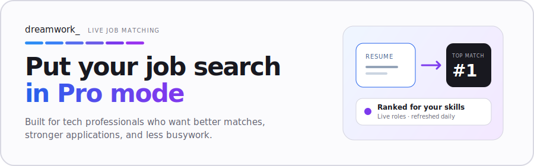

<a href="https://www.dreamworkhq.com/?utm_source=github&utm_medium=readme_cta&utm_campaign=gh-remote-tech-jobs">
  <picture>
    <source media="(prefers-color-scheme: dark)" srcset="./static/img/banner-dark.svg">
    <source media="(prefers-color-scheme: light)" srcset="./static/img/banner-light.svg">
    
  </picture>
</a>

<h1 align="center">Remote Tech Jobs</h1>

Fully remote software engineering, data, and security roles worldwide. Hybrid roles are excluded. When an employer limits remote work to a country or timezone, the location column says so.

  
  

  <a href="https://www.dreamworkhq.com/?utm_source=github&utm_medium=readme_cta&utm_campaign=gh-remote-tech-jobs">
    <picture>
      <source media="(prefers-color-scheme: dark)" srcset="./static/img/btn-matches-dark.svg">
      <source media="(prefers-color-scheme: light)" srcset="./static/img/btn-matches-light.svg">
      
    </picture>
  </a>

  <a href="https://www.dreamworkhq.com/?utm_source=github&utm_medium=link_row&utm_campaign=gh-remote-tech-jobs">dreamworkhq.com</a>
  ·
  <a href="https://www.dreamworkhq.com/blog?utm_source=github&utm_medium=link_row&utm_campaign=gh-remote-tech-jobs">Blog</a>
  ·
  <a href="https://www.dreamworkhq.com/research?utm_source=github&utm_medium=link_row&utm_campaign=gh-remote-tech-jobs">Hiring research</a>
  ·
  <a href="../../issues">Report a listing</a>

Star this repo and new roles land in your GitHub feed every day. Listings come from [Dreamwork](https://www.dreamworkhq.com/?utm_source=github&utm_medium=readme_cta&utm_campaign=gh-remote-tech-jobs), which crawls 400,000+ jobs directly from company career pages.

Last updated: **2026-07-16**. Showing the **600** most recently indexed roles, curated from **3,000+** open listings on Dreamwork. Salary shows when the posting discloses it. Click a role to see details and apply.

- [Engineering](#engineering-532) · 532 roles
- [Data Science](#data-science-38) · 38 roles
- [Security](#security-30) · 30 roles

<!-- TABLE_START (auto-generated: do not edit by hand; edits are overwritten daily) -->

### Engineering (532)

| Company | Role | Location | Pay | Added |
| --- | --- | --- | --- | --- |
| **[Gramian](https://www.dreamworkhq.com/c/gramianconsulting.com?utm_source=github&utm_campaign=gh-remote-tech-jobs)** | [Senior Software Engineer (Java / AWS) - REMOTE](https://www.dreamworkhq.com/job/b8a4a2d7-8b26-40aa-89bb-c5729952cdcf?utm_source=github&utm_campaign=gh-remote-tech-jobs) | Remote (France) |  | 0d |
| **[Gramian](https://www.dreamworkhq.com/c/gramianconsulting.com?utm_source=github&utm_campaign=gh-remote-tech-jobs)** | [Space Quality Assurance Engineer (ECSS-Q) - Freidrichshafen](https://www.dreamworkhq.com/job/44af083c-8fbc-4dd8-924e-a7967b60a4f0?utm_source=github&utm_campaign=gh-remote-tech-jobs) | Remote (Germany) |  | 0d |
| **[Gramian](https://www.dreamworkhq.com/c/gramianconsulting.com?utm_source=github&utm_campaign=gh-remote-tech-jobs)** | [Senior Webflow Developer (SEO & Interactive Experiences)](https://www.dreamworkhq.com/job/a6976c0a-49f0-4b7a-9c14-8c44cf45ecfc?utm_source=github&utm_campaign=gh-remote-tech-jobs) | Remote (Brazil) | $73K–$104K | 0d |
| **[Gramian](https://www.dreamworkhq.com/c/gramianconsulting.com?utm_source=github&utm_campaign=gh-remote-tech-jobs)** | [Space Avionics Systems Architect (Friedrichshafen, Bremen, or Munich)](https://www.dreamworkhq.com/job/e3789b0b-c92c-4beb-be45-749c4ef69841?utm_source=github&utm_campaign=gh-remote-tech-jobs) | Remote (Germany) |  | 0d |
| **[Gramian](https://www.dreamworkhq.com/c/gramianconsulting.com?utm_source=github&utm_campaign=gh-remote-tech-jobs)** | [Aerospace Simulation Engineer (Avionics Systems) - FRIEDRICHSHAFEN](https://www.dreamworkhq.com/job/c03d8394-ec85-4fd1-8c1e-fe1823f46a34?utm_source=github&utm_campaign=gh-remote-tech-jobs) | Remote (Germany) |  | 0d |
| **[Gramian](https://www.dreamworkhq.com/c/gramianconsulting.com?utm_source=github&utm_campaign=gh-remote-tech-jobs)** | [Satellite Control Systems Engineer (AOCS/GNC) - Freidrichshafen](https://www.dreamworkhq.com/job/96d8a6b0-cbac-4d88-b851-2591e5cf0afb?utm_source=github&utm_campaign=gh-remote-tech-jobs) | Remote (Germany) |  | 0d |
| **[Gramian](https://www.dreamworkhq.com/c/gramianconsulting.com?utm_source=github&utm_campaign=gh-remote-tech-jobs)** | [Senior iOS Engineer (Swift, AVFoundation & Mobile Capture)](https://www.dreamworkhq.com/job/a5b86744-6757-4d6c-b538-d2f915042949?utm_source=github&utm_campaign=gh-remote-tech-jobs) | Remote (Poland) |  | 0d |
| **[Gramian](https://www.dreamworkhq.com/c/gramianconsulting.com?utm_source=github&utm_campaign=gh-remote-tech-jobs)** | [Senior SoC Architect (ONSITE)](https://www.dreamworkhq.com/job/57d189d8-397a-4838-843c-10d5fe81108a?utm_source=github&utm_campaign=gh-remote-tech-jobs) | Remote (Switzerland) |  | 0d |
| **[Gramian](https://www.dreamworkhq.com/c/gramianconsulting.com?utm_source=github&utm_campaign=gh-remote-tech-jobs)** | [Senior Backend Engineer - Golang Migration](https://www.dreamworkhq.com/job/7cb740a3-3be1-44c7-979b-dacd7f7da6ae?utm_source=github&utm_campaign=gh-remote-tech-jobs) | Remote (Argentina) |  | 0d |
| **[Gramian](https://www.dreamworkhq.com/c/gramianconsulting.com?utm_source=github&utm_campaign=gh-remote-tech-jobs)** | [Senior Software Engineer (Cloud Platform & Java) - REMOTE](https://www.dreamworkhq.com/job/ac6a0375-4cd9-43af-841a-4554665c992f?utm_source=github&utm_campaign=gh-remote-tech-jobs) | Remote (France) |  | 0d |
| **[Gramian](https://www.dreamworkhq.com/c/gramianconsulting.com?utm_source=github&utm_campaign=gh-remote-tech-jobs)** | [Senior Backend Engineer (Python, Go & Distributed Systems)](https://www.dreamworkhq.com/job/368b8933-255d-4025-a176-4b4f6f529c44?utm_source=github&utm_campaign=gh-remote-tech-jobs) | Remote (Brazil) |  | 0d |
| **[Trafilea](https://www.dreamworkhq.com/c/trafilea.com?utm_source=github&utm_campaign=gh-remote-tech-jobs)** | [Tech Lead - AI](https://www.dreamworkhq.com/job/74d4097f-903f-47f4-81f3-826d8fa9306a?utm_source=github&utm_campaign=gh-remote-tech-jobs) | Remote (Remote job) |  | 0d |
| **[Trafilea](https://www.dreamworkhq.com/c/trafilea.com?utm_source=github&utm_campaign=gh-remote-tech-jobs)** | [Tech Manager AI](https://www.dreamworkhq.com/job/3645916c-740b-4b2c-a204-3f0810e5d1fa?utm_source=github&utm_campaign=gh-remote-tech-jobs) | Remote (Remote job) |  | 0d |
| **[Trafilea](https://www.dreamworkhq.com/c/trafilea.com?utm_source=github&utm_campaign=gh-remote-tech-jobs)** | [Cursor Developer / AI-Driven Development Specialist](https://www.dreamworkhq.com/job/e8df4c01-5ae2-45b4-8735-1d1ad9a03da3?utm_source=github&utm_campaign=gh-remote-tech-jobs) | Remote (Remote job) |  | 0d |
| **[Trafilea](https://www.dreamworkhq.com/c/trafilea.com?utm_source=github&utm_campaign=gh-remote-tech-jobs)** | [Sr Software Engineer Fullstack](https://www.dreamworkhq.com/job/652463dc-5913-4def-8345-383c4ee671aa?utm_source=github&utm_campaign=gh-remote-tech-jobs) | Remote (Remote job) |  | 0d |
| **[Trafilea](https://www.dreamworkhq.com/c/trafilea.com?utm_source=github&utm_campaign=gh-remote-tech-jobs)** | [DevOps (Cloud Engineer) Lead](https://www.dreamworkhq.com/job/0dcf65cc-cd70-4944-9752-ead2d2cd9b17?utm_source=github&utm_campaign=gh-remote-tech-jobs) | Remote (Remote job) |  | 0d |
| **[Trafilea](https://www.dreamworkhq.com/c/trafilea.com?utm_source=github&utm_campaign=gh-remote-tech-jobs)** | [Senior Software Engineer Backend](https://www.dreamworkhq.com/job/828b28e4-750f-44ea-a81f-11d6df3a0330?utm_source=github&utm_campaign=gh-remote-tech-jobs) | Remote (Remote job) |  | 0d |
| **[Trafilea](https://www.dreamworkhq.com/c/trafilea.com?utm_source=github&utm_campaign=gh-remote-tech-jobs)** | [AI Automation Lead](https://www.dreamworkhq.com/job/b8c93c81-195e-4689-bd0c-615699403da3?utm_source=github&utm_campaign=gh-remote-tech-jobs) | Remote (Remote job) |  | 0d |
| **[Trafilea](https://www.dreamworkhq.com/c/trafilea.com?utm_source=github&utm_campaign=gh-remote-tech-jobs)** | [Sr QA Analyst AI](https://www.dreamworkhq.com/job/7c06f3e5-1efb-4b23-9f46-2550e46d19a7?utm_source=github&utm_campaign=gh-remote-tech-jobs) | Remote (Remote job) |  | 0d |
| **[Trafilea](https://www.dreamworkhq.com/c/trafilea.com?utm_source=github&utm_campaign=gh-remote-tech-jobs)** | [Senior Data Engineer (BI)](https://www.dreamworkhq.com/job/10cba851-ed98-4dfa-85d1-eb7b42232f79?utm_source=github&utm_campaign=gh-remote-tech-jobs) | Remote (Remote job) |  | 0d |
| **[Accenture](https://www.dreamworkhq.com/c/accenture.com?utm_source=github&utm_campaign=gh-remote-tech-jobs)** | [Custom Software Engineer](https://www.dreamworkhq.com/job/519cec10-6e2a-48b8-88e1-d71de196c678?utm_source=github&utm_campaign=gh-remote-tech-jobs) | Remote (Bengaluru) |  | 0d |
| **[Accenture](https://www.dreamworkhq.com/c/accenture.com?utm_source=github&utm_campaign=gh-remote-tech-jobs)** | [Senior MENDIX Developer](https://www.dreamworkhq.com/job/f471413f-e8af-421e-9ccb-10c3e1a755c7?utm_source=github&utm_campaign=gh-remote-tech-jobs) | Remote (Cluj-Napoca) |  | 0d |
| **[Shi](https://www.dreamworkhq.com/c/shi.com?utm_source=github&utm_campaign=gh-remote-tech-jobs)** | [Solutions Engineer - Data Visualization](https://www.dreamworkhq.com/job/1e6d6819-3e62-40ea-b408-70e05eefd11a?utm_source=github&utm_campaign=gh-remote-tech-jobs) | Remote (US - TX - Home Office) | $144K–$169K | 0d |
| **[Shi](https://www.dreamworkhq.com/c/shi.com?utm_source=github&utm_campaign=gh-remote-tech-jobs)** | [Solutions Engineer - Google Education](https://www.dreamworkhq.com/job/3c84e87d-8253-4609-817f-71197a0c18bd?utm_source=github&utm_campaign=gh-remote-tech-jobs) | Remote (US - OH - Home Office) | $105K–$140K | 0d |
| **[CONQUEST ONE](https://www.dreamworkhq.com/c/conquestone.com.br?utm_source=github&utm_campaign=gh-remote-tech-jobs)** | [Data Engineer & IA](https://www.dreamworkhq.com/job/0bbc6b25-0e95-49ba-9e63-b412f9eccf1b?utm_source=github&utm_campaign=gh-remote-tech-jobs) | Remote (Estrangeiro - Brasil) |  | 0d |
| **[Adecco Recruitment](https://www.dreamworkhq.com/c/adecco.com?utm_source=github&utm_campaign=gh-remote-tech-jobs)** | [Python Developer](https://www.dreamworkhq.com/job/84beb31b-7254-47f0-9ba0-895938284063?utm_source=github&utm_campaign=gh-remote-tech-jobs) | Remote (Lisboa) |  | 0d |
| **[Rumos Consulting](https://www.dreamworkhq.com/c/rumos.pt?utm_source=github&utm_campaign=gh-remote-tech-jobs)** | [Quality Engineer - Mobile Device/App Automation Testing](https://www.dreamworkhq.com/job/5447a3dc-44c4-448c-86ae-0dc83e71c3c3?utm_source=github&utm_campaign=gh-remote-tech-jobs) | Remote (Lisboa) |  | 0d |
| **DELAgroup** | [DELAgroup: Procura DevOps/ SRE](https://www.dreamworkhq.com/job/6731ac0d-ad16-445e-aa28-40c69f0fb53f?utm_source=github&utm_campaign=gh-remote-tech-jobs) | Remote (Lisboa) |  | 0d |
| **Optimizer – Serviços e Consulta…** | [Senior AI & Solution Architect](https://www.dreamworkhq.com/job/1b814f03-da38-49e7-acc1-e309b457294a?utm_source=github&utm_campaign=gh-remote-tech-jobs) | Remote (Porto) |  | 0d |
| **[Adentis](https://www.dreamworkhq.com/c/adentis.pt?utm_source=github&utm_campaign=gh-remote-tech-jobs)** | [.NET Developer (Full Remote)](https://www.dreamworkhq.com/job/91a416f7-76a9-4cfe-9c59-3bbf839dae48?utm_source=github&utm_campaign=gh-remote-tech-jobs) | Remote |  | 0d |
| **[Integer Consulting](https://www.dreamworkhq.com/c/integerconsulting.pt?utm_source=github&utm_campaign=gh-remote-tech-jobs)** | [Outsystems Developer - ODC Expert - Remoto](https://www.dreamworkhq.com/job/8f39fded-ab97-42b9-b3dd-c1a83e22c93d?utm_source=github&utm_campaign=gh-remote-tech-jobs) | Remote |  | 0d |
| **[BENILAR SOLUTIONS, UNIPESSOAL L…](https://www.dreamworkhq.com/c/benilar.com?utm_source=github&utm_campaign=gh-remote-tech-jobs)** | [Architecte Solutions AWS Cloud – Télétravail](https://www.dreamworkhq.com/job/60f01621-097d-43e6-b0c1-67ff0f89e551?utm_source=github&utm_campaign=gh-remote-tech-jobs) | Remote (( Todas as Zonas )) |  | 0d |
| **[BENILAR SOLUTIONS, UNIPESSOAL L…](https://www.dreamworkhq.com/c/benilar.com?utm_source=github&utm_campaign=gh-remote-tech-jobs)** | [AWS Cloud Solutions Architect – Remote](https://www.dreamworkhq.com/job/0a75dcfe-77be-4d66-8c27-6282616f4d01?utm_source=github&utm_campaign=gh-remote-tech-jobs) | Remote (( Todas as Zonas )) |  | 0d |
| **[WorldIT](https://www.dreamworkhq.com/c/worldit.pt?utm_source=github&utm_campaign=gh-remote-tech-jobs)** | [Senior Full Stack/AWS Cloud Engineer - Full Remote (M/F)](https://www.dreamworkhq.com/job/29333f1f-be4d-4337-9395-5cc29b0527bc?utm_source=github&utm_campaign=gh-remote-tech-jobs) | Remote (( Todas as Zonas )) |  | 0d |
| **[InPost](https://www.dreamworkhq.com/c/inpost.eu?utm_source=github&utm_campaign=gh-remote-tech-jobs)** | [Senior Engineering Manager - Shipping Services (m/f/n)](https://www.dreamworkhq.com/job/5c9a36f8-a6cf-476c-aefe-6fce5f02a53c?utm_source=github&utm_campaign=gh-remote-tech-jobs) | Remote (Warszawa, Województwo mazowieckie, Pola…) |  | 0d |
| **[InPost](https://www.dreamworkhq.com/c/inpost.eu?utm_source=github&utm_campaign=gh-remote-tech-jobs)** | [Staff Software Engineer in Test (m/f/n)](https://www.dreamworkhq.com/job/4ca91193-148c-4232-9d9c-2ae4c6891919?utm_source=github&utm_campaign=gh-remote-tech-jobs) | Remote (Warszawa, Województwo mazowieckie, Pola…) |  | 0d |
| **[Scopely](https://www.dreamworkhq.com/c/scopely.com?utm_source=github&utm_campaign=gh-remote-tech-jobs)** | [Senior Software Engineer (Gaming Fullstack) - WWE Champions](https://www.dreamworkhq.com/job/4c50a698-6a41-4e1a-8e9f-06a0a8d17535?utm_source=github&utm_campaign=gh-remote-tech-jobs) | Remote (CA - Canada; US - United States) | $130K–$198K | 0d |
| **[K Id](https://www.dreamworkhq.com/c/k-id.io?utm_source=github&utm_campaign=gh-remote-tech-jobs)** | [Forward Deployed Engineer, Japan](https://www.dreamworkhq.com/job/13d084a4-66de-421d-978e-0336ca002813?utm_source=github&utm_campaign=gh-remote-tech-jobs) | Remote (Japan) |  | 0d |
| **[ShipBob](https://www.dreamworkhq.com/c/shipbob.com?utm_source=github&utm_campaign=gh-remote-tech-jobs)** | [Forward Deployed Engineer III](https://www.dreamworkhq.com/job/647e5937-1def-41db-b13c-c1859decda91?utm_source=github&utm_campaign=gh-remote-tech-jobs) | Remote (Remote - India) |  | 0d |
| **[Gdit](https://www.dreamworkhq.com/c/gdit.com?utm_source=github&utm_campaign=gh-remote-tech-jobs)** | [Oracle Identity & Access Management Engineer](https://www.dreamworkhq.com/job/24586bd6-bf0c-45fe-a261-1369c626534a?utm_source=github&utm_campaign=gh-remote-tech-jobs) | Remote (Any Location / Remote) | $113K–$139K | 0d |
| **[Gdit](https://www.dreamworkhq.com/c/gdit.com?utm_source=github&utm_campaign=gh-remote-tech-jobs)** | [Scala Backend Developer](https://www.dreamworkhq.com/job/6114f4ed-5ef9-4f87-9c26-0c68245f6c67?utm_source=github&utm_campaign=gh-remote-tech-jobs) | Remote (Any Location / Remote) | $86K–$116K | 0d |
| **[Gdit](https://www.dreamworkhq.com/c/gdit.com?utm_source=github&utm_campaign=gh-remote-tech-jobs)** | [Senior Developer (Front-End)](https://www.dreamworkhq.com/job/9148bb15-e3b4-4b71-a3c3-ee22180b1339?utm_source=github&utm_campaign=gh-remote-tech-jobs) | Remote (Any Location / Remote) | $111K–$150K | 0d |
| **[Netgear](https://www.dreamworkhq.com/c/netgear.com?utm_source=github&utm_campaign=gh-remote-tech-jobs)** | [Sr. Systems Engineer, MEA](https://www.dreamworkhq.com/job/71c9d613-e222-4ab9-a0c0-15646bfbfafa?utm_source=github&utm_campaign=gh-remote-tech-jobs) | Remote (Dubai) |  | 0d |
| **[Tivita](https://www.dreamworkhq.com/c/tivita.com.br?utm_source=github&utm_campaign=gh-remote-tech-jobs)** | [Pessoa Engenheira de Software Frontend](https://www.dreamworkhq.com/job/751e6fdc-b284-44dd-aa44-e85e901daecc?utm_source=github&utm_campaign=gh-remote-tech-jobs) | Remote (São Paulo - Remoto) |  | 0d |
| **[Industrialelectricmanufacturing](https://www.dreamworkhq.com/c/iemfg.com?utm_source=github&utm_campaign=gh-remote-tech-jobs)** | [Applications Design Engineer](https://www.dreamworkhq.com/job/34d1c53c-dbbc-46f7-abf7-130f665f3b68?utm_source=github&utm_campaign=gh-remote-tech-jobs) | Remote (Jacksonville, Florida, United States; T…) | $120K–$180K | 0d |
| **[Algolia](https://www.dreamworkhq.com/c/algolia.com?utm_source=github&utm_campaign=gh-remote-tech-jobs)** | [Solutions Engineer - German Speaker](https://www.dreamworkhq.com/job/aafb1a74-3a79-4a52-b74e-48c5b6aef9ce?utm_source=github&utm_campaign=gh-remote-tech-jobs) | Remote (Remote - Germany) | $98K–$123K | 0d |
| **[Compass UOL](https://www.dreamworkhq.com/c/compass.uol.com.br?utm_source=github&utm_campaign=gh-remote-tech-jobs)** | [AWS Data Engineer \| Senior (Remote)](https://www.dreamworkhq.com/job/051a3c7f-da70-4a5c-ac01-662e60d4b58b?utm_source=github&utm_campaign=gh-remote-tech-jobs) | Remote (Brazil) |  | 0d |
| **[Compass UOL](https://www.dreamworkhq.com/c/compass.uol.com.br?utm_source=github&utm_campaign=gh-remote-tech-jobs)** | [Node.js Back-End Developer Sênior \| Remote](https://www.dreamworkhq.com/job/ed46916f-f8fc-4e48-97cb-7888b04e6637?utm_source=github&utm_campaign=gh-remote-tech-jobs) | Remote (Brazil) |  | 0d |
| **[Compass UOL](https://www.dreamworkhq.com/c/compass.uol.com.br?utm_source=github&utm_campaign=gh-remote-tech-jobs)** | [Databricks Data Engineer \| Senior (Remote)](https://www.dreamworkhq.com/job/e19ddf81-3952-409d-8746-b8e1f168b549?utm_source=github&utm_campaign=gh-remote-tech-jobs) | Remote (Brazil) |  | 0d |
| **[Compass UOL](https://www.dreamworkhq.com/c/compass.uol.com.br?utm_source=github&utm_campaign=gh-remote-tech-jobs)** | [Angular Front-End Developer Pleno \| Remoto](https://www.dreamworkhq.com/job/60905ae4-570d-4ab2-95fd-1664e333d5c2?utm_source=github&utm_campaign=gh-remote-tech-jobs) | Remote (Brazil) |  | 0d |
| **[Compass UOL](https://www.dreamworkhq.com/c/compass.uol.com.br?utm_source=github&utm_campaign=gh-remote-tech-jobs)** | [Kotlin Back-End Developer Sênior \| Remote](https://www.dreamworkhq.com/job/064a8b61-ec6a-450e-b9e0-1d14a84d0b6e?utm_source=github&utm_campaign=gh-remote-tech-jobs) | Remote (Brazil) |  | 0d |
| **[Compass UOL](https://www.dreamworkhq.com/c/compass.uol.com.br?utm_source=github&utm_campaign=gh-remote-tech-jobs)** | [QA Analyst \| Mid (Remote)](https://www.dreamworkhq.com/job/de523a97-dc37-4730-9c95-5a00101d6a95?utm_source=github&utm_campaign=gh-remote-tech-jobs) | Remote (Brazil) |  | 0d |
| **[Ferguson](https://www.dreamworkhq.com/c/ferguson.com?utm_source=github&utm_campaign=gh-remote-tech-jobs)** | [Lead Ceiling Fan Controls Engineer](https://www.dreamworkhq.com/job/3165b9b8-6b64-45bd-8a13-af0cf20c6b3b?utm_source=github&utm_campaign=gh-remote-tech-jobs) | Remote | $81K–$155K | 0d |
| **[Confluent](https://www.dreamworkhq.com/c/confluent.io?utm_source=github&utm_campaign=gh-remote-tech-jobs)** | [Senior Software Engineer - Streaming AI (Remote - Ontario / British Col…](https://www.dreamworkhq.com/job/6725e2e7-aa7e-4cdb-8c98-c994e8f2ed17?utm_source=github&utm_campaign=gh-remote-tech-jobs) | Remote (Remote, Ontario, Canada) | $105K–$124K | 0d |
| **[Syskahennessy](https://www.dreamworkhq.com/c/syskahennessy.com?utm_source=github&utm_campaign=gh-remote-tech-jobs)** | [ICT Consultant (Telecom/Security/AV)](https://www.dreamworkhq.com/job/b5d03514-177b-4ef9-9c64-c68aefea91c7?utm_source=github&utm_campaign=gh-remote-tech-jobs) | Remote (San Francisco, CA) | $101K–$146K | 0d |
| **[Experian](https://www.dreamworkhq.com/c/experian.com?utm_source=github&utm_campaign=gh-remote-tech-jobs)** | [Vice President, Software Engineering (Remote)](https://www.dreamworkhq.com/job/3a66eb08-bd5a-49c6-8a46-139154ce82fb?utm_source=github&utm_campaign=gh-remote-tech-jobs) | Remote (United States, UNITED STATES, United St…) | $225K–$325K | 0d |
| **[Apple](https://www.dreamworkhq.com/c/apple.com?utm_source=github&utm_campaign=gh-remote-tech-jobs)** | [Engineering Manager - Digital Asset Management](https://www.dreamworkhq.com/job/e6c50f90-5c3c-4f92-b891-6a31434f7b0c?utm_source=github&utm_campaign=gh-remote-tech-jobs) | Remote (Hyderabad) |  | 0d |
| **[Caylent](https://www.dreamworkhq.com/c/caylent.com?utm_source=github&utm_campaign=gh-remote-tech-jobs)** | [Senior Cloud Software Engineer (.NET)](https://www.dreamworkhq.com/job/e5e28da9-f8f2-461a-ab98-301754de1e16?utm_source=github&utm_campaign=gh-remote-tech-jobs) | Remote (ARGENTINA) |  | 0d |
| **[Caylent](https://www.dreamworkhq.com/c/caylent.com?utm_source=github&utm_campaign=gh-remote-tech-jobs)** | [Senior Cloud Software Engineer (.NET)](https://www.dreamworkhq.com/job/111b3962-b9f6-4a29-a3b6-e4cc438c9a8b?utm_source=github&utm_campaign=gh-remote-tech-jobs) | Remote (MEXICO) |  | 0d |
| **[Caylent](https://www.dreamworkhq.com/c/caylent.com?utm_source=github&utm_campaign=gh-remote-tech-jobs)** | [Senior Cloud Software Engineer (.NET)](https://www.dreamworkhq.com/job/20464e9d-81fb-45d9-bea8-976ae9da1e8d?utm_source=github&utm_campaign=gh-remote-tech-jobs) | Remote (BRAZIL) |  | 0d |
| **[Baker Hughes](https://www.dreamworkhq.com/c/bakerhughes.com?utm_source=github&utm_campaign=gh-remote-tech-jobs)** | [Aeroderivative Mechanical Design Engineer](https://www.dreamworkhq.com/job/509dc30f-6676-481f-bce3-5698b3d20352?utm_source=github&utm_campaign=gh-remote-tech-jobs) | Remote (US-North Carolina-Remote) |  | 0d |
| **[Medtronic](https://www.dreamworkhq.com/c/medtronic.com?utm_source=github&utm_campaign=gh-remote-tech-jobs)** | [Cardiac Rhythm Management Technical Field Engineer -Palm Beach](https://www.dreamworkhq.com/job/34f757fc-ed51-4355-ac8a-4d66475c66bd?utm_source=github&utm_campaign=gh-remote-tech-jobs) | Remote (State of Florida, United States of Amer…) | $90K–$114K | 0d |
| **[Computrabajo Argentina](https://www.dreamworkhq.com/c/backtoitaly.com?utm_source=github&utm_campaign=gh-remote-tech-jobs)** | [Senior Backend Python Developer - Remoto para residentes en Argentina](https://www.dreamworkhq.com/job/053200a6-ecbc-445a-a198-ed2913448ca2?utm_source=github&utm_campaign=gh-remote-tech-jobs) | Remote (Capital Federal, Monserrat, Argentina) |  | 0d |
| **[Computrabajo Argentina](https://www.dreamworkhq.com/c/backtoitaly.com?utm_source=github&utm_campaign=gh-remote-tech-jobs)** | [ML / AI Engineer // Proyectos Bancarios - Remoto para residentes en Arg…](https://www.dreamworkhq.com/job/4314a79c-cba3-4306-81a1-c880744a525a?utm_source=github&utm_campaign=gh-remote-tech-jobs) | Remote (Capital Federal, Monserrat, Argentina) |  | 0d |
| **[Blend360](https://www.dreamworkhq.com/c/blend360.com?utm_source=github&utm_campaign=gh-remote-tech-jobs)** | [Lead Data Engineer](https://www.dreamworkhq.com/job/30b7e9ce-5a00-4cc6-a414-0840b44851c0?utm_source=github&utm_campaign=gh-remote-tech-jobs) | Remote (Bogotá, Bogota, Colombia) |  | 0d |
| **[Nagarro1](https://www.dreamworkhq.com/c/nagarro.com?utm_source=github&utm_campaign=gh-remote-tech-jobs)** | [Associate Principal Engineer, Sitecore Technical Architect](https://www.dreamworkhq.com/job/bbad983b-d771-47c4-a0c1-2bef3102354f?utm_source=github&utm_campaign=gh-remote-tech-jobs) | Remote (Remote, , India) |  | 0d |
| **[Nagarro1](https://www.dreamworkhq.com/c/nagarro.com?utm_source=github&utm_campaign=gh-remote-tech-jobs)** | [Staff Engineer, Digital Audio Workstations](https://www.dreamworkhq.com/job/f6d9b8bf-89ce-459f-b832-0333c1c67e76?utm_source=github&utm_campaign=gh-remote-tech-jobs) | Remote (Remote, , India) |  | 0d |
| **[Nagarro1](https://www.dreamworkhq.com/c/nagarro.com?utm_source=github&utm_campaign=gh-remote-tech-jobs)** | [Principal Engineer, Sitecore Architect (Optimizely)](https://www.dreamworkhq.com/job/6389d02a-e6f4-488f-8f31-e8a65d7b3152?utm_source=github&utm_campaign=gh-remote-tech-jobs) | Remote (Remote, , India) |  | 0d |
| **[Nagarro1](https://www.dreamworkhq.com/c/nagarro.com?utm_source=github&utm_campaign=gh-remote-tech-jobs)** | [Associate Principal Engineer, Java with Angular](https://www.dreamworkhq.com/job/2913e9eb-3e02-4cf0-8395-50bf4299c92f?utm_source=github&utm_campaign=gh-remote-tech-jobs) | Remote (Remote, , India) |  | 0d |
| **[Talkiatry](https://www.dreamworkhq.com/c/talkiatry.com?utm_source=github&utm_campaign=gh-remote-tech-jobs)** | [Senior Site Reliability Engineer](https://www.dreamworkhq.com/job/7ea772c8-f6f9-43d7-a6d9-4812202478cc?utm_source=github&utm_campaign=gh-remote-tech-jobs) | Remote | $160K–$185K | 0d |
| **[Olo](https://www.dreamworkhq.com/c/olo.com?utm_source=github&utm_campaign=gh-remote-tech-jobs)** | [Software Engineer - Core](https://www.dreamworkhq.com/job/4e34b3f9-9b83-49c4-a0cd-2ffc7167f3e6?utm_source=github&utm_campaign=gh-remote-tech-jobs) | Remote (Belfast, Northern Ireland, Remote) |  | 0d |
| **[Chronograph](https://www.dreamworkhq.com/c/chronograph.pe?utm_source=github&utm_campaign=gh-remote-tech-jobs)** | [Sr. Software Engineer, Platform Engineering](https://www.dreamworkhq.com/job/5f28b4aa-2a3c-4182-b0c7-02262dbb0624?utm_source=github&utm_campaign=gh-remote-tech-jobs) | Remote | $175K–$215K | 0d |
| **[Applaudo](https://www.dreamworkhq.com/c/applaudo.com?utm_source=github&utm_campaign=gh-remote-tech-jobs)** | [AI QA Engineer (Agentic Testing)](https://www.dreamworkhq.com/job/3c98d0f8-85df-4dee-b09c-b5c2ebf0ccf2?utm_source=github&utm_campaign=gh-remote-tech-jobs) | Remote (Bogotá, Bogota, Colombia) |  | 0d |
| **[Applaudo](https://www.dreamworkhq.com/c/applaudo.com?utm_source=github&utm_campaign=gh-remote-tech-jobs)** | [Senior Full Stack Java Engineer (Java + Angular)](https://www.dreamworkhq.com/job/1729a421-5003-4cd6-8b0a-967c85bbe20b?utm_source=github&utm_campaign=gh-remote-tech-jobs) | Remote (Mexico City, CDMX, Mexico) |  | 0d |
| **[Canals](https://www.dreamworkhq.com/c/canals.ai?utm_source=github&utm_campaign=gh-remote-tech-jobs)** | [Machine Learning Engineer](https://www.dreamworkhq.com/job/6e1b3f95-bdba-49a4-aa23-13823f2d6139?utm_source=github&utm_campaign=gh-remote-tech-jobs) | Remote (Bogota) |  | 0d |
| **[Legion](https://www.dreamworkhq.com/c/legioninc.com?utm_source=github&utm_campaign=gh-remote-tech-jobs)** | [Cloud Release Quality Manager](https://www.dreamworkhq.com/job/e6d2a521-b4cf-4038-9119-770def881359?utm_source=github&utm_campaign=gh-remote-tech-jobs) | Remote (Remote, United States) | $100K–$120K | 0d |
| **[Loenbro](https://www.dreamworkhq.com/c/loenbro.com?utm_source=github&utm_campaign=gh-remote-tech-jobs)** | [Lead Project Engineer - Construction](https://www.dreamworkhq.com/job/8aa9ade0-edff-4413-b0ae-bb47900a8b75?utm_source=github&utm_campaign=gh-remote-tech-jobs) | Remote | $120K–$140K | 0d |
| **[Allstate](https://www.dreamworkhq.com/c/allstatecorporation.com?utm_source=github&utm_campaign=gh-remote-tech-jobs)** | [Microsoft Azure Cloud Lead Consultant](https://www.dreamworkhq.com/job/83f6716d-99e1-4dd1-8211-f50260c3f3d5?utm_source=github&utm_campaign=gh-remote-tech-jobs) | Remote (USA - IL (Remote)) | $120K–$185K | 0d |
| **[Ceribell](https://www.dreamworkhq.com/c/ceribell.com?utm_source=github&utm_campaign=gh-remote-tech-jobs)** | [Senior Manager, Applied AI Engineering](https://www.dreamworkhq.com/job/0850862c-b38a-4824-acdb-afb7e4977d6d?utm_source=github&utm_campaign=gh-remote-tech-jobs) | Remote | $177K–$226K | 0d |
| **[AHEAD](https://www.dreamworkhq.com/c/ahead.com?utm_source=github&utm_campaign=gh-remote-tech-jobs)** | [Forward Deployed Engineer - AI SOC](https://www.dreamworkhq.com/job/350ea0f5-09ef-4c99-bd7f-79c12aae2425?utm_source=github&utm_campaign=gh-remote-tech-jobs) | Remote (United States) | $160K–$200K | 0d |
| **[Paretocaptiveservicesllc](https://www.dreamworkhq.com/c/paretohealth.com?utm_source=github&utm_campaign=gh-remote-tech-jobs)** | [Salesforce Engineer](https://www.dreamworkhq.com/job/6c455de6-df35-43df-b027-157ac9d812d0?utm_source=github&utm_campaign=gh-remote-tech-jobs) | Remote |  | 0d |
| **[Attentive](https://www.dreamworkhq.com/c/attentivemobile.com?utm_source=github&utm_campaign=gh-remote-tech-jobs)** | [Senior NetSuite Engineer](https://www.dreamworkhq.com/job/6b37983d-b7dc-4263-9b5b-21b41fe931e2?utm_source=github&utm_campaign=gh-remote-tech-jobs) | Remote (United States) | $150K–$210K | 0d |
| **[Omada Health](https://www.dreamworkhq.com/c/omadahealth.com?utm_source=github&utm_campaign=gh-remote-tech-jobs)** | [Senior Software Engineer, Data Engineering](https://www.dreamworkhq.com/job/5d71ed4c-f8ee-4961-8f5e-5eda89117917?utm_source=github&utm_campaign=gh-remote-tech-jobs) | Remote (Remote, USA) | $172K–$224K | 0d |
| **[Omada Health](https://www.dreamworkhq.com/c/omadahealth.com?utm_source=github&utm_campaign=gh-remote-tech-jobs)** | [Senior Engineering Manager, Data Engineering](https://www.dreamworkhq.com/job/bcd98dba-77a4-4dd8-89c6-c12fba4e236d?utm_source=github&utm_campaign=gh-remote-tech-jobs) | Remote (Remote, USA) | $194K–$253K | 0d |
| **[Grvt](https://www.dreamworkhq.com/c/grvt.io?utm_source=github&utm_campaign=gh-remote-tech-jobs)** | [Staff Software Engineer — Trade & Blockchain](https://www.dreamworkhq.com/job/d4c76d21-c5bd-4865-900a-37e82c3e6c08?utm_source=github&utm_campaign=gh-remote-tech-jobs) | Remote (Singapore) |  | 0d |
| **[Storyblok](https://www.dreamworkhq.com/c/storyblok.com?utm_source=github&utm_campaign=gh-remote-tech-jobs)** | [Frontend Engineer](https://www.dreamworkhq.com/job/090475e6-a4d4-4d05-afb1-7dd59668d364?utm_source=github&utm_campaign=gh-remote-tech-jobs) | Remote |  | 0d |
| **[Storyblok](https://www.dreamworkhq.com/c/storyblok.com?utm_source=github&utm_campaign=gh-remote-tech-jobs)** | [Senior Frontend Engineer II](https://www.dreamworkhq.com/job/b1cdfc53-8cf0-4ddd-899b-18dc2ad1ddf0?utm_source=github&utm_campaign=gh-remote-tech-jobs) | Remote |  | 0d |
| **[Redcare-Pharmacy](https://www.dreamworkhq.com/c/redcare-pharmacy.com?utm_source=github&utm_campaign=gh-remote-tech-jobs)** | [Senior ML Ops Engineer (m/f/d)](https://www.dreamworkhq.com/job/fd809f27-69d7-4ecf-9f78-d366b6bec7ae?utm_source=github&utm_campaign=gh-remote-tech-jobs) | Remote (Cologne, , Germany) |  | 0d |
| **[Redcare-Pharmacy](https://www.dreamworkhq.com/c/redcare-pharmacy.com?utm_source=github&utm_campaign=gh-remote-tech-jobs)** | [Senior ML Engineer (m/f/d)](https://www.dreamworkhq.com/job/3e7f8957-c48d-4ba0-92cc-09cebe9a744b?utm_source=github&utm_campaign=gh-remote-tech-jobs) | Remote (Cologne, , Germany) |  | 0d |
| **[Redcare-Pharmacy](https://www.dreamworkhq.com/c/redcare-pharmacy.com?utm_source=github&utm_campaign=gh-remote-tech-jobs)** | [Senior ERP Engineer – Microsoft Dynamics 365 Finance (m/f/d)](https://www.dreamworkhq.com/job/6629f531-f1e5-4c5e-a0b8-72412ad3f322?utm_source=github&utm_campaign=gh-remote-tech-jobs) | Remote (Cologne, , Germany) |  | 0d |
| **[Redcare-Pharmacy](https://www.dreamworkhq.com/c/redcare-pharmacy.com?utm_source=github&utm_campaign=gh-remote-tech-jobs)** | [Senior Java Engineer (m/f/d)](https://www.dreamworkhq.com/job/e57f0067-3593-4132-bfce-dcea1fb9252e?utm_source=github&utm_campaign=gh-remote-tech-jobs) | Remote (Berlin, BE, Germany) |  | 0d |
| **[Mintos](https://www.dreamworkhq.com/c/mintos.com?utm_source=github&utm_campaign=gh-remote-tech-jobs)** | [Backend Engineer (Java)](https://www.dreamworkhq.com/job/260fb798-65ee-408d-91b5-05d72e2117df?utm_source=github&utm_campaign=gh-remote-tech-jobs) | Remote (Rīga, LV) | $57K–$62K | 0d |
| **[Antora Energy](https://www.dreamworkhq.com/c/antoraenergy.com?utm_source=github&utm_campaign=gh-remote-tech-jobs)** | [Staff Applications Engineer](https://www.dreamworkhq.com/job/061dd0db-968b-4115-b66a-27dab06a2770?utm_source=github&utm_campaign=gh-remote-tech-jobs) | Remote (Remote, US) | $175K–$210K | 0d |
| **[Pindropsecurity](https://www.dreamworkhq.com/c/pindrop.com?utm_source=github&utm_campaign=gh-remote-tech-jobs)** | [Senior Voice Engineer](https://www.dreamworkhq.com/job/b8d0fb40-f8bd-4603-a07d-64b1d8f726f0?utm_source=github&utm_campaign=gh-remote-tech-jobs) | Remote (US - Remote) | $100K–$120K | 0d |
| **[GEHC External Site](https://www.dreamworkhq.com/c/gehc.com?utm_source=github&utm_campaign=gh-remote-tech-jobs)** | [Field Service Engineer 3 - Cincinnati, OH](https://www.dreamworkhq.com/job/f99b9e0a-24ca-4a21-94c8-d58281f79de1?utm_source=github&utm_campaign=gh-remote-tech-jobs) | Remote |  | 0d |
| **[GEHC External Site](https://www.dreamworkhq.com/c/gehc.com?utm_source=github&utm_campaign=gh-remote-tech-jobs)** | [Surgery Field Engineer Apprentice](https://www.dreamworkhq.com/job/6b314511-ae3c-45a1-9dc0-829c173aa1b2?utm_source=github&utm_campaign=gh-remote-tech-jobs) | Remote | $48K–$72K | 0d |
| **[Entrust](https://www.dreamworkhq.com/c/entrust.com?utm_source=github&utm_campaign=gh-remote-tech-jobs)** | [Senior ML Engineer, Doc Fraud](https://www.dreamworkhq.com/job/4e786f36-1405-43fc-b6db-fb6ed5129e99?utm_source=github&utm_campaign=gh-remote-tech-jobs) | Remote (United Kingdom - London (Onfido)) |  | 0d |
| **[Sidecarhealth](https://www.dreamworkhq.com/c/sidecarhealth.com?utm_source=github&utm_campaign=gh-remote-tech-jobs)** | [Senior Software Engineer, Data](https://www.dreamworkhq.com/job/c32c6715-9c55-468b-a1e0-89db3ba9b753?utm_source=github&utm_campaign=gh-remote-tech-jobs) | Remote |  | 0d |
| **[Bertelsmann-Jobs](https://www.dreamworkhq.com/c/bertelsmann.com?utm_source=github&utm_campaign=gh-remote-tech-jobs)** | [SAP ECC 6.0 ABAP Developer (Open to Remote)](https://www.dreamworkhq.com/job/824d6685-ea49-43bd-8c46-a5faa129ff80?utm_source=github&utm_campaign=gh-remote-tech-jobs) | Remote (Westminster, , United States) | $100K–$125K | 0d |
| **[Bertelsmann-Jobs](https://www.dreamworkhq.com/c/bertelsmann.com?utm_source=github&utm_campaign=gh-remote-tech-jobs)** | [Site Reliability Engineer (f/m/d) – Observability & Internal Tools](https://www.dreamworkhq.com/job/b6eb9718-f394-4532-a555-fc600fac38bb?utm_source=github&utm_campaign=gh-remote-tech-jobs) | Remote (Berlin, , Germany) |  | 0d |
| **[Bertelsmann-Jobs](https://www.dreamworkhq.com/c/bertelsmann.com?utm_source=github&utm_campaign=gh-remote-tech-jobs)** | [DevOps Engineer (w/m/d) - Google Cloud Platform](https://www.dreamworkhq.com/job/ff6d85f7-5a41-4b78-9852-0f81cff03aad?utm_source=github&utm_campaign=gh-remote-tech-jobs) | Remote (Berlin, , Germany) |  | 0d |
| **[Bertelsmann-Jobs](https://www.dreamworkhq.com/c/bertelsmann.com?utm_source=github&utm_campaign=gh-remote-tech-jobs)** | [Senior Full Stack Software Engineer (f/m/d) - React, Node.js](https://www.dreamworkhq.com/job/9bd05d83-f8f2-4451-9a6c-86494ddc7728?utm_source=github&utm_campaign=gh-remote-tech-jobs) | Remote (Berlin, , Germany) |  | 0d |
| **[Bertelsmann-Jobs](https://www.dreamworkhq.com/c/bertelsmann.com?utm_source=github&utm_campaign=gh-remote-tech-jobs)** | [C++ Engineer (f/m/d)](https://www.dreamworkhq.com/job/c008beef-b053-49f3-ade0-20bf11435629?utm_source=github&utm_campaign=gh-remote-tech-jobs) | Remote (Berlin, , Germany) |  | 0d |
| **[Safariai](https://www.dreamworkhq.com/c/safariai.com?utm_source=github&utm_campaign=gh-remote-tech-jobs)** | [Backend Developer](https://www.dreamworkhq.com/job/22b17510-f012-4380-8b60-39c67aa3df5a?utm_source=github&utm_campaign=gh-remote-tech-jobs) | Remote (North America/Remote) |  | 0d |
| **[Miratech](https://www.dreamworkhq.com/c/miratechgroup.com?utm_source=github&utm_campaign=gh-remote-tech-jobs)** | [NICE CXOne Support Engineer](https://www.dreamworkhq.com/job/47935034-2623-4d87-92ad-489e27271f5d?utm_source=github&utm_campaign=gh-remote-tech-jobs) | Remote (All Cities, , India) |  | 0d |
| **[Miratech](https://www.dreamworkhq.com/c/miratechgroup.com?utm_source=github&utm_campaign=gh-remote-tech-jobs)** | [Junior Technical Support Engineer(Genesys, Amazon Connect, Nice)](https://www.dreamworkhq.com/job/44c65107-8b7f-4862-8be9-01b3310ae56b?utm_source=github&utm_campaign=gh-remote-tech-jobs) | Remote (Bengaluru, KA, India) |  | 0d |
| **[Miratech](https://www.dreamworkhq.com/c/miratechgroup.com?utm_source=github&utm_campaign=gh-remote-tech-jobs)** | [Observability Engineer](https://www.dreamworkhq.com/job/d868041a-bdf5-4dd1-982b-db3b72663e3c?utm_source=github&utm_campaign=gh-remote-tech-jobs) | Remote (All Cities, , India) |  | 0d |
| **[Miratech](https://www.dreamworkhq.com/c/miratechgroup.com?utm_source=github&utm_campaign=gh-remote-tech-jobs)** | [Senior Java IVR Application Developer](https://www.dreamworkhq.com/job/7fc5859f-8720-4987-8f38-02958415717b?utm_source=github&utm_campaign=gh-remote-tech-jobs) | Remote (Texas City, TX, United States) |  | 0d |
| **[Miratech](https://www.dreamworkhq.com/c/miratechgroup.com?utm_source=github&utm_campaign=gh-remote-tech-jobs)** | [Senior QA Automation Engineer (Playwright)](https://www.dreamworkhq.com/job/e335f699-2479-4908-bd99-314486b961c5?utm_source=github&utm_campaign=gh-remote-tech-jobs) | Remote (Kyiv, Kyiv city, Ukraine) |  | 0d |
| **[Miratech](https://www.dreamworkhq.com/c/miratechgroup.com?utm_source=github&utm_campaign=gh-remote-tech-jobs)** | [Amazon Connect Support Engineer](https://www.dreamworkhq.com/job/2a80d76e-134e-43df-8e79-4730ba8f6787?utm_source=github&utm_campaign=gh-remote-tech-jobs) | Remote (USA, Latin, CANADA, United States) |  | 0d |
| **[Colabsoftware](https://www.dreamworkhq.com/c/colabsoftware.com?utm_source=github&utm_campaign=gh-remote-tech-jobs)** | [Senior Full Stack Developer](https://www.dreamworkhq.com/job/a1456abf-2cc1-416f-9831-ea4ff836ec99?utm_source=github&utm_campaign=gh-remote-tech-jobs) | Remote (Canada, Remote) |  | 0d |
| **[Axis Communications](https://www.dreamworkhq.com/c/axis.com?utm_source=github&utm_campaign=gh-remote-tech-jobs)** | [Architect & Engineering Manager - UK](https://www.dreamworkhq.com/job/4235b238-4a6b-4e96-b918-7eedefd85564?utm_source=github&utm_campaign=gh-remote-tech-jobs) | Remote (United Kingdom - Remote) |  | 0d |
| **[Uscareers Fujifilm](https://www.dreamworkhq.com/c/fujifilm.com?utm_source=github&utm_campaign=gh-remote-tech-jobs)** | [Sr Tech Support Engineer MI -1 (Level 2 support for medical device soft…](https://www.dreamworkhq.com/job/3da1d4e7-5a17-442b-9820-e10ca727df6b?utm_source=github&utm_campaign=gh-remote-tech-jobs) | Remote (Remote, US) |  | 0d |
| **[Dropbox](https://www.dreamworkhq.com/c/dropbox.com?utm_source=github&utm_campaign=gh-remote-tech-jobs)** | [Data Engineer](https://www.dreamworkhq.com/job/fec5626c-ba24-4453-9963-f1e5e153fc25?utm_source=github&utm_campaign=gh-remote-tech-jobs) | Remote (Remote - Poland) | $48K–$65K | 0d |
| **[Outside](https://www.dreamworkhq.com/c/outside.com?utm_source=github&utm_campaign=gh-remote-tech-jobs)** | [Senior Backend Engineer - MapMyFitness](https://www.dreamworkhq.com/job/65f39d65-a904-4b31-a079-4657ecacd7fb?utm_source=github&utm_campaign=gh-remote-tech-jobs) | Remote | $120K–$180K | 0d |
| **[FICO](https://www.dreamworkhq.com/c/fico.com?utm_source=github&utm_campaign=gh-remote-tech-jobs)** | [Sr Engineer, Data & Analytics Platform (Snowflake/dbt)](https://www.dreamworkhq.com/job/ae8a6d13-2f34-48b8-8d61-b0295a9cf014?utm_source=github&utm_campaign=gh-remote-tech-jobs) | Remote (Work from Home, United States) | $105K–$165K | 0d |
| **[Genesys](https://www.dreamworkhq.com/c/genesys.com?utm_source=github&utm_campaign=gh-remote-tech-jobs)** | [Senior Principal Forward Deployed Engineer](https://www.dreamworkhq.com/job/2240dc6a-d5c2-4958-b9ba-fe47cb5b9e47?utm_source=github&utm_campaign=gh-remote-tech-jobs) | Remote (Virtual Office (Malaysia)) |  | 0d |
| **[Capgemini](https://www.dreamworkhq.com/c/capgemini.com?utm_source=github&utm_campaign=gh-remote-tech-jobs)** | [Sr Data Engineer](https://www.dreamworkhq.com/job/fd04ef4f-7577-4c28-93a6-8ab61819c4b6?utm_source=github&utm_campaign=gh-remote-tech-jobs) | Remote |  | 0d |
| **[CACI](https://www.dreamworkhq.com/c/caci.com?utm_source=github&utm_campaign=gh-remote-tech-jobs)** | [Test Automation Engineer](https://www.dreamworkhq.com/job/411e2a8a-9e61-4054-baa9-5b023d767f07?utm_source=github&utm_campaign=gh-remote-tech-jobs) | Remote (999 REMOTE) | $75K–$158K | 0d |
| **[RenesasElectronics](https://www.dreamworkhq.com/c/renesas.com?utm_source=github&utm_campaign=gh-remote-tech-jobs)** | [Sr Staff Failure Analysis Engineer](https://www.dreamworkhq.com/job/67d495a0-f2b7-4848-aba8-f5e6103b21cf?utm_source=github&utm_campaign=gh-remote-tech-jobs) | Remote (Bayan Lepas, , Malaysia) |  | 0d |
| **[RenesasElectronics](https://www.dreamworkhq.com/c/renesas.com?utm_source=github&utm_campaign=gh-remote-tech-jobs)** | [Sr Staff Application Engineer - Firmware & Security](https://www.dreamworkhq.com/job/7d4199df-567a-472e-897b-84bcfd61b712?utm_source=github&utm_campaign=gh-remote-tech-jobs) | Remote (Bengaluru, KA, India) |  | 0d |
| **[RenesasElectronics](https://www.dreamworkhq.com/c/renesas.com?utm_source=github&utm_campaign=gh-remote-tech-jobs)** | [Staff Mixed-Signal IC Architect](https://www.dreamworkhq.com/job/6107ad75-1f94-4a27-9f7c-df08c483a69c?utm_source=github&utm_campaign=gh-remote-tech-jobs) | Remote (Johns Creek, GA, United States) |  | 0d |
| **[RenesasElectronics](https://www.dreamworkhq.com/c/renesas.com?utm_source=github&utm_campaign=gh-remote-tech-jobs)** | [Staff Application Engineer](https://www.dreamworkhq.com/job/d1eea09d-80ba-498b-b1d5-b86fdf1f53c1?utm_source=github&utm_campaign=gh-remote-tech-jobs) | Remote (Noida, UP, India) |  | 0d |
| **[RenesasElectronics](https://www.dreamworkhq.com/c/renesas.com?utm_source=github&utm_campaign=gh-remote-tech-jobs)** | [Staff Application Engineer](https://www.dreamworkhq.com/job/0ea1376c-ffec-4718-8712-631fac3ac24e?utm_source=github&utm_campaign=gh-remote-tech-jobs) | Remote (Bengaluru, KA, India) |  | 0d |
| **[RenesasElectronics](https://www.dreamworkhq.com/c/renesas.com?utm_source=github&utm_campaign=gh-remote-tech-jobs)** | [Principal Device Design Engineer](https://www.dreamworkhq.com/job/d92b0b21-e305-4090-8a57-b8519e2b92ca?utm_source=github&utm_campaign=gh-remote-tech-jobs) | Remote (Tempe, Arizona, United States) |  | 0d |
| **[RenesasElectronics](https://www.dreamworkhq.com/c/renesas.com?utm_source=github&utm_campaign=gh-remote-tech-jobs)** | [Principal Medium Voltage (MV) Power MOSFET Process Integration Engineer](https://www.dreamworkhq.com/job/ccabced0-5eba-4b5a-bd9d-e7e971ade025?utm_source=github&utm_campaign=gh-remote-tech-jobs) | Remote (Seoul, , Korea, republic of) |  | 0d |
| **[Efí Bank](https://www.dreamworkhq.com/c/efibank.com.br?utm_source=github&utm_campaign=gh-remote-tech-jobs)** | [Pessoa Engenheira de Software (Mulesoft) Pleno](https://www.dreamworkhq.com/job/e564b9aa-6cba-4e32-822a-c03a03d6590f?utm_source=github&utm_campaign=gh-remote-tech-jobs) | Remote |  | 0d |
| **[Eleks](https://www.dreamworkhq.com/c/eleks.com?utm_source=github&utm_campaign=gh-remote-tech-jobs)** | [Senior Database Developer (PostgreSQL, JR431, 432)](https://www.dreamworkhq.com/job/5192adfa-2742-4698-b378-d92da205fd02?utm_source=github&utm_campaign=gh-remote-tech-jobs) | Remote (Remote (Ukraine)) |  | 0d |
| **[Eleks](https://www.dreamworkhq.com/c/eleks.com?utm_source=github&utm_campaign=gh-remote-tech-jobs)** | [(energy domain), Data Quality Engineer, JR467](https://www.dreamworkhq.com/job/d3053ec7-5ffe-4eea-966d-5776614490aa?utm_source=github&utm_campaign=gh-remote-tech-jobs) | Remote (Remote (Ukraine)) |  | 0d |
| **[Sargentlundy](https://www.dreamworkhq.com/c/sargentlundy.com?utm_source=github&utm_campaign=gh-remote-tech-jobs)** | [Lead Instrumentation & Controls Engineer 1 - Nuclear](https://www.dreamworkhq.com/job/ea62e63f-4ddc-4cf2-a0e0-b8519fccffee?utm_source=github&utm_campaign=gh-remote-tech-jobs) | Remote (Remote, US) | $118K–$180K | 0d |
| **[Sargentlundy](https://www.dreamworkhq.com/c/sargentlundy.com?utm_source=github&utm_campaign=gh-remote-tech-jobs)** | [Senior Instrumentation & Controls Engineer 1 - Nuclear](https://www.dreamworkhq.com/job/70509633-1a22-4ea1-8c1b-a9a2155447e8?utm_source=github&utm_campaign=gh-remote-tech-jobs) | Remote (Remote, US) | $85K–$129K | 0d |
| **[Sargentlundy](https://www.dreamworkhq.com/c/sargentlundy.com?utm_source=github&utm_campaign=gh-remote-tech-jobs)** | [Instrumentation & Controls Engineering Consultant 2 - Nuclear](https://www.dreamworkhq.com/job/181316ec-8c46-476e-a65d-252669ee5161?utm_source=github&utm_campaign=gh-remote-tech-jobs) | Remote (Remote, US) | $145K–$222K | 0d |
| **[Sargentlundy](https://www.dreamworkhq.com/c/sargentlundy.com?utm_source=github&utm_campaign=gh-remote-tech-jobs)** | [Senior Electrical Engineer 1 - Nuclear](https://www.dreamworkhq.com/job/1e93e96a-47a8-486e-ad18-10da990ac4ce?utm_source=github&utm_campaign=gh-remote-tech-jobs) | Remote (Remote, US) | $85K–$129K | 0d |
| **[Sargentlundy](https://www.dreamworkhq.com/c/sargentlundy.com?utm_source=github&utm_campaign=gh-remote-tech-jobs)** | [Lead Electrical Engineer 1 - Nuclear](https://www.dreamworkhq.com/job/13a74425-002c-48e5-8aef-7f2a171a34fe?utm_source=github&utm_campaign=gh-remote-tech-jobs) | Remote (Remote, US) | $118K–$180K | 0d |
| **[Hostinger](https://www.dreamworkhq.com/c/hostinger.com?utm_source=github&utm_campaign=gh-remote-tech-jobs)** | [Senior Web Tracking Engineer](https://www.dreamworkhq.com/job/4bcd0df8-b98b-49b7-a00f-88628398f569?utm_source=github&utm_campaign=gh-remote-tech-jobs) | Remote (Vilnius) | $71K | 0d |
| **[G2i](https://www.dreamworkhq.com/c/g2i.co?utm_source=github&utm_campaign=gh-remote-tech-jobs)** | [Data Visualization Engineer](https://www.dreamworkhq.com/job/218401dd-462d-482b-92f0-ed0c6eb645b3?utm_source=github&utm_campaign=gh-remote-tech-jobs) | Remote (Global) |  | 0d |
| **[Cardinalhealth](https://www.dreamworkhq.com/c/cardinalhealth.com?utm_source=github&utm_campaign=gh-remote-tech-jobs)** | [Network Reliability Engineer - Tier II Support](https://www.dreamworkhq.com/job/ba1b94f8-fb6d-4efe-a970-455d9ae24734?utm_source=github&utm_campaign=gh-remote-tech-jobs) | Remote (US-Nationwide-FIELD) | $81K–$127K | 0d |
| **[Cardinalhealth](https://www.dreamworkhq.com/c/cardinalhealth.com?utm_source=github&utm_campaign=gh-remote-tech-jobs)** | [Senior Analyst, AI Engineer](https://www.dreamworkhq.com/job/336f26e0-e5ce-4300-9a4a-2fbe88673b2a?utm_source=github&utm_campaign=gh-remote-tech-jobs) | Remote (US-Nationwide-FIELD) | $81K–$103K | 0d |
| **[Takecommandhealth](https://www.dreamworkhq.com/c/takecommandhealth.com?utm_source=github&utm_campaign=gh-remote-tech-jobs)** | [Senior Software Engineer](https://www.dreamworkhq.com/job/c7393dc9-b276-43bb-bee5-f05c82812c3c?utm_source=github&utm_campaign=gh-remote-tech-jobs) | Remote (U.S. Remote or hybrid in Austin or Dall…) | $140K–$195K | 0d |
| **[CityOfNewYork](https://www.dreamworkhq.com/c/nyc.gov?utm_source=github&utm_campaign=gh-remote-tech-jobs)** | [Appian Developer-Release Management](https://www.dreamworkhq.com/job/add46cd8-9681-473f-a371-c810dfa72fff?utm_source=github&utm_campaign=gh-remote-tech-jobs) | Remote (New York, NY, United States) | $120K–$140K | 0d |
| **[All for One Group](https://www.dreamworkhq.com/c/allforthone.com?utm_source=github&utm_campaign=gh-remote-tech-jobs)** | [Cloud Developer (SAP Business ByDesign - PDI) (human)](https://www.dreamworkhq.com/job/7e02891e-1400-4ff2-b5cb-afa908e6f857?utm_source=github&utm_campaign=gh-remote-tech-jobs) | Remote |  | 0d |
| **[Five9](https://www.dreamworkhq.com/c/five9.com?utm_source=github&utm_campaign=gh-remote-tech-jobs)** | [Senior Asset Development Engineer](https://www.dreamworkhq.com/job/910a206d-be83-46b6-98d0-d68e756c2131?utm_source=github&utm_campaign=gh-remote-tech-jobs) | Remote (United States (Remote)) | $115K–$319K | 0d |
| **[AMD](https://www.dreamworkhq.com/c/amd.com?utm_source=github&utm_campaign=gh-remote-tech-jobs)** | [Agentic AI Business Applications Developer](https://www.dreamworkhq.com/job/e4156271-2fbd-4330-acfa-0a3926e74233?utm_source=github&utm_campaign=gh-remote-tech-jobs) | Remote (Austin, Texas, United States) |  | 0d |
| **[Veeva](https://www.dreamworkhq.com/c/veeva.com?utm_source=github&utm_campaign=gh-remote-tech-jobs)** | [IT Integration Engineer](https://www.dreamworkhq.com/job/6db84e2b-dd07-4017-89d4-064b20df13dc?utm_source=github&utm_campaign=gh-remote-tech-jobs) | Remote (India - Hyderabad) |  | 0d |
| **[Mcghealth](https://www.dreamworkhq.com/c/mcghealth.com?utm_source=github&utm_campaign=gh-remote-tech-jobs)** | [Staff Software Development Engineer](https://www.dreamworkhq.com/job/4c1b28de-3036-4566-96ea-2f2590672d80?utm_source=github&utm_campaign=gh-remote-tech-jobs) | Remote | $136K–$190K | 0d |
| **[Wintrust](https://www.dreamworkhq.com/c/wintrust.com?utm_source=github&utm_campaign=gh-remote-tech-jobs)** | [Advanced Software Engineer](https://www.dreamworkhq.com/job/63ab7418-4bfc-4947-b539-26d11eaede7b?utm_source=github&utm_campaign=gh-remote-tech-jobs) | Remote (Rosemont, IL) | $70K–$85K | 0d |
| **[Airbnb](https://www.dreamworkhq.com/c/airbnb.com?utm_source=github&utm_campaign=gh-remote-tech-jobs)** | [Senior Machine Learning Engineer, Relevance and Personalization (Query …](https://www.dreamworkhq.com/job/33127d9a-94cc-454a-be3d-cd0043771a05?utm_source=github&utm_campaign=gh-remote-tech-jobs) | Remote (United States) | $200K–$235K | 0d |
| **[Ensono](https://www.dreamworkhq.com/c/ensono.com?utm_source=github&utm_campaign=gh-remote-tech-jobs)** | [Senior Consultant, DevOps](https://www.dreamworkhq.com/job/292c7122-72c5-4528-9f37-a8cdf3e36fa5?utm_source=github&utm_campaign=gh-remote-tech-jobs) | Remote (Remote - United Kingdom) |  | 0d |
| **[Lightfeatheriollc](https://www.dreamworkhq.com/c/lightfeather.io?utm_source=github&utm_campaign=gh-remote-tech-jobs)** | [Senior ServiceNow Engineer](https://www.dreamworkhq.com/job/716dccd0-8395-4008-b042-c4f8d4e9070b?utm_source=github&utm_campaign=gh-remote-tech-jobs) | Remote (United States) | $90K–$115K | 0d |
| **[Lightfeatheriollc](https://www.dreamworkhq.com/c/lightfeather.io?utm_source=github&utm_campaign=gh-remote-tech-jobs)** | [Senior ServiceNow Developer - Public Trust Clearance](https://www.dreamworkhq.com/job/50f039d8-0220-4d19-aa65-ff290edd3e8b?utm_source=github&utm_campaign=gh-remote-tech-jobs) | Remote (United States) | $90K–$115K | 0d |
| **[Lightfeatheriollc](https://www.dreamworkhq.com/c/lightfeather.io?utm_source=github&utm_campaign=gh-remote-tech-jobs)** | [ServiceNow Developer](https://www.dreamworkhq.com/job/e021bf7b-bc93-4196-9140-44fff6eb642e?utm_source=github&utm_campaign=gh-remote-tech-jobs) | Remote (United States) | $90K–$115K | 0d |
| **[Lightfeatheriollc](https://www.dreamworkhq.com/c/lightfeather.io?utm_source=github&utm_campaign=gh-remote-tech-jobs)** | [Senior ServiceNow Developer](https://www.dreamworkhq.com/job/32079581-e91b-4aab-8e25-1f8a8d755289?utm_source=github&utm_campaign=gh-remote-tech-jobs) | Remote (United States) | $120K–$140K | 0d |
| **[RTX (Raytheon)](https://www.dreamworkhq.com/c/rtx.com?utm_source=github&utm_campaign=gh-remote-tech-jobs)** | [Cloud Platform Release Deployment Engineer (Remote)](https://www.dreamworkhq.com/job/12714066-7e06-4880-9d81-41f7579ae7e2?utm_source=github&utm_campaign=gh-remote-tech-jobs) | Remote (US-MA-REMOTE) | $108K–$205K | 0d |
| **[RTX (Raytheon)](https://www.dreamworkhq.com/c/rtx.com?utm_source=github&utm_campaign=gh-remote-tech-jobs)** | [Principal Service Engineer (Onsite)](https://www.dreamworkhq.com/job/a546ab14-216c-4210-a4f6-07ff91fa7de3?utm_source=github&utm_campaign=gh-remote-tech-jobs) | Remote (US-MD-REMOTE) | $108K–$205K | 0d |
| **[RTX (Raytheon)](https://www.dreamworkhq.com/c/rtx.com?utm_source=github&utm_campaign=gh-remote-tech-jobs)** | [SAP ABAP Full Stack Developer (Remote)](https://www.dreamworkhq.com/job/e5f366c2-49bc-4e58-8c9a-82df78f3c1b5?utm_source=github&utm_campaign=gh-remote-tech-jobs) | Remote (US-CO-REMOTE) | $87K–$165K | 0d |
| **[Trilogy Federal](https://www.dreamworkhq.com/c/trilogyfederal.com?utm_source=github&utm_campaign=gh-remote-tech-jobs)** | [Senior SharePoint/Power Apps Developer](https://www.dreamworkhq.com/job/17d42406-334e-4743-98e9-1c9296d3884a?utm_source=github&utm_campaign=gh-remote-tech-jobs) | Remote (Arlington, VA) | $120K–$135K | 0d |
| **[Healthesystems](https://www.dreamworkhq.com/c/healthesystems.com?utm_source=github&utm_campaign=gh-remote-tech-jobs)** | [Test Engineer, Senior - Remote](https://www.dreamworkhq.com/job/2f287ceb-c8f1-4bba-8dc0-c7b1c77d90c6?utm_source=github&utm_campaign=gh-remote-tech-jobs) | Remote (Remote-Work From Home) | $90K–$124K | 0d |
| **[Xero](https://www.dreamworkhq.com/c/xero.com?utm_source=github&utm_campaign=gh-remote-tech-jobs)** | [Senior Software Engineer](https://www.dreamworkhq.com/job/7c1bb2f5-c7d9-4680-8359-746757ae838c?utm_source=github&utm_campaign=gh-remote-tech-jobs) | Remote (AU: Queensland Remote Worker) |  | 0d |
| **[Launchpadtechnologiesinc](https://www.dreamworkhq.com/c/launchpadtech.com?utm_source=github&utm_campaign=gh-remote-tech-jobs)** | [Back-End Developer](https://www.dreamworkhq.com/job/4bd26f00-46c1-47af-b79d-8329a228ab68?utm_source=github&utm_campaign=gh-remote-tech-jobs) | Remote (Latam) |  | 0d |
| **[Launchpadtechnologiesinc](https://www.dreamworkhq.com/c/launchpadtech.com?utm_source=github&utm_campaign=gh-remote-tech-jobs)** | [Data Engineer](https://www.dreamworkhq.com/job/87506e69-8973-433d-ba70-bf581247cc98?utm_source=github&utm_campaign=gh-remote-tech-jobs) | Remote (Latam) |  | 0d |
| **[Launchpadtechnologiesinc](https://www.dreamworkhq.com/c/launchpadtech.com?utm_source=github&utm_campaign=gh-remote-tech-jobs)** | [DevOps Engineer](https://www.dreamworkhq.com/job/d3e7bbd0-e38a-4618-8bfe-5d2c52fc77bc?utm_source=github&utm_campaign=gh-remote-tech-jobs) | Remote (Latam) |  | 0d |
| **[Launchpadtechnologiesinc](https://www.dreamworkhq.com/c/launchpadtech.com?utm_source=github&utm_campaign=gh-remote-tech-jobs)** | [Front-End Developer](https://www.dreamworkhq.com/job/6c66974c-f1b0-4f63-ba7e-c2a668a3495c?utm_source=github&utm_campaign=gh-remote-tech-jobs) | Remote (Latam) |  | 0d |
| **[Launchpadtechnologiesinc](https://www.dreamworkhq.com/c/launchpadtech.com?utm_source=github&utm_campaign=gh-remote-tech-jobs)** | [Software Quality Analyst](https://www.dreamworkhq.com/job/3438637d-9673-4b2a-bae6-a85bcbebec47?utm_source=github&utm_campaign=gh-remote-tech-jobs) | Remote (Latam) |  | 0d |
| **[Wyndlabs](https://www.dreamworkhq.com/c/grassnetwork.io?utm_source=github&utm_campaign=gh-remote-tech-jobs)** | [Senior Software Engineer (Backend)](https://www.dreamworkhq.com/job/e82e25b3-0256-4dbe-87ab-79312dff264d?utm_source=github&utm_campaign=gh-remote-tech-jobs) | Remote |  | 0d |
| **[Bjakcareer](https://www.dreamworkhq.com/c/a1.app?utm_source=github&utm_campaign=gh-remote-tech-jobs)** | [Mobile Application Developer (Germany)](https://www.dreamworkhq.com/job/11c15a22-8f54-41d9-be68-8104dedb3c94?utm_source=github&utm_campaign=gh-remote-tech-jobs) | Remote (Germany) |  | 0d |
| **[Bjakcareer](https://www.dreamworkhq.com/c/a1.app?utm_source=github&utm_campaign=gh-remote-tech-jobs)** | [Full Stack Engineer (Australia)](https://www.dreamworkhq.com/job/974c5724-739f-4c40-b077-7c811af56e46?utm_source=github&utm_campaign=gh-remote-tech-jobs) | Remote (Sydney, Australia) |  | 0d |
| **[Bjakcareer](https://www.dreamworkhq.com/c/a1.app?utm_source=github&utm_campaign=gh-remote-tech-jobs)** | [Applied AI Engineer - AI Neobank App (Ireland)](https://www.dreamworkhq.com/job/5dd00659-6bb6-470d-a330-680263797831?utm_source=github&utm_campaign=gh-remote-tech-jobs) | Remote (Ireland) |  | 0d |
| **[Bjakcareer](https://www.dreamworkhq.com/c/a1.app?utm_source=github&utm_campaign=gh-remote-tech-jobs)** | [Android Software Engineer - AI Neobank App (Spain)](https://www.dreamworkhq.com/job/08625c0d-a641-452b-bb58-611a1cb0f7f9?utm_source=github&utm_campaign=gh-remote-tech-jobs) | Remote (Spain) |  | 0d |
| **[Bjakcareer](https://www.dreamworkhq.com/c/a1.app?utm_source=github&utm_campaign=gh-remote-tech-jobs)** | [Backend Developer (Portugal)](https://www.dreamworkhq.com/job/939af542-de87-41a9-b133-95ef56a03ed0?utm_source=github&utm_campaign=gh-remote-tech-jobs) | Remote (Portugal) |  | 0d |
| **[Bjakcareer](https://www.dreamworkhq.com/c/a1.app?utm_source=github&utm_campaign=gh-remote-tech-jobs)** | [Backend Developer (Poland)](https://www.dreamworkhq.com/job/9bc52db6-0b47-4eda-b0bc-67d6cff810d1?utm_source=github&utm_campaign=gh-remote-tech-jobs) | Remote (Poland) |  | 0d |
| **[Bjakcareer](https://www.dreamworkhq.com/c/a1.app?utm_source=github&utm_campaign=gh-remote-tech-jobs)** | [Full Stack Software Engineer - AI Neobank App (Germany)](https://www.dreamworkhq.com/job/6eb92b2d-9ef2-4c60-a520-e290d44958cf?utm_source=github&utm_campaign=gh-remote-tech-jobs) | Remote (Germany) |  | 0d |
| **[Bjakcareer](https://www.dreamworkhq.com/c/a1.app?utm_source=github&utm_campaign=gh-remote-tech-jobs)** | [Mobile Developer - AI Neobank App (China)](https://www.dreamworkhq.com/job/42a72369-ab9a-4fae-a5d6-b3b2c6107263?utm_source=github&utm_campaign=gh-remote-tech-jobs) | Remote (China) |  | 0d |
| **[Bjakcareer](https://www.dreamworkhq.com/c/a1.app?utm_source=github&utm_campaign=gh-remote-tech-jobs)** | [Applied AI Engineer - AI Neobank App (India)](https://www.dreamworkhq.com/job/3700a889-68bc-44fc-8f6c-66b0b661ea08?utm_source=github&utm_campaign=gh-remote-tech-jobs) | Remote (India) |  | 0d |
| **[Bjakcareer](https://www.dreamworkhq.com/c/a1.app?utm_source=github&utm_campaign=gh-remote-tech-jobs)** | [Android Developer (Indonesia)](https://www.dreamworkhq.com/job/36e6c636-8889-4bf2-bd54-9fabebb8d4d9?utm_source=github&utm_campaign=gh-remote-tech-jobs) | Remote (Indonesia) |  | 0d |
| **[Bjakcareer](https://www.dreamworkhq.com/c/a1.app?utm_source=github&utm_campaign=gh-remote-tech-jobs)** | [Mobile Developer - AI Neobank App (Germany)](https://www.dreamworkhq.com/job/a55a3846-18e8-433b-9170-880c84d3b114?utm_source=github&utm_campaign=gh-remote-tech-jobs) | Remote (Germany) |  | 0d |
| **[Bjakcareer](https://www.dreamworkhq.com/c/a1.app?utm_source=github&utm_campaign=gh-remote-tech-jobs)** | [Mobile Application Developer (Philippines)](https://www.dreamworkhq.com/job/0f4d9563-1f26-425b-a482-56bb9a0b70bc?utm_source=github&utm_campaign=gh-remote-tech-jobs) | Remote (Philippines) |  | 0d |
| **[Bjakcareer](https://www.dreamworkhq.com/c/a1.app?utm_source=github&utm_campaign=gh-remote-tech-jobs)** | [Mobile Application Developer (Spain)](https://www.dreamworkhq.com/job/affaa15c-8679-4097-9088-680fa030475c?utm_source=github&utm_campaign=gh-remote-tech-jobs) | Remote (Spain) |  | 0d |
| **[Bjakcareer](https://www.dreamworkhq.com/c/a1.app?utm_source=github&utm_campaign=gh-remote-tech-jobs)** | [Full Stack Engineer (Hong Kong)](https://www.dreamworkhq.com/job/63be0468-c5a4-4974-bbd9-88fad3f4e978?utm_source=github&utm_campaign=gh-remote-tech-jobs) | Remote (Hong Kong) |  | 0d |
| **[Bjakcareer](https://www.dreamworkhq.com/c/a1.app?utm_source=github&utm_campaign=gh-remote-tech-jobs)** | [Applied AI Engineer - AI Neobank App (Hong Kong)](https://www.dreamworkhq.com/job/c04ee5ec-85ce-4162-96d6-70031d464ef4?utm_source=github&utm_campaign=gh-remote-tech-jobs) | Remote (Hong Kong) |  | 0d |
| **[Bjakcareer](https://www.dreamworkhq.com/c/a1.app?utm_source=github&utm_campaign=gh-remote-tech-jobs)** | [Android Software Engineer - AI Neobank App (Germany)](https://www.dreamworkhq.com/job/684f6762-ab2e-495a-9918-48a3433801f0?utm_source=github&utm_campaign=gh-remote-tech-jobs) | Remote (Germany) |  | 0d |
| **[Bjakcareer](https://www.dreamworkhq.com/c/a1.app?utm_source=github&utm_campaign=gh-remote-tech-jobs)** | [Backend Software Engineer - AI Neobank App (Sweden)](https://www.dreamworkhq.com/job/f87fd553-abe1-488e-8c7f-8e094986f62f?utm_source=github&utm_campaign=gh-remote-tech-jobs) | Remote (Sweden) |  | 0d |
| **[Bjakcareer](https://www.dreamworkhq.com/c/a1.app?utm_source=github&utm_campaign=gh-remote-tech-jobs)** | [Backend Developer (China)](https://www.dreamworkhq.com/job/25a100da-7b64-4d37-bceb-e6351dd26032?utm_source=github&utm_campaign=gh-remote-tech-jobs) | Remote (China) |  | 0d |
| **[Bjakcareer](https://www.dreamworkhq.com/c/a1.app?utm_source=github&utm_campaign=gh-remote-tech-jobs)** | [Applied AI Engineer (Singapore)](https://www.dreamworkhq.com/job/06b5e5e0-8e15-4051-b6d8-f7e1cd23d52a?utm_source=github&utm_campaign=gh-remote-tech-jobs) | Remote (Singapore) |  | 0d |
| **[Bjakcareer](https://www.dreamworkhq.com/c/a1.app?utm_source=github&utm_campaign=gh-remote-tech-jobs)** | [Backend Software Engineer - AI Neobank App (Vietnam)](https://www.dreamworkhq.com/job/6820fd36-938d-44cf-b299-72815d567a73?utm_source=github&utm_campaign=gh-remote-tech-jobs) | Remote (Vietnam) |  | 0d |
| **[Bjakcareer](https://www.dreamworkhq.com/c/a1.app?utm_source=github&utm_campaign=gh-remote-tech-jobs)** | [iOS Developer (US)](https://www.dreamworkhq.com/job/86bfa871-07e9-4618-ba26-a19c3ef59ee8?utm_source=github&utm_campaign=gh-remote-tech-jobs) | Remote (United States) |  | 0d |
| **[Bjakcareer](https://www.dreamworkhq.com/c/a1.app?utm_source=github&utm_campaign=gh-remote-tech-jobs)** | [Android Software Engineer - AI Neobank App (Poland)](https://www.dreamworkhq.com/job/c4e80361-9257-4354-945e-0adbd05e95b7?utm_source=github&utm_campaign=gh-remote-tech-jobs) | Remote (Poland) |  | 0d |
| **[Bjakcareer](https://www.dreamworkhq.com/c/a1.app?utm_source=github&utm_campaign=gh-remote-tech-jobs)** | [Mobile Application Developer (Portugal)](https://www.dreamworkhq.com/job/1ebef5d6-b28c-4a35-afb6-89a04a2a552f?utm_source=github&utm_campaign=gh-remote-tech-jobs) | Remote (Portugal) |  | 0d |
| **[Bjakcareer](https://www.dreamworkhq.com/c/a1.app?utm_source=github&utm_campaign=gh-remote-tech-jobs)** | [Applied AI Engineer - AI Neobank App (Philippines)](https://www.dreamworkhq.com/job/1c8a2ba8-99a0-410b-99a5-3da951d7f01e?utm_source=github&utm_campaign=gh-remote-tech-jobs) | Remote (Philippines) |  | 0d |
| **[Bjakcareer](https://www.dreamworkhq.com/c/a1.app?utm_source=github&utm_campaign=gh-remote-tech-jobs)** | [Backend Software Engineer - AI Neobank App (Philippines)](https://www.dreamworkhq.com/job/fe69ef6a-3dd0-4910-9541-b593b7bf08c4?utm_source=github&utm_campaign=gh-remote-tech-jobs) | Remote (Philippines) |  | 0d |
| **[Bjakcareer](https://www.dreamworkhq.com/c/a1.app?utm_source=github&utm_campaign=gh-remote-tech-jobs)** | [Android Software Engineer - AI Neobank App (Thailand)](https://www.dreamworkhq.com/job/eace0a61-7b79-455a-8e31-91165dbf3be4?utm_source=github&utm_campaign=gh-remote-tech-jobs) | Remote (Thailand) |  | 0d |
| **[Bjakcareer](https://www.dreamworkhq.com/c/a1.app?utm_source=github&utm_campaign=gh-remote-tech-jobs)** | [Mobile Application Developer (Poland)](https://www.dreamworkhq.com/job/65233714-f0d9-4b2d-9796-65aecd39f46d?utm_source=github&utm_campaign=gh-remote-tech-jobs) | Remote (Poland) |  | 0d |
| **[Bjakcareer](https://www.dreamworkhq.com/c/a1.app?utm_source=github&utm_campaign=gh-remote-tech-jobs)** | [Backend Developer (Germany)](https://www.dreamworkhq.com/job/7eb088c0-52af-45a2-9b2a-38adaa6c9d11?utm_source=github&utm_campaign=gh-remote-tech-jobs) | Remote (Germany) |  | 0d |
| **[Bjakcareer](https://www.dreamworkhq.com/c/a1.app?utm_source=github&utm_campaign=gh-remote-tech-jobs)** | [Full Stack Software Engineer - AI Neobank App (Ireland)](https://www.dreamworkhq.com/job/cdff9e03-410c-4b3c-849e-8e27a756ef81?utm_source=github&utm_campaign=gh-remote-tech-jobs) | Remote (Ireland) |  | 0d |
| **[Bjakcareer](https://www.dreamworkhq.com/c/a1.app?utm_source=github&utm_campaign=gh-remote-tech-jobs)** | [Full Stack Software Engineer - AI Neobank App (Singapore)](https://www.dreamworkhq.com/job/ccd5db22-0dca-4765-aead-22e1d59d4875?utm_source=github&utm_campaign=gh-remote-tech-jobs) | Remote (Singapore) |  | 0d |
| **[Bjakcareer](https://www.dreamworkhq.com/c/a1.app?utm_source=github&utm_campaign=gh-remote-tech-jobs)** | [Mobile Developer - AI Neobank App (Japan)](https://www.dreamworkhq.com/job/be1dae51-6ae2-4d62-ab79-e327298a0ee3?utm_source=github&utm_campaign=gh-remote-tech-jobs) | Remote (Tokyo, Japan) |  | 0d |
| **[Bjakcareer](https://www.dreamworkhq.com/c/a1.app?utm_source=github&utm_campaign=gh-remote-tech-jobs)** | [Full Stack Engineer (Singapore)](https://www.dreamworkhq.com/job/9dd28bcb-61f6-4377-af4c-b8245abe9c35?utm_source=github&utm_campaign=gh-remote-tech-jobs) | Remote (Singapore) |  | 0d |
| **[Bjakcareer](https://www.dreamworkhq.com/c/a1.app?utm_source=github&utm_campaign=gh-remote-tech-jobs)** | [Android Software Engineer - AI Neobank App (Australia)](https://www.dreamworkhq.com/job/59ddded3-d4a3-428a-960e-389b7b8c6c0d?utm_source=github&utm_campaign=gh-remote-tech-jobs) | Remote (Sydney, Australia) |  | 0d |
| **[Bjakcareer](https://www.dreamworkhq.com/c/a1.app?utm_source=github&utm_campaign=gh-remote-tech-jobs)** | [Applied AI Engineer (Korea)](https://www.dreamworkhq.com/job/a2262161-4991-413e-8d7a-6b473a569969?utm_source=github&utm_campaign=gh-remote-tech-jobs) | Remote (Seoul, Korea) |  | 0d |
| **[Bjakcareer](https://www.dreamworkhq.com/c/a1.app?utm_source=github&utm_campaign=gh-remote-tech-jobs)** | [Full Stack Software Engineer - AI Neobank App (Poland)](https://www.dreamworkhq.com/job/5592d3e9-5432-4d1a-ad5a-0bcb2cd2aff4?utm_source=github&utm_campaign=gh-remote-tech-jobs) | Remote (Poland) |  | 0d |
| **[Bjakcareer](https://www.dreamworkhq.com/c/a1.app?utm_source=github&utm_campaign=gh-remote-tech-jobs)** | [Applied AI Engineer - AI Neobank App (Sweden)](https://www.dreamworkhq.com/job/41cf001b-f121-49c1-acca-2f58a42f32ec?utm_source=github&utm_campaign=gh-remote-tech-jobs) | Remote (Sweden) |  | 0d |
| **[Bjakcareer](https://www.dreamworkhq.com/c/a1.app?utm_source=github&utm_campaign=gh-remote-tech-jobs)** | [Applied AI Engineer (Austria)](https://www.dreamworkhq.com/job/87613d46-04cc-40b4-80fa-30622f69537f?utm_source=github&utm_campaign=gh-remote-tech-jobs) | Remote (Austria) |  | 0d |
| **[Bjakcareer](https://www.dreamworkhq.com/c/a1.app?utm_source=github&utm_campaign=gh-remote-tech-jobs)** | [Backend Developer (Thailand)](https://www.dreamworkhq.com/job/ce211e7d-e0c5-48b3-9f00-06c778e380d0?utm_source=github&utm_campaign=gh-remote-tech-jobs) | Remote (Thailand) |  | 0d |
| **[Bjakcareer](https://www.dreamworkhq.com/c/a1.app?utm_source=github&utm_campaign=gh-remote-tech-jobs)** | [Backend Software Engineer - AI Neobank App (Ireland)](https://www.dreamworkhq.com/job/4e80168c-7122-490c-9154-5eda36fcebdd?utm_source=github&utm_campaign=gh-remote-tech-jobs) | Remote (Ireland) |  | 0d |
| **[Bjakcareer](https://www.dreamworkhq.com/c/a1.app?utm_source=github&utm_campaign=gh-remote-tech-jobs)** | [Applied AI Engineer (Ireland)](https://www.dreamworkhq.com/job/d9d4321b-56a8-4b57-a62b-511014b3010a?utm_source=github&utm_campaign=gh-remote-tech-jobs) | Remote (Ireland) |  | 0d |
| **[Bjakcareer](https://www.dreamworkhq.com/c/a1.app?utm_source=github&utm_campaign=gh-remote-tech-jobs)** | [Android Software Engineer - AI Neobank App (Netherlands)](https://www.dreamworkhq.com/job/e36397a1-ad55-4d60-b105-0d7381fd2c69?utm_source=github&utm_campaign=gh-remote-tech-jobs) | Remote (Netherlands) |  | 0d |
| **[Bjakcareer](https://www.dreamworkhq.com/c/a1.app?utm_source=github&utm_campaign=gh-remote-tech-jobs)** | [Android Developer (Vietnam)](https://www.dreamworkhq.com/job/c13b045e-f62e-4074-a028-51f806fe470c?utm_source=github&utm_campaign=gh-remote-tech-jobs) | Remote (Vietnam) |  | 0d |
| **[Bjakcareer](https://www.dreamworkhq.com/c/a1.app?utm_source=github&utm_campaign=gh-remote-tech-jobs)** | [iOS Developer (Poland)](https://www.dreamworkhq.com/job/1ad4a783-860f-484f-8ea8-6fec4f0f20f6?utm_source=github&utm_campaign=gh-remote-tech-jobs) | Remote (Poland) |  | 0d |
| **[Bjakcareer](https://www.dreamworkhq.com/c/a1.app?utm_source=github&utm_campaign=gh-remote-tech-jobs)** | [Android Software Engineer - AI Neobank App (Vietnam)](https://www.dreamworkhq.com/job/c13201a4-a011-431e-a30b-3e5ec0ac32d6?utm_source=github&utm_campaign=gh-remote-tech-jobs) | Remote (Vietnam) |  | 0d |
| **[Bjakcareer](https://www.dreamworkhq.com/c/a1.app?utm_source=github&utm_campaign=gh-remote-tech-jobs)** | [Applied AI Engineer - AI Neobank App (Australia)](https://www.dreamworkhq.com/job/fc5a7f64-4db3-42a1-b027-600ed2db5515?utm_source=github&utm_campaign=gh-remote-tech-jobs) | Remote (Sydney, Australia) |  | 0d |
| **[Bjakcareer](https://www.dreamworkhq.com/c/a1.app?utm_source=github&utm_campaign=gh-remote-tech-jobs)** | [iOS Developer (Thailand)](https://www.dreamworkhq.com/job/0e7e0056-6ea2-439e-bb31-0d2e51f914f1?utm_source=github&utm_campaign=gh-remote-tech-jobs) | Remote (Thailand) |  | 0d |
| **[Bjakcareer](https://www.dreamworkhq.com/c/a1.app?utm_source=github&utm_campaign=gh-remote-tech-jobs)** | [Backend Software Engineer - AI Neobank App (Singapore)](https://www.dreamworkhq.com/job/b6ea62f1-18af-4692-9b38-2be4a45e5105?utm_source=github&utm_campaign=gh-remote-tech-jobs) | Remote (Singapore) |  | 0d |
| **[Bjakcareer](https://www.dreamworkhq.com/c/a1.app?utm_source=github&utm_campaign=gh-remote-tech-jobs)** | [Mobile Application Developer (Australia)](https://www.dreamworkhq.com/job/5873641c-a2b8-4b87-a991-7f3d6e5107cb?utm_source=github&utm_campaign=gh-remote-tech-jobs) | Remote (Sydney, Australia) |  | 0d |
| **[Bjakcareer](https://www.dreamworkhq.com/c/a1.app?utm_source=github&utm_campaign=gh-remote-tech-jobs)** | [Backend Software Engineer - AI Neobank App (Thailand)](https://www.dreamworkhq.com/job/58d7a2f2-4e5f-4c27-9805-ad2d21ddfdc8?utm_source=github&utm_campaign=gh-remote-tech-jobs) | Remote (Thailand) |  | 0d |
| **[Bjakcareer](https://www.dreamworkhq.com/c/a1.app?utm_source=github&utm_campaign=gh-remote-tech-jobs)** | [Applied AI Engineer (Philippines)](https://www.dreamworkhq.com/job/f4fc96cc-a43d-4dcf-abad-e9101f831afe?utm_source=github&utm_campaign=gh-remote-tech-jobs) | Remote (Philippines) |  | 0d |
| **[Bjakcareer](https://www.dreamworkhq.com/c/a1.app?utm_source=github&utm_campaign=gh-remote-tech-jobs)** | [Applied AI Engineer (Spain)](https://www.dreamworkhq.com/job/100e02e1-0683-4628-9fc9-6025b9f1b011?utm_source=github&utm_campaign=gh-remote-tech-jobs) | Remote (Spain) |  | 0d |
| **[Bjakcareer](https://www.dreamworkhq.com/c/a1.app?utm_source=github&utm_campaign=gh-remote-tech-jobs)** | [Backend Developer (Sweden)](https://www.dreamworkhq.com/job/c0bc8494-413e-4d86-baa3-9c5ffd96f468?utm_source=github&utm_campaign=gh-remote-tech-jobs) | Remote (Sweden) |  | 0d |
| **[Bjakcareer](https://www.dreamworkhq.com/c/a1.app?utm_source=github&utm_campaign=gh-remote-tech-jobs)** | [Applied AI Engineer (China)](https://www.dreamworkhq.com/job/1046fdc0-caef-4e30-9fcc-0d8a5286e2a9?utm_source=github&utm_campaign=gh-remote-tech-jobs) | Remote (China) |  | 0d |
| **[Bjakcareer](https://www.dreamworkhq.com/c/a1.app?utm_source=github&utm_campaign=gh-remote-tech-jobs)** | [Backend Developer (Spain)](https://www.dreamworkhq.com/job/84d80b98-09c9-4930-b99f-4066d5964533?utm_source=github&utm_campaign=gh-remote-tech-jobs) | Remote (Spain) |  | 0d |
| **[Bjakcareer](https://www.dreamworkhq.com/c/a1.app?utm_source=github&utm_campaign=gh-remote-tech-jobs)** | [iOS Developer (India)](https://www.dreamworkhq.com/job/00827646-70b5-4c18-845e-e6e1be7c4cdd?utm_source=github&utm_campaign=gh-remote-tech-jobs) | Remote (India) |  | 0d |
| **[Bjakcareer](https://www.dreamworkhq.com/c/a1.app?utm_source=github&utm_campaign=gh-remote-tech-jobs)** | [Full Stack Engineer (Philippines)](https://www.dreamworkhq.com/job/b076a663-e98d-4e22-8b94-650b5add7242?utm_source=github&utm_campaign=gh-remote-tech-jobs) | Remote (Philippines) |  | 0d |
| **[Bjakcareer](https://www.dreamworkhq.com/c/a1.app?utm_source=github&utm_campaign=gh-remote-tech-jobs)** | [Backend Software Engineer - AI Neobank App (US)](https://www.dreamworkhq.com/job/2e0672b5-f43c-4485-9d97-6f62b9451935?utm_source=github&utm_campaign=gh-remote-tech-jobs) | Remote (United States) |  | 0d |
| **[Bjakcareer](https://www.dreamworkhq.com/c/a1.app?utm_source=github&utm_campaign=gh-remote-tech-jobs)** | [Applied AI Engineer - AI Neobank App (US)](https://www.dreamworkhq.com/job/17153927-f380-4bc3-9481-b781a1d7dea3?utm_source=github&utm_campaign=gh-remote-tech-jobs) | Remote (United States) |  | 0d |
| **[Bjakcareer](https://www.dreamworkhq.com/c/a1.app?utm_source=github&utm_campaign=gh-remote-tech-jobs)** | [Applied AI Engineer - AI Neobank App (Poland)](https://www.dreamworkhq.com/job/4ff29b52-919c-4dcc-b8aa-b549ab193012?utm_source=github&utm_campaign=gh-remote-tech-jobs) | Remote (Poland) |  | 0d |
| **[Bjakcareer](https://www.dreamworkhq.com/c/a1.app?utm_source=github&utm_campaign=gh-remote-tech-jobs)** | [Applied AI Engineer - AI Neobank App (Portugal)](https://www.dreamworkhq.com/job/3e22f182-1700-4188-94fa-ccf2535633b6?utm_source=github&utm_campaign=gh-remote-tech-jobs) | Remote (Portugal) |  | 0d |
| **[Bjakcareer](https://www.dreamworkhq.com/c/a1.app?utm_source=github&utm_campaign=gh-remote-tech-jobs)** | [Android Software Engineer - AI Neobank App (Sweden)](https://www.dreamworkhq.com/job/d48283c6-800c-4718-b7d7-17826a6c05fd?utm_source=github&utm_campaign=gh-remote-tech-jobs) | Remote (Sweden) |  | 0d |
| **[Bjakcareer](https://www.dreamworkhq.com/c/a1.app?utm_source=github&utm_campaign=gh-remote-tech-jobs)** | [Android Developer (Poland)](https://www.dreamworkhq.com/job/6c4e4df7-c64d-43e3-807e-c71f6f3abff9?utm_source=github&utm_campaign=gh-remote-tech-jobs) | Remote (Austria) |  | 0d |
| **[Bjakcareer](https://www.dreamworkhq.com/c/a1.app?utm_source=github&utm_campaign=gh-remote-tech-jobs)** | [Android Software Engineer - AI Neobank App (Philippines)](https://www.dreamworkhq.com/job/07f69ef4-d387-4c1a-bd71-2eaad3a3dbcb?utm_source=github&utm_campaign=gh-remote-tech-jobs) | Remote (Philippines) |  | 0d |
| **[Bjakcareer](https://www.dreamworkhq.com/c/a1.app?utm_source=github&utm_campaign=gh-remote-tech-jobs)** | [Applied AI Engineer (Netherlands)](https://www.dreamworkhq.com/job/c468c9c7-a51a-4da7-b0b4-cd9e39c355a3?utm_source=github&utm_campaign=gh-remote-tech-jobs) | Remote (Netherlands) |  | 0d |
| **[Bjakcareer](https://www.dreamworkhq.com/c/a1.app?utm_source=github&utm_campaign=gh-remote-tech-jobs)** | [iOS Developer (China)](https://www.dreamworkhq.com/job/e79a94a9-d22f-41cd-a1aa-16a733682204?utm_source=github&utm_campaign=gh-remote-tech-jobs) | Remote (China) |  | 0d |
| **[Bjakcareer](https://www.dreamworkhq.com/c/a1.app?utm_source=github&utm_campaign=gh-remote-tech-jobs)** | [Full Stack Engineer (Sweden)](https://www.dreamworkhq.com/job/e8efd0b8-c260-43c0-9852-c230178b775c?utm_source=github&utm_campaign=gh-remote-tech-jobs) | Remote (Sweden) |  | 0d |
| **[Bjakcareer](https://www.dreamworkhq.com/c/a1.app?utm_source=github&utm_campaign=gh-remote-tech-jobs)** | [Mobile Developer - AI Neobank App (Portugal)](https://www.dreamworkhq.com/job/49eb5e98-8156-4f81-bf8a-1e9f0a87934d?utm_source=github&utm_campaign=gh-remote-tech-jobs) | Remote (Portugal) |  | 0d |
| **[Bjakcareer](https://www.dreamworkhq.com/c/a1.app?utm_source=github&utm_campaign=gh-remote-tech-jobs)** | [Backend Developer (Korea)](https://www.dreamworkhq.com/job/d9aae142-6849-4720-8602-b317b54cc7b0?utm_source=github&utm_campaign=gh-remote-tech-jobs) | Remote (Seoul, Korea) |  | 0d |
| **[Bjakcareer](https://www.dreamworkhq.com/c/a1.app?utm_source=github&utm_campaign=gh-remote-tech-jobs)** | [Mobile Developer - AI Neobank App (Spain)](https://www.dreamworkhq.com/job/2f606614-71b5-448b-be57-3f7f52de5c5e?utm_source=github&utm_campaign=gh-remote-tech-jobs) | Remote (Spain) |  | 0d |
| **[Bjakcareer](https://www.dreamworkhq.com/c/a1.app?utm_source=github&utm_campaign=gh-remote-tech-jobs)** | [Applied AI Engineer - AI Neobank App (Netherlands)](https://www.dreamworkhq.com/job/e9ab599d-67cd-4467-a4b0-de49a4924a9b?utm_source=github&utm_campaign=gh-remote-tech-jobs) | Remote (Netherlands) |  | 0d |
| **[Bjakcareer](https://www.dreamworkhq.com/c/a1.app?utm_source=github&utm_campaign=gh-remote-tech-jobs)** | [Backend Software Engineer - AI Neobank App (Hong Kong)](https://www.dreamworkhq.com/job/999fdeca-af64-4325-b1b0-bcd0f403c85c?utm_source=github&utm_campaign=gh-remote-tech-jobs) | Remote (Hong Kong) |  | 0d |
| **[Bjakcareer](https://www.dreamworkhq.com/c/a1.app?utm_source=github&utm_campaign=gh-remote-tech-jobs)** | [iOS Developer (Sweden)](https://www.dreamworkhq.com/job/5d5192c0-2cab-4fd9-8b62-811abd3fc536?utm_source=github&utm_campaign=gh-remote-tech-jobs) | Remote (Sweden) |  | 0d |
| **[Bjakcareer](https://www.dreamworkhq.com/c/a1.app?utm_source=github&utm_campaign=gh-remote-tech-jobs)** | [iOS Developer (Australia)](https://www.dreamworkhq.com/job/d33534aa-64e6-42f5-ad2b-e8d4c6596036?utm_source=github&utm_campaign=gh-remote-tech-jobs) | Remote (Sydney, Australia) |  | 0d |
| **[Bjakcareer](https://www.dreamworkhq.com/c/a1.app?utm_source=github&utm_campaign=gh-remote-tech-jobs)** | [Full Stack Engineer (China)](https://www.dreamworkhq.com/job/27f5cf6b-1a35-484e-b696-1dbb1f0d8f55?utm_source=github&utm_campaign=gh-remote-tech-jobs) | Remote (China) |  | 0d |
| **[Bjakcareer](https://www.dreamworkhq.com/c/a1.app?utm_source=github&utm_campaign=gh-remote-tech-jobs)** | [Backend Developer (India)](https://www.dreamworkhq.com/job/01008419-39ad-4e00-bccb-d4f27ef9f132?utm_source=github&utm_campaign=gh-remote-tech-jobs) | Remote (India) |  | 0d |
| **[Bjakcareer](https://www.dreamworkhq.com/c/a1.app?utm_source=github&utm_campaign=gh-remote-tech-jobs)** | [Android Developer (Germany)](https://www.dreamworkhq.com/job/c7446a8e-d633-4bea-ab8b-bf7881805217?utm_source=github&utm_campaign=gh-remote-tech-jobs) | Remote (Germany) |  | 0d |
| **[Bjakcareer](https://www.dreamworkhq.com/c/a1.app?utm_source=github&utm_campaign=gh-remote-tech-jobs)** | [Applied AI Engineer (Portugal)](https://www.dreamworkhq.com/job/4a0db0b9-789e-4850-98ca-ba9f70ad913f?utm_source=github&utm_campaign=gh-remote-tech-jobs) | Remote (Portugal) |  | 0d |
| **[Bjakcareer](https://www.dreamworkhq.com/c/a1.app?utm_source=github&utm_campaign=gh-remote-tech-jobs)** | [Full Stack Software Engineer - AI Neobank App (Hong Kong)](https://www.dreamworkhq.com/job/3baab4ca-14b5-4e19-9550-6134fea8f2b0?utm_source=github&utm_campaign=gh-remote-tech-jobs) | Remote (Hong Kong) |  | 0d |
| **[Bjakcareer](https://www.dreamworkhq.com/c/a1.app?utm_source=github&utm_campaign=gh-remote-tech-jobs)** | [Mobile Developer - AI Neobank App (Sweden)](https://www.dreamworkhq.com/job/9fb9b242-12e8-4a39-ae9f-e5a2229c4649?utm_source=github&utm_campaign=gh-remote-tech-jobs) | Remote (Sweden) |  | 0d |
| **[Bjakcareer](https://www.dreamworkhq.com/c/a1.app?utm_source=github&utm_campaign=gh-remote-tech-jobs)** | [Full Stack Engineer (Portugal)](https://www.dreamworkhq.com/job/31354eec-049e-446f-8380-41f482078623?utm_source=github&utm_campaign=gh-remote-tech-jobs) | Remote (Portugal) |  | 0d |
| **[Bjakcareer](https://www.dreamworkhq.com/c/a1.app?utm_source=github&utm_campaign=gh-remote-tech-jobs)** | [Backend Software Engineer - AI Neobank App (Germany)](https://www.dreamworkhq.com/job/f724f293-dba9-4f60-99dc-1aac7893098d?utm_source=github&utm_campaign=gh-remote-tech-jobs) | Remote (Germany) |  | 0d |
| **[Bjakcareer](https://www.dreamworkhq.com/c/a1.app?utm_source=github&utm_campaign=gh-remote-tech-jobs)** | [Backend Developer (Australia)](https://www.dreamworkhq.com/job/439a97aa-1eb6-4f2d-9934-cd433c89f08c?utm_source=github&utm_campaign=gh-remote-tech-jobs) | Remote (Sydney, Australia) |  | 0d |
| **[Bjakcareer](https://www.dreamworkhq.com/c/a1.app?utm_source=github&utm_campaign=gh-remote-tech-jobs)** | [Applied AI Engineer (Poland)](https://www.dreamworkhq.com/job/5fedcb91-7933-497d-832e-8b593b2e4538?utm_source=github&utm_campaign=gh-remote-tech-jobs) | Remote (Poland) |  | 0d |
| **[Bjakcareer](https://www.dreamworkhq.com/c/a1.app?utm_source=github&utm_campaign=gh-remote-tech-jobs)** | [Full Stack Engineer (US)](https://www.dreamworkhq.com/job/43881dec-0873-49d4-b75a-7e547b2e5820?utm_source=github&utm_campaign=gh-remote-tech-jobs) | Remote (United States) |  | 0d |
| **[Bjakcareer](https://www.dreamworkhq.com/c/a1.app?utm_source=github&utm_campaign=gh-remote-tech-jobs)** | [Mobile Developer - AI Neobank App (Ireland)](https://www.dreamworkhq.com/job/c0ed14e6-2e31-44a2-8baf-f3447fc01c06?utm_source=github&utm_campaign=gh-remote-tech-jobs) | Remote (Ireland) |  | 0d |
| **[Bjakcareer](https://www.dreamworkhq.com/c/a1.app?utm_source=github&utm_campaign=gh-remote-tech-jobs)** | [Backend Software Engineer - AI Neobank App (Spain)](https://www.dreamworkhq.com/job/ca029b46-b253-4d51-8f25-fc799aa160d4?utm_source=github&utm_campaign=gh-remote-tech-jobs) | Remote (Spain) |  | 0d |
| **[Bjakcareer](https://www.dreamworkhq.com/c/a1.app?utm_source=github&utm_campaign=gh-remote-tech-jobs)** | [Mobile Developer - AI Neobank App (Austria)](https://www.dreamworkhq.com/job/6ced9991-5da0-42fc-a7fa-df30dcdd4525?utm_source=github&utm_campaign=gh-remote-tech-jobs) | Remote (Austria) |  | 0d |
| **[Bjakcareer](https://www.dreamworkhq.com/c/a1.app?utm_source=github&utm_campaign=gh-remote-tech-jobs)** | [Backend Developer (Vietnam)](https://www.dreamworkhq.com/job/4a7e64c0-898d-4d1a-aa8d-b5d8950f4494?utm_source=github&utm_campaign=gh-remote-tech-jobs) | Remote (Vietnam) |  | 0d |
| **[Bjakcareer](https://www.dreamworkhq.com/c/a1.app?utm_source=github&utm_campaign=gh-remote-tech-jobs)** | [Android Software Engineer - AI Neobank App (Korea)](https://www.dreamworkhq.com/job/03292029-fa69-48c8-88d5-9e3a87215017?utm_source=github&utm_campaign=gh-remote-tech-jobs) | Remote (Seoul, Korea) |  | 0d |
| **[Bjakcareer](https://www.dreamworkhq.com/c/a1.app?utm_source=github&utm_campaign=gh-remote-tech-jobs)** | [Full Stack Engineer (Germany)](https://www.dreamworkhq.com/job/6177b95e-ee32-441d-8e0e-31a9ec078732?utm_source=github&utm_campaign=gh-remote-tech-jobs) | Remote (Germany) |  | 0d |
| **[Bjakcareer](https://www.dreamworkhq.com/c/a1.app?utm_source=github&utm_campaign=gh-remote-tech-jobs)** | [Backend Developer (Singapore)](https://www.dreamworkhq.com/job/119c741a-6445-42ce-91c7-4de3730a9250?utm_source=github&utm_campaign=gh-remote-tech-jobs) | Remote (Singapore) |  | 0d |
| **[Bjakcareer](https://www.dreamworkhq.com/c/a1.app?utm_source=github&utm_campaign=gh-remote-tech-jobs)** | [Applied AI Engineer - AI Neobank App (China)](https://www.dreamworkhq.com/job/1f203876-0e57-48ec-858a-eb3a95aae703?utm_source=github&utm_campaign=gh-remote-tech-jobs) | Remote (China) |  | 0d |
| **[Bjakcareer](https://www.dreamworkhq.com/c/a1.app?utm_source=github&utm_campaign=gh-remote-tech-jobs)** | [Full Stack Software Engineer - AI Neobank App (Sweden)](https://www.dreamworkhq.com/job/87ca8133-60dc-44db-b4b8-6167dcca7c2e?utm_source=github&utm_campaign=gh-remote-tech-jobs) | Remote (Sweden) |  | 0d |
| **[Bjakcareer](https://www.dreamworkhq.com/c/a1.app?utm_source=github&utm_campaign=gh-remote-tech-jobs)** | [Backend Software Engineer - AI Neobank App (India)](https://www.dreamworkhq.com/job/9ab07ebf-6b3d-4ab8-9da0-5d75e14ec859?utm_source=github&utm_campaign=gh-remote-tech-jobs) | Remote (India) |  | 0d |
| **[Bjakcareer](https://www.dreamworkhq.com/c/a1.app?utm_source=github&utm_campaign=gh-remote-tech-jobs)** | [iOS Developer (Spain)](https://www.dreamworkhq.com/job/24e634b8-3897-4d67-b9dc-f7aa48fe10c5?utm_source=github&utm_campaign=gh-remote-tech-jobs) | Remote (Spain) |  | 0d |
| **[Bjakcareer](https://www.dreamworkhq.com/c/a1.app?utm_source=github&utm_campaign=gh-remote-tech-jobs)** | [Mobile Developer - AI Neobank App (Netherlands)](https://www.dreamworkhq.com/job/35872d59-bd20-4918-be57-ba89c673a800?utm_source=github&utm_campaign=gh-remote-tech-jobs) | Remote (Netherlands) |  | 0d |
| **[Bjakcareer](https://www.dreamworkhq.com/c/a1.app?utm_source=github&utm_campaign=gh-remote-tech-jobs)** | [Android Developer (Philippines)](https://www.dreamworkhq.com/job/32eba400-f461-4f5b-99c7-fbef5c464d5c?utm_source=github&utm_campaign=gh-remote-tech-jobs) | Remote (Philippines) |  | 0d |
| **[Bjakcareer](https://www.dreamworkhq.com/c/a1.app?utm_source=github&utm_campaign=gh-remote-tech-jobs)** | [Applied AI Engineer (Australia)](https://www.dreamworkhq.com/job/65880d02-3d69-4b57-8ed0-5bcd0953954d?utm_source=github&utm_campaign=gh-remote-tech-jobs) | Remote (Sydney, Australia) |  | 0d |
| **[Bjakcareer](https://www.dreamworkhq.com/c/a1.app?utm_source=github&utm_campaign=gh-remote-tech-jobs)** | [Android Developer (India)](https://www.dreamworkhq.com/job/f5084d07-4ea5-4df0-a17a-8eaf61641c8d?utm_source=github&utm_campaign=gh-remote-tech-jobs) | Remote (India) |  | 0d |
| **[Bjakcareer](https://www.dreamworkhq.com/c/a1.app?utm_source=github&utm_campaign=gh-remote-tech-jobs)** | [Mobile Developer - AI Neobank App (Philippines)](https://www.dreamworkhq.com/job/83beea13-d7f0-470b-88d0-9cb3505e9225?utm_source=github&utm_campaign=gh-remote-tech-jobs) | Remote (Philippines) |  | 0d |
| **[Bjakcareer](https://www.dreamworkhq.com/c/a1.app?utm_source=github&utm_campaign=gh-remote-tech-jobs)** | [Mobile Developer - AI Neobank App (Indonesia)](https://www.dreamworkhq.com/job/e408efb7-b35d-47b1-afb0-98cb4681101b?utm_source=github&utm_campaign=gh-remote-tech-jobs) | Remote (Indonesia) |  | 0d |
| **[Bjakcareer](https://www.dreamworkhq.com/c/a1.app?utm_source=github&utm_campaign=gh-remote-tech-jobs)** | [Android Software Engineer - AI Neobank App (India)](https://www.dreamworkhq.com/job/2741cc2e-a3db-4c11-8877-054e34e2351d?utm_source=github&utm_campaign=gh-remote-tech-jobs) | Remote (India) |  | 0d |
| **[Bjakcareer](https://www.dreamworkhq.com/c/a1.app?utm_source=github&utm_campaign=gh-remote-tech-jobs)** | [Mobile Application Developer (Singapore)](https://www.dreamworkhq.com/job/99cda383-dcdc-4c39-b35e-a08e6c25246b?utm_source=github&utm_campaign=gh-remote-tech-jobs) | Remote (Singapore) |  | 0d |
| **[Bjakcareer](https://www.dreamworkhq.com/c/a1.app?utm_source=github&utm_campaign=gh-remote-tech-jobs)** | [Full Stack Engineer (Spain)](https://www.dreamworkhq.com/job/72ab3a3f-7105-4f3f-96bd-6ae8ba845b28?utm_source=github&utm_campaign=gh-remote-tech-jobs) | Remote (Spain) |  | 0d |
| **[Bjakcareer](https://www.dreamworkhq.com/c/a1.app?utm_source=github&utm_campaign=gh-remote-tech-jobs)** | [Backend Software Engineer - AI Neobank App (Korea)](https://www.dreamworkhq.com/job/9f2d6fee-dea1-4c8b-90ad-387ebc070103?utm_source=github&utm_campaign=gh-remote-tech-jobs) | Remote (Seoul, Korea) |  | 0d |
| **[Bjakcareer](https://www.dreamworkhq.com/c/a1.app?utm_source=github&utm_campaign=gh-remote-tech-jobs)** | [Applied AI Engineer (Hong Kong)](https://www.dreamworkhq.com/job/09b95703-54e5-4c29-8632-50ff857f3214?utm_source=github&utm_campaign=gh-remote-tech-jobs) | Remote (Hong Kong) |  | 0d |
| **[Bjakcareer](https://www.dreamworkhq.com/c/a1.app?utm_source=github&utm_campaign=gh-remote-tech-jobs)** | [iOS Developer (Philippines)](https://www.dreamworkhq.com/job/a9a2f9e5-5a8a-473b-8b7b-e42ec9b013b6?utm_source=github&utm_campaign=gh-remote-tech-jobs) | Remote (Philippines) |  | 0d |
| **[Bjakcareer](https://www.dreamworkhq.com/c/a1.app?utm_source=github&utm_campaign=gh-remote-tech-jobs)** | [Mobile Application Developer (Hong Kong)](https://www.dreamworkhq.com/job/6dd8c674-414f-4f90-8934-77c6aca1a1d1?utm_source=github&utm_campaign=gh-remote-tech-jobs) | Remote (Hong Kong) |  | 0d |
| **[Bjakcareer](https://www.dreamworkhq.com/c/a1.app?utm_source=github&utm_campaign=gh-remote-tech-jobs)** | [Mobile Developer - AI Neobank App (Vietnam)](https://www.dreamworkhq.com/job/90dc0586-8101-4e50-b408-a7d8d1b347c6?utm_source=github&utm_campaign=gh-remote-tech-jobs) | Remote (Vietnam) |  | 0d |
| **[Bjakcareer](https://www.dreamworkhq.com/c/a1.app?utm_source=github&utm_campaign=gh-remote-tech-jobs)** | [Android Software Engineer - AI Neobank App (China)](https://www.dreamworkhq.com/job/1150277c-9c02-4018-a0c6-fd63b2c18fcc?utm_source=github&utm_campaign=gh-remote-tech-jobs) | Remote (China) |  | 0d |
| **[Bjakcareer](https://www.dreamworkhq.com/c/a1.app?utm_source=github&utm_campaign=gh-remote-tech-jobs)** | [Mobile Developer - AI Neobank App (Australia)](https://www.dreamworkhq.com/job/ae13d0b8-1db7-4b48-8925-67e658697413?utm_source=github&utm_campaign=gh-remote-tech-jobs) | Remote (Sydney, Australia) |  | 0d |
| **[Bjakcareer](https://www.dreamworkhq.com/c/a1.app?utm_source=github&utm_campaign=gh-remote-tech-jobs)** | [Full Stack Software Engineer - AI Neobank App (Philippines)](https://www.dreamworkhq.com/job/8ba411ed-698f-4774-ad80-b2483f2097a9?utm_source=github&utm_campaign=gh-remote-tech-jobs) | Remote (Philippines) |  | 0d |
| **[Bjakcareer](https://www.dreamworkhq.com/c/a1.app?utm_source=github&utm_campaign=gh-remote-tech-jobs)** | [Applied AI Engineer (Indonesia)](https://www.dreamworkhq.com/job/3fe0c030-8dcb-4e0b-9fae-d5d5fc2684d2?utm_source=github&utm_campaign=gh-remote-tech-jobs) | Remote (Indonesia) |  | 0d |
| **[Bjakcareer](https://www.dreamworkhq.com/c/a1.app?utm_source=github&utm_campaign=gh-remote-tech-jobs)** | [Android Developer (Portugal)](https://www.dreamworkhq.com/job/c5201efa-6a57-408c-a4b1-95471cea6d4b?utm_source=github&utm_campaign=gh-remote-tech-jobs) | Remote (Portugal) |  | 0d |
| **[Bjakcareer](https://www.dreamworkhq.com/c/a1.app?utm_source=github&utm_campaign=gh-remote-tech-jobs)** | [iOS Developer (Portugal)](https://www.dreamworkhq.com/job/7a198565-fc41-4292-970f-3ea3dccec7c4?utm_source=github&utm_campaign=gh-remote-tech-jobs) | Remote (Portugal) |  | 0d |
| **[Bjakcareer](https://www.dreamworkhq.com/c/a1.app?utm_source=github&utm_campaign=gh-remote-tech-jobs)** | [Android Software Engineer - AI Neobank App (Ireland)](https://www.dreamworkhq.com/job/cfca5942-138d-444b-88c0-b322f03592cc?utm_source=github&utm_campaign=gh-remote-tech-jobs) | Remote (Ireland) |  | 0d |
| **[Bjakcareer](https://www.dreamworkhq.com/c/a1.app?utm_source=github&utm_campaign=gh-remote-tech-jobs)** | [Backend Developer (Netherlands)](https://www.dreamworkhq.com/job/f4606446-bce5-4f68-a090-fffcd4d0e0df?utm_source=github&utm_campaign=gh-remote-tech-jobs) | Remote (Netherlands) |  | 0d |
| **[Bjakcareer](https://www.dreamworkhq.com/c/a1.app?utm_source=github&utm_campaign=gh-remote-tech-jobs)** | [Full Stack Engineer (Poland)](https://www.dreamworkhq.com/job/893c78ac-4285-4d82-8789-94bb597426f8?utm_source=github&utm_campaign=gh-remote-tech-jobs) | Remote (Poland) |  | 0d |
| **[Bjakcareer](https://www.dreamworkhq.com/c/a1.app?utm_source=github&utm_campaign=gh-remote-tech-jobs)** | [iOS Developer (Singapore)](https://www.dreamworkhq.com/job/0c51c53f-986e-4536-a6c4-7450ebb1a4a2?utm_source=github&utm_campaign=gh-remote-tech-jobs) | Remote (Singapore) |  | 0d |
| **[Bjakcareer](https://www.dreamworkhq.com/c/a1.app?utm_source=github&utm_campaign=gh-remote-tech-jobs)** | [Backend Software Engineer - AI Neobank App (Indonesia)](https://www.dreamworkhq.com/job/ed59860f-2ea3-4be8-886d-3c09f2affb13?utm_source=github&utm_campaign=gh-remote-tech-jobs) | Remote (Indonesia) |  | 0d |
| **[Bjakcareer](https://www.dreamworkhq.com/c/a1.app?utm_source=github&utm_campaign=gh-remote-tech-jobs)** | [Full Stack Software Engineer - AI Neobank App (US)](https://www.dreamworkhq.com/job/e4e7d263-6665-484e-bc37-b0957b614f6b?utm_source=github&utm_campaign=gh-remote-tech-jobs) | Remote (United States) |  | 0d |
| **[Bjakcareer](https://www.dreamworkhq.com/c/a1.app?utm_source=github&utm_campaign=gh-remote-tech-jobs)** | [Mobile Application Developer (India)](https://www.dreamworkhq.com/job/85c16f49-7a03-420f-8649-e402c0335a81?utm_source=github&utm_campaign=gh-remote-tech-jobs) | Remote (India) |  | 0d |
| **[Bjakcareer](https://www.dreamworkhq.com/c/a1.app?utm_source=github&utm_campaign=gh-remote-tech-jobs)** | [Mobile Developer - AI Neobank App (Poland)](https://www.dreamworkhq.com/job/6b9d4658-6567-4ed7-87ba-9cd516af8dcc?utm_source=github&utm_campaign=gh-remote-tech-jobs) | Remote (Poland) |  | 0d |
| **[Bjakcareer](https://www.dreamworkhq.com/c/a1.app?utm_source=github&utm_campaign=gh-remote-tech-jobs)** | [iOS Developer (Korea)](https://www.dreamworkhq.com/job/b7fcce33-6a51-4387-93ff-4f0c2a3f6d04?utm_source=github&utm_campaign=gh-remote-tech-jobs) | Remote (Seoul, Korea) |  | 0d |
| **[Bjakcareer](https://www.dreamworkhq.com/c/a1.app?utm_source=github&utm_campaign=gh-remote-tech-jobs)** | [Android Developer (US)](https://www.dreamworkhq.com/job/bf4e7749-a8cf-4635-ad6d-49ab8b091366?utm_source=github&utm_campaign=gh-remote-tech-jobs) | Remote (Sweden) |  | 0d |
| **[Bjakcareer](https://www.dreamworkhq.com/c/a1.app?utm_source=github&utm_campaign=gh-remote-tech-jobs)** | [Android Software Engineer - AI Neobank App (Singapore)](https://www.dreamworkhq.com/job/c63329ea-cd79-4625-b6e4-4e5681b1603a?utm_source=github&utm_campaign=gh-remote-tech-jobs) | Remote (Singapore) |  | 0d |
| **[Bjakcareer](https://www.dreamworkhq.com/c/a1.app?utm_source=github&utm_campaign=gh-remote-tech-jobs)** | [iOS Developer (Indonesia)](https://www.dreamworkhq.com/job/f4d1703e-e010-4158-8852-179e3dd62313?utm_source=github&utm_campaign=gh-remote-tech-jobs) | Remote (Indonesia) |  | 0d |
| **[Bjakcareer](https://www.dreamworkhq.com/c/a1.app?utm_source=github&utm_campaign=gh-remote-tech-jobs)** | [Android Developer (China)](https://www.dreamworkhq.com/job/8a7f22cc-8d06-4203-a4b3-4cafb32478e9?utm_source=github&utm_campaign=gh-remote-tech-jobs) | Remote (China) |  | 0d |
| **[Bjakcareer](https://www.dreamworkhq.com/c/a1.app?utm_source=github&utm_campaign=gh-remote-tech-jobs)** | [Backend Developer (US)](https://www.dreamworkhq.com/job/6462fcb9-3fcb-4736-9674-4f9c57004a24?utm_source=github&utm_campaign=gh-remote-tech-jobs) | Remote (United States) |  | 0d |
| **[Bjakcareer](https://www.dreamworkhq.com/c/a1.app?utm_source=github&utm_campaign=gh-remote-tech-jobs)** | [Android Developer (Singapore)](https://www.dreamworkhq.com/job/79658bc8-20ba-4a70-824e-8bab3747895d?utm_source=github&utm_campaign=gh-remote-tech-jobs) | Remote (Singapore) |  | 0d |
| **[Bjakcareer](https://www.dreamworkhq.com/c/a1.app?utm_source=github&utm_campaign=gh-remote-tech-jobs)** | [Full Stack Engineer (Indonesia)](https://www.dreamworkhq.com/job/7cb2cb0f-c43b-4f8d-83fd-854096c26193?utm_source=github&utm_campaign=gh-remote-tech-jobs) | Remote (Indonesia) |  | 0d |
| **[Bjakcareer](https://www.dreamworkhq.com/c/a1.app?utm_source=github&utm_campaign=gh-remote-tech-jobs)** | [Full Stack Engineer (Netherlands)](https://www.dreamworkhq.com/job/4f72e662-d32a-4ef9-93e3-0d1114209583?utm_source=github&utm_campaign=gh-remote-tech-jobs) | Remote (Netherlands) |  | 0d |
| **[Bjakcareer](https://www.dreamworkhq.com/c/a1.app?utm_source=github&utm_campaign=gh-remote-tech-jobs)** | [Mobile Application Developer (US)](https://www.dreamworkhq.com/job/c77ced37-c726-4915-8821-a96cc4cb314b?utm_source=github&utm_campaign=gh-remote-tech-jobs) | Remote (United States) |  | 0d |
| **[Bjakcareer](https://www.dreamworkhq.com/c/a1.app?utm_source=github&utm_campaign=gh-remote-tech-jobs)** | [Applied AI Engineer - AI Neobank App (Vietnam)](https://www.dreamworkhq.com/job/141dc127-b481-4e2f-afb6-2326bb6f2e0d?utm_source=github&utm_campaign=gh-remote-tech-jobs) | Remote (Vietnam) |  | 0d |
| **[Bjakcareer](https://www.dreamworkhq.com/c/a1.app?utm_source=github&utm_campaign=gh-remote-tech-jobs)** | [Backend Software Engineer - AI Neobank App (Austria)](https://www.dreamworkhq.com/job/aacbec82-b8e5-4e46-a494-f773e4a76841?utm_source=github&utm_campaign=gh-remote-tech-jobs) | Remote (Austria) |  | 0d |
| **[Bjakcareer](https://www.dreamworkhq.com/c/a1.app?utm_source=github&utm_campaign=gh-remote-tech-jobs)** | [Mobile Application Developer (Vietnam)](https://www.dreamworkhq.com/job/28f05136-3e3c-4d4c-ab2b-bca89162196b?utm_source=github&utm_campaign=gh-remote-tech-jobs) | Remote (Vietnam) |  | 0d |
| **[Bjakcareer](https://www.dreamworkhq.com/c/a1.app?utm_source=github&utm_campaign=gh-remote-tech-jobs)** | [Backend Developer (Philippines)](https://www.dreamworkhq.com/job/8c5ce8a1-3160-4ec4-af98-d31089bd098a?utm_source=github&utm_campaign=gh-remote-tech-jobs) | Remote (Philippines) |  | 0d |
| **[Bjakcareer](https://www.dreamworkhq.com/c/a1.app?utm_source=github&utm_campaign=gh-remote-tech-jobs)** | [Android Developer (Ireland)](https://www.dreamworkhq.com/job/375fc2d4-1c52-4a70-b450-61bb77569c0c?utm_source=github&utm_campaign=gh-remote-tech-jobs) | Remote (Ireland) |  | 0d |
| **[Bjakcareer](https://www.dreamworkhq.com/c/a1.app?utm_source=github&utm_campaign=gh-remote-tech-jobs)** | [iOS Developer (Vietnam)](https://www.dreamworkhq.com/job/9d58718e-b6ef-4e49-96d0-1c1a9d893d96?utm_source=github&utm_campaign=gh-remote-tech-jobs) | Remote (Vietnam) |  | 0d |
| **[Bjakcareer](https://www.dreamworkhq.com/c/a1.app?utm_source=github&utm_campaign=gh-remote-tech-jobs)** | [Mobile Developer - AI Neobank App (Korea)](https://www.dreamworkhq.com/job/9e6b2421-0601-475c-8ad0-cc6c73d0f17f?utm_source=github&utm_campaign=gh-remote-tech-jobs) | Remote (Seoul, Korea) |  | 0d |
| **[Bjakcareer](https://www.dreamworkhq.com/c/a1.app?utm_source=github&utm_campaign=gh-remote-tech-jobs)** | [Mobile Application Developer (Sweden)](https://www.dreamworkhq.com/job/8cb8919c-4198-440a-9476-8b39eab774bd?utm_source=github&utm_campaign=gh-remote-tech-jobs) | Remote (Sweden) |  | 0d |
| **[Bjakcareer](https://www.dreamworkhq.com/c/a1.app?utm_source=github&utm_campaign=gh-remote-tech-jobs)** | [Backend Software Engineer - AI Neobank App (Australia)](https://www.dreamworkhq.com/job/4c5d1a88-9b2a-43e8-8503-c9a0bf9ba4a6?utm_source=github&utm_campaign=gh-remote-tech-jobs) | Remote (Sydney, Australia) |  | 0d |
| **[Bjakcareer](https://www.dreamworkhq.com/c/a1.app?utm_source=github&utm_campaign=gh-remote-tech-jobs)** | [Applied AI Engineer (Sweden)](https://www.dreamworkhq.com/job/35309230-a569-42ec-914d-e7262e41b1ae?utm_source=github&utm_campaign=gh-remote-tech-jobs) | Remote (Sweden) |  | 0d |
| **[Bjakcareer](https://www.dreamworkhq.com/c/a1.app?utm_source=github&utm_campaign=gh-remote-tech-jobs)** | [Mobile Application Developer (Ireland)](https://www.dreamworkhq.com/job/a98e1fda-8e30-4cb5-9b65-0f79872996d3?utm_source=github&utm_campaign=gh-remote-tech-jobs) | Remote (Ireland) |  | 0d |
| **[Bjakcareer](https://www.dreamworkhq.com/c/a1.app?utm_source=github&utm_campaign=gh-remote-tech-jobs)** | [Full Stack Software Engineer - AI Neobank App (Thailand)](https://www.dreamworkhq.com/job/b928e0da-1b1a-45fa-95fb-08836a029719?utm_source=github&utm_campaign=gh-remote-tech-jobs) | Remote (Thailand) |  | 0d |
| **[Bjakcareer](https://www.dreamworkhq.com/c/a1.app?utm_source=github&utm_campaign=gh-remote-tech-jobs)** | [Full Stack Software Engineer - AI Neobank App (Netherlands)](https://www.dreamworkhq.com/job/a3efff6e-f36b-40c7-b983-517d5fa661cd?utm_source=github&utm_campaign=gh-remote-tech-jobs) | Remote (Netherlands) |  | 0d |
| **[Bjakcareer](https://www.dreamworkhq.com/c/a1.app?utm_source=github&utm_campaign=gh-remote-tech-jobs)** | [Android Developer (Hong Kong)](https://www.dreamworkhq.com/job/4e3f34e8-6b88-4003-8fdf-400098411959?utm_source=github&utm_campaign=gh-remote-tech-jobs) | Remote (Hong Kong) |  | 0d |
| **[Bjakcareer](https://www.dreamworkhq.com/c/a1.app?utm_source=github&utm_campaign=gh-remote-tech-jobs)** | [Applied AI Engineer - AI Neobank App (Germany)](https://www.dreamworkhq.com/job/fde3659d-6ca8-41ea-bde8-e66fae58ec30?utm_source=github&utm_campaign=gh-remote-tech-jobs) | Remote (Germany) |  | 0d |
| **[Bjakcareer](https://www.dreamworkhq.com/c/a1.app?utm_source=github&utm_campaign=gh-remote-tech-jobs)** | [Full Stack Engineer (India)](https://www.dreamworkhq.com/job/74ae6fdc-413d-456f-b401-19466981a6cb?utm_source=github&utm_campaign=gh-remote-tech-jobs) | Remote (India) |  | 0d |
| **[Bjakcareer](https://www.dreamworkhq.com/c/a1.app?utm_source=github&utm_campaign=gh-remote-tech-jobs)** | [Mobile Application Developer (China)](https://www.dreamworkhq.com/job/a661b5f6-7864-42a5-8cc7-0562869ac58d?utm_source=github&utm_campaign=gh-remote-tech-jobs) | Remote (China) |  | 0d |
| **[Bjakcareer](https://www.dreamworkhq.com/c/a1.app?utm_source=github&utm_campaign=gh-remote-tech-jobs)** | [Mobile Developer - AI Neobank App (Singapore)](https://www.dreamworkhq.com/job/babd8557-03d6-45f8-9ae1-a5e5d89e1b7c?utm_source=github&utm_campaign=gh-remote-tech-jobs) | Remote (Singapore) |  | 0d |
| **[Bjakcareer](https://www.dreamworkhq.com/c/a1.app?utm_source=github&utm_campaign=gh-remote-tech-jobs)** | [Applied AI Engineer - AI Neobank App (Spain)](https://www.dreamworkhq.com/job/64ef4703-f929-4379-bb54-25f8fc8704a1?utm_source=github&utm_campaign=gh-remote-tech-jobs) | Remote (Spain) |  | 0d |
| **[Bjakcareer](https://www.dreamworkhq.com/c/a1.app?utm_source=github&utm_campaign=gh-remote-tech-jobs)** | [Android Developer (Netherlands)](https://www.dreamworkhq.com/job/188c4eed-cbf7-4b63-aa74-6f3cf526b289?utm_source=github&utm_campaign=gh-remote-tech-jobs) | Remote (Netherlands) |  | 0d |
| **[Bjakcareer](https://www.dreamworkhq.com/c/a1.app?utm_source=github&utm_campaign=gh-remote-tech-jobs)** | [Full Stack Engineer (Vietnam)](https://www.dreamworkhq.com/job/4413ddfe-54ae-4d97-b302-27e9951dcb19?utm_source=github&utm_campaign=gh-remote-tech-jobs) | Remote (Vietnam) |  | 0d |
| **[Bjakcareer](https://www.dreamworkhq.com/c/a1.app?utm_source=github&utm_campaign=gh-remote-tech-jobs)** | [Android Software Engineer - AI Neobank App (Portugal)](https://www.dreamworkhq.com/job/a31f6eba-4e94-4f1d-8615-362d7fc98938?utm_source=github&utm_campaign=gh-remote-tech-jobs) | Remote (Portugal) |  | 0d |
| **[Bjakcareer](https://www.dreamworkhq.com/c/a1.app?utm_source=github&utm_campaign=gh-remote-tech-jobs)** | [Backend Software Engineer - AI Neobank App (Netherlands)](https://www.dreamworkhq.com/job/9d93a9da-c195-4ab2-b6ab-c48bd5ed00d6?utm_source=github&utm_campaign=gh-remote-tech-jobs) | Remote (Netherlands) |  | 0d |
| **[Bjakcareer](https://www.dreamworkhq.com/c/a1.app?utm_source=github&utm_campaign=gh-remote-tech-jobs)** | [Applied AI Engineer - AI Neobank App (Korea)](https://www.dreamworkhq.com/job/733d755e-9f0a-4b19-b44b-d70025ad06ad?utm_source=github&utm_campaign=gh-remote-tech-jobs) | Remote (Seoul, Korea) |  | 0d |
| **[Bjakcareer](https://www.dreamworkhq.com/c/a1.app?utm_source=github&utm_campaign=gh-remote-tech-jobs)** | [Backend Software Engineer - AI Neobank App (Portugal)](https://www.dreamworkhq.com/job/f46f15d5-2a95-4dd2-9e80-32cb6162fc2c?utm_source=github&utm_campaign=gh-remote-tech-jobs) | Remote (Portugal) |  | 0d |
| **[Bjakcareer](https://www.dreamworkhq.com/c/a1.app?utm_source=github&utm_campaign=gh-remote-tech-jobs)** | [Applied AI Engineer - AI Neobank App (Indonesia)](https://www.dreamworkhq.com/job/f98b072f-8fb8-4b41-a4dd-b16bcf58daa8?utm_source=github&utm_campaign=gh-remote-tech-jobs) | Remote (Indonesia) |  | 0d |
| **[Bjakcareer](https://www.dreamworkhq.com/c/a1.app?utm_source=github&utm_campaign=gh-remote-tech-jobs)** | [Full Stack Software Engineer - AI Neobank App (Korea)](https://www.dreamworkhq.com/job/28d8c8e7-6d7e-4708-8f2c-47755759191f?utm_source=github&utm_campaign=gh-remote-tech-jobs) | Remote (Seoul, Korea) |  | 0d |
| **[Bjakcareer](https://www.dreamworkhq.com/c/a1.app?utm_source=github&utm_campaign=gh-remote-tech-jobs)** | [Full Stack Software Engineer - AI Neobank App (China)](https://www.dreamworkhq.com/job/24cb98b6-7279-4e15-82b8-cc93b483dc01?utm_source=github&utm_campaign=gh-remote-tech-jobs) | Remote (China) |  | 0d |
| **[Bjakcareer](https://www.dreamworkhq.com/c/a1.app?utm_source=github&utm_campaign=gh-remote-tech-jobs)** | [Backend Developer (Austria)](https://www.dreamworkhq.com/job/055efe1c-a82b-4e5f-ab5c-36bb9d6c527a?utm_source=github&utm_campaign=gh-remote-tech-jobs) | Remote (Austria) |  | 0d |
| **[Bjakcareer](https://www.dreamworkhq.com/c/a1.app?utm_source=github&utm_campaign=gh-remote-tech-jobs)** | [Backend Developer (Hong Kong)](https://www.dreamworkhq.com/job/80f98a3c-fa92-4c67-8e38-78808784dc84?utm_source=github&utm_campaign=gh-remote-tech-jobs) | Remote (Hong Kong) |  | 0d |
| **[Bjakcareer](https://www.dreamworkhq.com/c/a1.app?utm_source=github&utm_campaign=gh-remote-tech-jobs)** | [Mobile Application Developer (Indonesia)](https://www.dreamworkhq.com/job/0a27ae16-e920-47ce-944f-557fc781932d?utm_source=github&utm_campaign=gh-remote-tech-jobs) | Remote (Indonesia) |  | 0d |
| **[Bjakcareer](https://www.dreamworkhq.com/c/a1.app?utm_source=github&utm_campaign=gh-remote-tech-jobs)** | [Android Software Engineer - AI Neobank App (Hong Kong)](https://www.dreamworkhq.com/job/e02d6176-d48b-423c-95a5-7ffaa48144f6?utm_source=github&utm_campaign=gh-remote-tech-jobs) | Remote (Hong Kong) |  | 0d |
| **[Bjakcareer](https://www.dreamworkhq.com/c/a1.app?utm_source=github&utm_campaign=gh-remote-tech-jobs)** | [Full Stack Engineer (Korea)](https://www.dreamworkhq.com/job/1ca77cc0-440d-4d21-97e5-226dd64f4a87?utm_source=github&utm_campaign=gh-remote-tech-jobs) | Remote (Seoul, Korea) |  | 0d |
| **[Bjakcareer](https://www.dreamworkhq.com/c/a1.app?utm_source=github&utm_campaign=gh-remote-tech-jobs)** | [iOS Developer (Germany)](https://www.dreamworkhq.com/job/21b3766a-0e98-4f7a-8722-d590ea05ee07?utm_source=github&utm_campaign=gh-remote-tech-jobs) | Remote (Germany) |  | 0d |
| **[Bjakcareer](https://www.dreamworkhq.com/c/a1.app?utm_source=github&utm_campaign=gh-remote-tech-jobs)** | [Full Stack Software Engineer - AI Neobank App (India)](https://www.dreamworkhq.com/job/87e80809-36cb-439e-ae52-8b153a43ac21?utm_source=github&utm_campaign=gh-remote-tech-jobs) | Remote (India) |  | 0d |
| **[Bjakcareer](https://www.dreamworkhq.com/c/a1.app?utm_source=github&utm_campaign=gh-remote-tech-jobs)** | [Applied AI Engineer - AI Neobank App (Singapore)](https://www.dreamworkhq.com/job/70fa2cc6-f7eb-4fb7-8f79-5ffd65bb9540?utm_source=github&utm_campaign=gh-remote-tech-jobs) | Remote (Singapore) |  | 0d |
| **[Bjakcareer](https://www.dreamworkhq.com/c/a1.app?utm_source=github&utm_campaign=gh-remote-tech-jobs)** | [Android Software Engineer - AI Neobank App (US)](https://www.dreamworkhq.com/job/37f7f0b3-ea0f-46b6-b57a-f2b65cace337?utm_source=github&utm_campaign=gh-remote-tech-jobs) | Remote (United States) |  | 0d |
| **[Bjakcareer](https://www.dreamworkhq.com/c/a1.app?utm_source=github&utm_campaign=gh-remote-tech-jobs)** | [Full Stack Software Engineer - AI Neobank App (Portugal)](https://www.dreamworkhq.com/job/86160174-d41b-4516-9878-c3ef1c1a14e4?utm_source=github&utm_campaign=gh-remote-tech-jobs) | Remote (Portugal) |  | 0d |
| **[Bjakcareer](https://www.dreamworkhq.com/c/a1.app?utm_source=github&utm_campaign=gh-remote-tech-jobs)** | [Android Developer (Sweden)](https://www.dreamworkhq.com/job/833a3c5a-0f09-47fb-863a-802ca62f8f86?utm_source=github&utm_campaign=gh-remote-tech-jobs) | Remote (Sweden) |  | 0d |
| **[Bjakcareer](https://www.dreamworkhq.com/c/a1.app?utm_source=github&utm_campaign=gh-remote-tech-jobs)** | [Full Stack Engineer (Ireland)](https://www.dreamworkhq.com/job/0e80529e-0e62-4cf8-abb6-b3b6c2f10cd9?utm_source=github&utm_campaign=gh-remote-tech-jobs) | Remote (Ireland) |  | 0d |
| **[Bjakcareer](https://www.dreamworkhq.com/c/a1.app?utm_source=github&utm_campaign=gh-remote-tech-jobs)** | [Backend Software Engineer - AI Neobank App (China)](https://www.dreamworkhq.com/job/2c296468-557a-4447-ab2d-8ad595f46a67?utm_source=github&utm_campaign=gh-remote-tech-jobs) | Remote (China) |  | 0d |
| **[Bjakcareer](https://www.dreamworkhq.com/c/a1.app?utm_source=github&utm_campaign=gh-remote-tech-jobs)** | [Mobile Developer - AI Neobank App (Hong Kong)](https://www.dreamworkhq.com/job/3398a7e4-750d-4020-8476-bebf65492996?utm_source=github&utm_campaign=gh-remote-tech-jobs) | Remote (Hong Kong) |  | 0d |
| **[Bjakcareer](https://www.dreamworkhq.com/c/a1.app?utm_source=github&utm_campaign=gh-remote-tech-jobs)** | [Mobile Application Developer (Korea)](https://www.dreamworkhq.com/job/e59f5b74-bfd6-40b7-b780-ca203409d529?utm_source=github&utm_campaign=gh-remote-tech-jobs) | Remote (Seoul, Korea) |  | 0d |
| **[Bjakcareer](https://www.dreamworkhq.com/c/a1.app?utm_source=github&utm_campaign=gh-remote-tech-jobs)** | [Full Stack Software Engineer - AI Neobank App (Indonesia)](https://www.dreamworkhq.com/job/0c8e4032-a9d2-459e-8ac3-d2b725619703?utm_source=github&utm_campaign=gh-remote-tech-jobs) | Remote (Indonesia) |  | 0d |
| **[Bjakcareer](https://www.dreamworkhq.com/c/a1.app?utm_source=github&utm_campaign=gh-remote-tech-jobs)** | [iOS Developer (Ireland)](https://www.dreamworkhq.com/job/414c7dc1-7917-4db5-858a-dce612262163?utm_source=github&utm_campaign=gh-remote-tech-jobs) | Remote (Ireland) |  | 0d |
| **[Bjakcareer](https://www.dreamworkhq.com/c/a1.app?utm_source=github&utm_campaign=gh-remote-tech-jobs)** | [iOS Developer (Netherlands)](https://www.dreamworkhq.com/job/4e60ff34-7408-4190-b3c3-851fa0141bdc?utm_source=github&utm_campaign=gh-remote-tech-jobs) | Remote (Netherlands) |  | 0d |
| **[Bjakcareer](https://www.dreamworkhq.com/c/a1.app?utm_source=github&utm_campaign=gh-remote-tech-jobs)** | [Android Developer (Australia)](https://www.dreamworkhq.com/job/6eb7d9f8-b0b1-41fd-b6e3-bc1ad67efc63?utm_source=github&utm_campaign=gh-remote-tech-jobs) | Remote (Sydney, Australia) |  | 0d |
| **[Bjakcareer](https://www.dreamworkhq.com/c/a1.app?utm_source=github&utm_campaign=gh-remote-tech-jobs)** | [Applied AI Engineer (Germany)](https://www.dreamworkhq.com/job/bd6ec16c-605c-41a1-bc0f-bdb58ceeeece?utm_source=github&utm_campaign=gh-remote-tech-jobs) | Remote (Germany) |  | 0d |
| **[Bjakcareer](https://www.dreamworkhq.com/c/a1.app?utm_source=github&utm_campaign=gh-remote-tech-jobs)** | [Full Stack Software Engineer - AI Neobank App (Vietnam)](https://www.dreamworkhq.com/job/639ab059-66f9-4b7d-bab8-ece02b45d0d1?utm_source=github&utm_campaign=gh-remote-tech-jobs) | Remote (Vietnam) |  | 0d |
| **[Bjakcareer](https://www.dreamworkhq.com/c/a1.app?utm_source=github&utm_campaign=gh-remote-tech-jobs)** | [Android Developer (Spain)](https://www.dreamworkhq.com/job/f523ac66-be41-45e3-aafb-43f240f0bfc8?utm_source=github&utm_campaign=gh-remote-tech-jobs) | Remote (Spain) |  | 0d |
| **[Bjakcareer](https://www.dreamworkhq.com/c/a1.app?utm_source=github&utm_campaign=gh-remote-tech-jobs)** | [Android Developer (Austria)](https://www.dreamworkhq.com/job/e9fd38f3-452c-4635-befc-c4189596630c?utm_source=github&utm_campaign=gh-remote-tech-jobs) | Remote (Austria) |  | 0d |
| **[Bjakcareer](https://www.dreamworkhq.com/c/a1.app?utm_source=github&utm_campaign=gh-remote-tech-jobs)** | [Mobile Application Developer (Netherlands)](https://www.dreamworkhq.com/job/90c882e4-2fda-41f6-8ac0-aa0f841e6571?utm_source=github&utm_campaign=gh-remote-tech-jobs) | Remote (Netherlands) |  | 0d |
| **[ZOLLMedical Corp](https://www.dreamworkhq.com/c/zoll.com?utm_source=github&utm_campaign=gh-remote-tech-jobs)** | [Manager, Supplier Quality Engineering](https://www.dreamworkhq.com/job/acb3f368-ec2a-489f-a0b7-ce634620a381?utm_source=github&utm_campaign=gh-remote-tech-jobs) | Remote (Deerfield, WI) | $120K–$145K | 0d |
| **[knowmad mood](https://www.dreamworkhq.com/c/knowmad.com?utm_source=github&utm_campaign=gh-remote-tech-jobs)** | [Senior Backend Engineer (.NET) \| Dynamics 365, Business Central & Inte…](https://www.dreamworkhq.com/job/9b16892f-5652-48af-a861-16bfedac9bbd?utm_source=github&utm_campaign=gh-remote-tech-jobs) | Remote (Madrid, España, Spain) |  | 0d |
| **[Motorola Solutions](https://www.dreamworkhq.com/c/motorolasolutions.com?utm_source=github&utm_campaign=gh-remote-tech-jobs)** | [Senior R&D Software Engineer - Networked Electronic Warfare](https://www.dreamworkhq.com/job/d8214473-6408-4a7e-a47d-128d79e33bf4?utm_source=github&utm_campaign=gh-remote-tech-jobs) | Remote (California Southern Remote Work) | $140K–$200K | 0d |
| **[Ryder](https://www.dreamworkhq.com/c/ryder.com?utm_source=github&utm_campaign=gh-remote-tech-jobs)** | [Continuous Improvement Engineer](https://www.dreamworkhq.com/job/bf98b9c9-92dd-4722-a5f7-d719f6d1aabb?utm_source=github&utm_campaign=gh-remote-tech-jobs) | Remote (USA - Remote IL) | $85K | 0d |
| **[SEEK](https://www.dreamworkhq.com/c/seek.com.au?utm_source=github&utm_campaign=gh-remote-tech-jobs)** | [Senior Software Engineer](https://www.dreamworkhq.com/job/eff12456-8f7a-40a3-8fc9-5f4cf6c3af65?utm_source=github&utm_campaign=gh-remote-tech-jobs) | Remote (Kuala Lumpur, Wilayah Persekutuan Kuala…) |  | 0d |
| **[SEEK](https://www.dreamworkhq.com/c/seek.com.au?utm_source=github&utm_campaign=gh-remote-tech-jobs)** | [Software Engineer](https://www.dreamworkhq.com/job/9b211a9e-f1bd-4127-a6a5-59c96094d172?utm_source=github&utm_campaign=gh-remote-tech-jobs) | Remote (Kuala Lumpur, Wilayah Persekutuan Kuala…) |  | 0d |
| **[The Global Talent Co](https://www.dreamworkhq.com/c/globaltalent.co?utm_source=github&utm_campaign=gh-remote-tech-jobs)** | [GTM Engineer](https://www.dreamworkhq.com/job/2e1e09da-12f5-4653-bc1b-5a4ff4818907?utm_source=github&utm_campaign=gh-remote-tech-jobs) | Remote (Latin America) |  | 0d |
| **[The Global Talent Co](https://www.dreamworkhq.com/c/globaltalent.co?utm_source=github&utm_campaign=gh-remote-tech-jobs)** | [Growth Engineer](https://www.dreamworkhq.com/job/5397efec-a5cd-49d4-8dca-e8fe570283d4?utm_source=github&utm_campaign=gh-remote-tech-jobs) | Remote (Latin America) |  | 0d |
| **[Synerg](https://www.dreamworkhq.com/c/synergbiopharma.com?utm_source=github&utm_campaign=gh-remote-tech-jobs)** | [Staff Process Engineer](https://www.dreamworkhq.com/job/5f5f18a0-305c-41c6-b9c3-9c29c6ff849a?utm_source=github&utm_campaign=gh-remote-tech-jobs) | Remote (Tustin, California, United States) | $170K–$200K | 0d |
| **[1mind](https://www.dreamworkhq.com/c/1mind.com?utm_source=github&utm_campaign=gh-remote-tech-jobs)** | [Forward-Deployed Engineering Lead](https://www.dreamworkhq.com/job/4ac5d161-054c-4f0a-9835-4683acaa4ed8?utm_source=github&utm_campaign=gh-remote-tech-jobs) | Remote (Remote - US) | $200K–$250K | 0d |
| **[Thoughtworksreferral](https://www.dreamworkhq.com/c/thoughtworks.com?utm_source=github&utm_campaign=gh-remote-tech-jobs)** | [Senior Infrastructure Engineer (GCP Cloud) - Advanced Spanish and Engli…](https://www.dreamworkhq.com/job/5c327402-90e8-4149-b003-88c178d6a52a?utm_source=github&utm_campaign=gh-remote-tech-jobs) | Remote (Brazil, Brazil) |  | 0d |
| **[Sigma Software](https://www.dreamworkhq.com/c/sigma.software?utm_source=github&utm_campaign=gh-remote-tech-jobs)** | [Machine Learning Engineer](https://www.dreamworkhq.com/job/376bea67-bbe9-43f6-a72a-68faad986b6e?utm_source=github&utm_campaign=gh-remote-tech-jobs) | Remote (Kyiv, Kyiv city, Ukraine) |  | 0d |
| **[Twilio](https://www.dreamworkhq.com/c/twilio.com?utm_source=github&utm_campaign=gh-remote-tech-jobs)** | [Software Engineer L2 - Cloud Infrastructure](https://www.dreamworkhq.com/job/30a49352-f98b-4b25-9e05-e3ee6875e95e?utm_source=github&utm_campaign=gh-remote-tech-jobs) | Remote (Remote - US) | $117K–$172K | 0d |
| **[Ndeavour](https://www.dreamworkhq.com/c/mobilewavesolutions.com?utm_source=github&utm_campaign=gh-remote-tech-jobs)** | [Senior Data Engineer (Databricks / AWS)](https://www.dreamworkhq.com/job/9445d81b-901e-4e2e-bd95-67730e7943d4?utm_source=github&utm_campaign=gh-remote-tech-jobs) | Remote (All Cities) |  | 0d |
| **[Nvent](https://www.dreamworkhq.com/c/nvent.com?utm_source=github&utm_campaign=gh-remote-tech-jobs)** | [Field Application Engineer - Data Center Solutions](https://www.dreamworkhq.com/job/5458d8f7-0f66-4ad4-b0e1-b10018fe1e10?utm_source=github&utm_campaign=gh-remote-tech-jobs) | Remote (Newark, NJ, US) | $101K–$205K | 0d |
| **[Icfexternal](https://www.dreamworkhq.com/c/icf.com?utm_source=github&utm_campaign=gh-remote-tech-jobs)** | [Lead Salesforce Developer](https://www.dreamworkhq.com/job/a5863ab9-67d4-471b-a862-1ea35ab024f4?utm_source=github&utm_campaign=gh-remote-tech-jobs) | Remote (Reston, VA) | $119K–$203K | 0d |
| **[Playtech](https://www.dreamworkhq.com/c/playtech.com?utm_source=github&utm_campaign=gh-remote-tech-jobs)** | [Scala Developer](https://www.dreamworkhq.com/job/a5508556-9320-4a79-b9cb-d798377c3551?utm_source=github&utm_campaign=gh-remote-tech-jobs) | Remote (Kyiv, , Ukraine) |  | 0d |
| **[Encora](https://www.dreamworkhq.com/c/encora.com?utm_source=github&utm_campaign=gh-remote-tech-jobs)** | [Test Automation Developer](https://www.dreamworkhq.com/job/9edc09ee-f70d-4d4e-af87-1cce7406d0dc?utm_source=github&utm_campaign=gh-remote-tech-jobs) | Remote (Brazil) |  | 0d |
| **[Healthcare](https://www.dreamworkhq.com/c/healthcare.com?utm_source=github&utm_campaign=gh-remote-tech-jobs)** | [ENGR SR SOFTWARE DEVT](https://www.dreamworkhq.com/job/8e06f400-858f-484a-9499-d282bb466d36?utm_source=github&utm_campaign=gh-remote-tech-jobs) | Remote (Remote - Utah) | $106K–$146K | 0d |
| **[Healthcare](https://www.dreamworkhq.com/c/healthcare.com?utm_source=github&utm_campaign=gh-remote-tech-jobs)** | [Engineering Manager - APAC](https://www.dreamworkhq.com/job/db418af6-8a70-43be-9f87-4c576c3f50d5?utm_source=github&utm_campaign=gh-remote-tech-jobs) | Remote (AU, NORTH RYDE, VIRTUAL) |  | 0d |
| **[Encora](https://www.dreamworkhq.com/c/encora.com?utm_source=github&utm_campaign=gh-remote-tech-jobs)** | [Software Development Manager](https://www.dreamworkhq.com/job/22d58859-e613-4f75-92ca-f98331b6a27f?utm_source=github&utm_campaign=gh-remote-tech-jobs) | Remote (Brazil) |  | 0d |
| **[Encora](https://www.dreamworkhq.com/c/encora.com?utm_source=github&utm_campaign=gh-remote-tech-jobs)** | [DevOps - Tools Support Engineer](https://www.dreamworkhq.com/job/59d9362b-2ae6-490a-a50d-36f4bbf98c04?utm_source=github&utm_campaign=gh-remote-tech-jobs) | Remote (Brazil) |  | 0d |
| **[Encora](https://www.dreamworkhq.com/c/encora.com?utm_source=github&utm_campaign=gh-remote-tech-jobs)** | [Analytics Platform Engineer](https://www.dreamworkhq.com/job/216da59d-3abe-45c2-bcaa-67442912d1cb?utm_source=github&utm_campaign=gh-remote-tech-jobs) | Remote (Brazil) |  | 0d |
| **[Figma](https://www.dreamworkhq.com/c/figma.com?utm_source=github&utm_campaign=gh-remote-tech-jobs)** | [Forward Deployed Engineer](https://www.dreamworkhq.com/job/0bb15a2e-23df-4dec-b33d-150a2122970d?utm_source=github&utm_campaign=gh-remote-tech-jobs) | Remote (San Francisco, CA • New York, NY • Unit…) | $153K–$296K | 0d |
| **[Upstart](https://www.dreamworkhq.com/c/upstart.com?utm_source=github&utm_campaign=gh-remote-tech-jobs)** | [Senior Software Engineer, Mobile](https://www.dreamworkhq.com/job/e61ba99e-0d51-48ff-b7f0-a4ca8b226b9a?utm_source=github&utm_campaign=gh-remote-tech-jobs) | Remote (United States \| Remote) | $167K–$231K | 0d |
| **[Render](https://www.dreamworkhq.com/c/render.com?utm_source=github&utm_campaign=gh-remote-tech-jobs)** | [Senior Engineering Manager, Product](https://www.dreamworkhq.com/job/f320c302-0375-4528-822f-9b92b065f276?utm_source=github&utm_campaign=gh-remote-tech-jobs) | Remote (Remote: United States) |  | 0d |
| **[Stackadapt](https://www.dreamworkhq.com/c/stackadapt.com?utm_source=github&utm_campaign=gh-remote-tech-jobs)** | [Software Engineer, User Profile](https://www.dreamworkhq.com/job/27a0e52c-c9e0-453a-81d1-6658ad4c25f4?utm_source=github&utm_campaign=gh-remote-tech-jobs) | Remote (Alberta, Canada; Calgary, Alberta, Cana…) |  | 0d |
| **[Stackadapt](https://www.dreamworkhq.com/c/stackadapt.com?utm_source=github&utm_campaign=gh-remote-tech-jobs)** | [Staff Quality Engineer](https://www.dreamworkhq.com/job/6b336a0e-e475-443e-a43e-900c7f526359?utm_source=github&utm_campaign=gh-remote-tech-jobs) | Remote (Canada; United States) |  | 0d |
| **[VOLL](https://www.dreamworkhq.com/c/voll.com.br?utm_source=github&utm_campaign=gh-remote-tech-jobs)** | [Especialista em Desenvolvimento de Software - Platform Engineer - API &…](https://www.dreamworkhq.com/job/d74bd715-6723-40be-8439-7cec17c1b04b?utm_source=github&utm_campaign=gh-remote-tech-jobs) | Remote (Brazil) |  | 0d |
| **[Torcrobotics](https://www.dreamworkhq.com/c/torc.ai?utm_source=github&utm_campaign=gh-remote-tech-jobs)** | [Senior Simulation Vehicle Modeling Engineer](https://www.dreamworkhq.com/job/1eebeb19-eab4-4e57-bc0b-efbf59f1c015?utm_source=github&utm_campaign=gh-remote-tech-jobs) | Remote (Ann Arbor, MI, Remote - US) | $161K–$193K | 0d |
| **[Betr](https://www.dreamworkhq.com/c/betr.com?utm_source=github&utm_campaign=gh-remote-tech-jobs)** | [Manual QA Engineer](https://www.dreamworkhq.com/job/348fe765-42d1-4d39-89cd-d6711a2e605a?utm_source=github&utm_campaign=gh-remote-tech-jobs) | Remote (United States) |  | 0d |
| **[Bridgeway](https://www.dreamworkhq.com/c/bridgeway.com?utm_source=github&utm_campaign=gh-remote-tech-jobs)** | [Senior Platform Engineer](https://www.dreamworkhq.com/job/f45b94ae-2b79-42e6-832f-deaafb5f71ef?utm_source=github&utm_campaign=gh-remote-tech-jobs) | Remote |  | 0d |
| **[Bridgeway](https://www.dreamworkhq.com/c/bridgeway.com?utm_source=github&utm_campaign=gh-remote-tech-jobs)** | [Senior Systems Analyst (Data Conversion)](https://www.dreamworkhq.com/job/8f175cc2-c2ad-4b8c-8cfb-8cc1d4f61ab1?utm_source=github&utm_campaign=gh-remote-tech-jobs) | Remote |  | 0d |
| **[Asurion](https://www.dreamworkhq.com/c/asurion.com?utm_source=github&utm_campaign=gh-remote-tech-jobs)** | [Staff Software Engineer - Generative AI Engineering](https://www.dreamworkhq.com/job/601de44e-4e3f-497e-a092-71a13f7f0ba0?utm_source=github&utm_campaign=gh-remote-tech-jobs) | Remote (US-Work at Home) |  | 0d |
| **[Synack](https://www.dreamworkhq.com/c/synack.com?utm_source=github&utm_campaign=gh-remote-tech-jobs)** | [Senior Software Engineer, AI](https://www.dreamworkhq.com/job/5f840ce5-a40e-4b1a-8ce2-69c16dcdd368?utm_source=github&utm_campaign=gh-remote-tech-jobs) | Remote (Remote in the United Kingdom) | $191K–$229K | 0d |
| **[Two Six Technologies](https://www.dreamworkhq.com/c/twosixtech.com?utm_source=github&utm_campaign=gh-remote-tech-jobs)** | [Principal Engineer](https://www.dreamworkhq.com/job/18fd9125-4825-4270-a88f-232b5e06c398?utm_source=github&utm_campaign=gh-remote-tech-jobs) | Remote (Remote, USA) | $180K–$200K | 0d |
| **[Software Mind](https://www.dreamworkhq.com/c/softwaremind.com?utm_source=github&utm_campaign=gh-remote-tech-jobs)** | [\[MMS\] Cloud Engineer (GCP/Azure Managed Services)](https://www.dreamworkhq.com/job/a246fe4b-afb8-4168-b19f-261de8484b20?utm_source=github&utm_campaign=gh-remote-tech-jobs) | Remote (Warsaw, Masovian Voivodeship, Poland) |  | 0d |
| **[Software Mind](https://www.dreamworkhq.com/c/softwaremind.com?utm_source=github&utm_campaign=gh-remote-tech-jobs)** | [\[MSO\] Senior System Engineer (Linux)](https://www.dreamworkhq.com/job/56536e00-b396-4af3-8d4e-c4cef18280d7?utm_source=github&utm_campaign=gh-remote-tech-jobs) | Remote (Warsaw, Masovian Voivodeship, Poland) |  | 0d |
| **[Software Mind](https://www.dreamworkhq.com/c/softwaremind.com?utm_source=github&utm_campaign=gh-remote-tech-jobs)** | [\[VMM\] Senior DevOps Engineer](https://www.dreamworkhq.com/job/c38843af-7fb3-4d39-acc4-125909192b93?utm_source=github&utm_campaign=gh-remote-tech-jobs) | Remote (Buenos Aires, Buenos Aires, Argentina) |  | 0d |
| **[Cincinnatichildrens](https://www.dreamworkhq.com/c/cincinnatichildrens.org?utm_source=github&utm_campaign=gh-remote-tech-jobs)** | [Student II - Software Engineering](https://www.dreamworkhq.com/job/09bd86b8-5f5b-4c61-a4ac-4133bee3e555?utm_source=github&utm_campaign=gh-remote-tech-jobs) | Remote |  | 0d |
| **[Roompricegenie](https://www.dreamworkhq.com/c/roompricegenie.com?utm_source=github&utm_campaign=gh-remote-tech-jobs)** | [Remote AI Engineer - Knowledge (m/f/d)](https://www.dreamworkhq.com/job/41cf62b5-6ba7-4e8a-bc27-e56d0d015c7d?utm_source=github&utm_campaign=gh-remote-tech-jobs) | Remote (Remote Germany) |  | 0d |
| **[Roompricegenie](https://www.dreamworkhq.com/c/roompricegenie.com?utm_source=github&utm_campaign=gh-remote-tech-jobs)** | [Remote AI Engineer - Agents (m/f/d)](https://www.dreamworkhq.com/job/f4fb79fc-810d-4461-9aff-88c2914ada61?utm_source=github&utm_campaign=gh-remote-tech-jobs) | Remote (Remote Germany) |  | 0d |
| **[EcoVadis](https://www.dreamworkhq.com/c/ecovadis.com?utm_source=github&utm_campaign=gh-remote-tech-jobs)** | [Data Architect](https://www.dreamworkhq.com/job/e35dd317-7d0f-4c29-be8d-43b6c3d5de07?utm_source=github&utm_campaign=gh-remote-tech-jobs) | Remote (Barcelona, CT, Spain) |  | 0d |
| **[EcoVadis](https://www.dreamworkhq.com/c/ecovadis.com?utm_source=github&utm_campaign=gh-remote-tech-jobs)** | [Senior AI/ML Engineer](https://www.dreamworkhq.com/job/115efcb1-7a57-4c02-bd54-3d138317a754?utm_source=github&utm_campaign=gh-remote-tech-jobs) | Remote (Barcelona, CT, Spain) |  | 0d |
| **[Northrop Grumman](https://www.dreamworkhq.com/c/northropgrumman.com?utm_source=github&utm_campaign=gh-remote-tech-jobs)** | [Staff Engineer Manufacturing](https://www.dreamworkhq.com/job/c584fcc8-8303-44fe-b06a-4b4b3098fef5?utm_source=github&utm_campaign=gh-remote-tech-jobs) | Remote (United States-Unknown) | $146K–$220K | 0d |
| **[Northrop Grumman](https://www.dreamworkhq.com/c/northropgrumman.com?utm_source=github&utm_campaign=gh-remote-tech-jobs)** | [Sr Principal Engineer Supplier Quality](https://www.dreamworkhq.com/job/2d23bf69-c704-4edc-9373-a1f184669f60?utm_source=github&utm_campaign=gh-remote-tech-jobs) | Remote (United States-Remote) | $118K–$176K | 0d |
| **[C.H. Robinson](https://www.dreamworkhq.com/c/chrobinson.com?utm_source=github&utm_campaign=gh-remote-tech-jobs)** | [Software Engineer III](https://www.dreamworkhq.com/job/a68e9426-608b-4164-9784-f18e0eef0d7d?utm_source=github&utm_campaign=gh-remote-tech-jobs) | Remote (Minnesota Remote) | $103K–$231K | 0d |
| **[Cisco](https://www.dreamworkhq.com/c/cisco.com?utm_source=github&utm_campaign=gh-remote-tech-jobs)** | [Engineering Project Manager](https://www.dreamworkhq.com/job/0e783f78-78a3-4f1e-8210-9e462cfd26a5?utm_source=github&utm_campaign=gh-remote-tech-jobs) | Remote (Richardson, Texas, US) | $114K–$161K | 0d |
| **[Carrier](https://www.dreamworkhq.com/c/corporate.carrier.com?utm_source=github&utm_campaign=gh-remote-tech-jobs)** | [Critical Systems Service Support Engineer](https://www.dreamworkhq.com/job/bd69aa22-ead3-40b2-9975-754075acd116?utm_source=github&utm_campaign=gh-remote-tech-jobs) | Remote (CAFLO: Carrier-Home Florida Remote Loca…) | $79K–$158K | 0d |
| **[Nvidia](https://www.dreamworkhq.com/c/nvidia.com?utm_source=github&utm_campaign=gh-remote-tech-jobs)** | [Senior Site Reliability Engineer](https://www.dreamworkhq.com/job/515608d9-f3d7-4ef4-9fdf-ac29c00d2a99?utm_source=github&utm_campaign=gh-remote-tech-jobs) | Remote (India, Remote) |  | 0d |
| **[Zocdoc](https://www.dreamworkhq.com/c/zocdoc.com?utm_source=github&utm_campaign=gh-remote-tech-jobs)** | [Engineering Manager, Frontend Platform & Design Systems](https://www.dreamworkhq.com/job/280e1330-6ec0-4a4e-9c6a-d7eac0351393?utm_source=github&utm_campaign=gh-remote-tech-jobs) | Remote (USA Remote) | $210K–$270K | 0d |
| **[Evry Health](https://www.dreamworkhq.com/c/evryhealth.com?utm_source=github&utm_campaign=gh-remote-tech-jobs)** | [Sr. Software Engineer (Node)](https://www.dreamworkhq.com/job/af7e5279-5ece-441f-8f77-78c3e3905c05?utm_source=github&utm_campaign=gh-remote-tech-jobs) | Remote |  | 0d |
| **[AES](https://www.dreamworkhq.com/c/aes.com?utm_source=github&utm_campaign=gh-remote-tech-jobs)** | [T&D Planning Engineer](https://www.dreamworkhq.com/job/77baa726-3ece-438c-8da1-5f102079820b?utm_source=github&utm_campaign=gh-remote-tech-jobs) | Remote (US, Dayton, OH) |  | 0d |
| **[Dunnhumby](https://www.dreamworkhq.com/c/dunnhumby.com?utm_source=github&utm_campaign=gh-remote-tech-jobs)** | [Engineering Manager](https://www.dreamworkhq.com/job/a62e7006-57d5-49b2-b193-b285b14cb42b?utm_source=github&utm_campaign=gh-remote-tech-jobs) | Remote (Cincinnati) |  | 0d |
| **[Adobe](https://www.dreamworkhq.com/c/adobe.com?utm_source=github&utm_campaign=gh-remote-tech-jobs)** | [Senior AEM Co-Innovation Engineer](https://www.dreamworkhq.com/job/9004397c-f20f-4d9f-a07f-33e372354669?utm_source=github&utm_campaign=gh-remote-tech-jobs) | Remote (Remote Illinois) | $179K–$259K | 0d |
| **[Computrabajo Perú](https://www.dreamworkhq.com/c/valtx.com?utm_source=github&utm_campaign=gh-remote-tech-jobs)** | [DevOps Engineer (Azure Expert)](https://www.dreamworkhq.com/job/821c2853-e199-4236-8123-90acd393038b?utm_source=github&utm_campaign=gh-remote-tech-jobs) | Remote (Lima, Lima, Peru) |  | 0d |
| **[Computrabajo Perú](https://www.dreamworkhq.com/c/valtx.com?utm_source=github&utm_campaign=gh-remote-tech-jobs)** | [iOS Developer - Provincia/Perú](https://www.dreamworkhq.com/job/b11226cf-85c5-4685-957a-a49871b68bf1?utm_source=github&utm_campaign=gh-remote-tech-jobs) | Remote (La Libertad, Trujillo, Peru) |  | 0d |
| **[Xboxgaming](https://www.dreamworkhq.com/c/king.com?utm_source=github&utm_campaign=gh-remote-tech-jobs)** | [Senior Engineer](https://www.dreamworkhq.com/job/b249e3c3-cfbf-4245-8994-5b93b50c6333?utm_source=github&utm_campaign=gh-remote-tech-jobs) | Remote (Work From Home - ESP) |  | 0d |
| **[Anthropic](https://www.dreamworkhq.com/c/anthropic.com?utm_source=github&utm_campaign=gh-remote-tech-jobs)** | [Data Center Architect, CSA](https://www.dreamworkhq.com/job/c00d5a31-1fd8-4ac8-aa14-df427c790983?utm_source=github&utm_campaign=gh-remote-tech-jobs) | Remote (Remote-Friendly, United States) | $320K–$405K | 0d |
| **[Eurofins](https://www.dreamworkhq.com/c/eurofins.com?utm_source=github&utm_campaign=gh-remote-tech-jobs)** | [Senior Java Developer](https://www.dreamworkhq.com/job/e54df70d-cb56-43a9-853d-acf25b803fd6?utm_source=github&utm_campaign=gh-remote-tech-jobs) | Remote (Craiova, DJ, Romania) |  | 0d |
| **[Eurofins](https://www.dreamworkhq.com/c/eurofins.com?utm_source=github&utm_campaign=gh-remote-tech-jobs)** | [Senior Java Developer](https://www.dreamworkhq.com/job/380fc188-067e-4051-b11b-c08ac40e5578?utm_source=github&utm_campaign=gh-remote-tech-jobs) | Remote (Sibiu, SB, Romania) |  | 0d |
| **[Eurofins](https://www.dreamworkhq.com/c/eurofins.com?utm_source=github&utm_campaign=gh-remote-tech-jobs)** | [Senior Java Developer](https://www.dreamworkhq.com/job/ec409c2f-8464-4fcc-98f0-83e231f0b338?utm_source=github&utm_campaign=gh-remote-tech-jobs) | Remote (Ploiești, PH, Romania) |  | 0d |
| **[Eurofins](https://www.dreamworkhq.com/c/eurofins.com?utm_source=github&utm_campaign=gh-remote-tech-jobs)** | [Senior Java Developer](https://www.dreamworkhq.com/job/ac7ba379-8a6e-47d9-bf82-4370cbded3aa?utm_source=github&utm_campaign=gh-remote-tech-jobs) | Remote (Brașov, BV, Romania) |  | 0d |
| **[Eurofins](https://www.dreamworkhq.com/c/eurofins.com?utm_source=github&utm_campaign=gh-remote-tech-jobs)** | [Senior Java Developer](https://www.dreamworkhq.com/job/93a883b9-5a11-46d3-90d6-f22be0dc92a4?utm_source=github&utm_campaign=gh-remote-tech-jobs) | Remote (Constanța, CT, Romania) |  | 0d |
| **[Eurofins](https://www.dreamworkhq.com/c/eurofins.com?utm_source=github&utm_campaign=gh-remote-tech-jobs)** | [Senior Java Developer](https://www.dreamworkhq.com/job/17f513a0-753b-467f-bb43-09ff5ceec925?utm_source=github&utm_campaign=gh-remote-tech-jobs) | Remote (Cluj-Napoca, CJ, Romania) |  | 0d |
| **[Eurofins](https://www.dreamworkhq.com/c/eurofins.com?utm_source=github&utm_campaign=gh-remote-tech-jobs)** | [Senior Java Developer](https://www.dreamworkhq.com/job/0c9e868d-d91e-498f-a00b-6ec6fc43b416?utm_source=github&utm_campaign=gh-remote-tech-jobs) | Remote (Galați, GL, Romania) |  | 0d |
| **[Eurofins](https://www.dreamworkhq.com/c/eurofins.com?utm_source=github&utm_campaign=gh-remote-tech-jobs)** | [Senior Java Developer](https://www.dreamworkhq.com/job/bcad441d-3e7b-4463-94bb-5b4f6ea456ce?utm_source=github&utm_campaign=gh-remote-tech-jobs) | Remote (Oradea, BH, Romania) |  | 0d |
| **[Eurofins](https://www.dreamworkhq.com/c/eurofins.com?utm_source=github&utm_campaign=gh-remote-tech-jobs)** | [Senior Java Developer](https://www.dreamworkhq.com/job/ea609a16-87ae-42f9-afcb-71d25bd50ea6?utm_source=github&utm_campaign=gh-remote-tech-jobs) | Remote (Bucharest, Bucharest, Romania) |  | 0d |
| **[Datavail](https://www.dreamworkhq.com/c/datavail.com?utm_source=github&utm_campaign=gh-remote-tech-jobs)** | [Senior Alteryx Developer](https://www.dreamworkhq.com/job/d3f0f875-a392-4140-be0c-0eaf2510c843?utm_source=github&utm_campaign=gh-remote-tech-jobs) | Remote (Mumbai, Maharashtra, India) |  | 0d |
| **[Datavail](https://www.dreamworkhq.com/c/datavail.com?utm_source=github&utm_campaign=gh-remote-tech-jobs)** | [Oracle Cloud CX/Eloqua Lead Consultant](https://www.dreamworkhq.com/job/dd27cc96-3d7d-4026-85e5-00d5b8f6ecef?utm_source=github&utm_campaign=gh-remote-tech-jobs) | Remote (Anywhere USA, United States) |  | 0d |
| **[Serem](https://www.dreamworkhq.com/c/serem.es?utm_source=github&utm_campaign=gh-remote-tech-jobs)** | [Desarrollador/a Mainframe](https://www.dreamworkhq.com/job/1c6fd738-3259-4760-a492-132a842c9e7b?utm_source=github&utm_campaign=gh-remote-tech-jobs) | Remote (Sevilla, Sevilla) |  | 0d |
| **[Michael Page](https://www.dreamworkhq.com/c/michaelpage.com.mx?utm_source=github&utm_campaign=gh-remote-tech-jobs)** | [Engineering Manager de Core Platform](https://www.dreamworkhq.com/job/2caf37e8-0966-473a-b708-56db9ace4fd8?utm_source=github&utm_campaign=gh-remote-tech-jobs) | Remote (Madrid, Madrid) |  | 0d |
| **[Serem](https://www.dreamworkhq.com/c/serem.es?utm_source=github&utm_campaign=gh-remote-tech-jobs)** | [Ingeniero/a Senior de Plataforma Cloud AWS](https://www.dreamworkhq.com/job/31e08557-fc64-4cbe-b7a1-efef223bfa03?utm_source=github&utm_campaign=gh-remote-tech-jobs) | Remote (Madrid, Madrid) |  | 0d |
| **Baoss** | [Platform Architect](https://www.dreamworkhq.com/job/3c6fff62-f37c-4db2-9727-ae255569fafc?utm_source=github&utm_campaign=gh-remote-tech-jobs) | Remote (Madrid, Madrid) |  | 0d |
| **[UST](https://www.dreamworkhq.com/c/ust.com?utm_source=github&utm_campaign=gh-remote-tech-jobs)** | [Lead SRE Engineer (AWS) - Remote](https://www.dreamworkhq.com/job/b7288a67-ba2a-4dfa-8c15-1a4e51782af4?utm_source=github&utm_campaign=gh-remote-tech-jobs) | Remote (Madrid, Madrid) |  | 0d |
| **[Talan](https://www.dreamworkhq.com/c/talan.com?utm_source=github&utm_campaign=gh-remote-tech-jobs)** | [Senior Database Administrator](https://www.dreamworkhq.com/job/637ffe7c-6416-4fbd-9891-d8d72af4bc52?utm_source=github&utm_campaign=gh-remote-tech-jobs) | Remote (Málaga, Málaga) |  | 0d |
| **[Siemens Healthineers](https://www.dreamworkhq.com/c/siemens-healthineers.com?utm_source=github&utm_campaign=gh-remote-tech-jobs)** | [Medical Imaging Field Engineer 3- Kansas City, MO](https://www.dreamworkhq.com/job/89ec9273-3fb5-4c3a-b7be-04fbb9fbdc58?utm_source=github&utm_campaign=gh-remote-tech-jobs) | Remote (United States, KS, Kansas City - Remote) | $64K–$88K | 0d |
| **[Siemens Healthineers](https://www.dreamworkhq.com/c/siemens-healthineers.com?utm_source=github&utm_campaign=gh-remote-tech-jobs)** | [Medical Imaging Field Engineer 2 - Chicago, IL](https://www.dreamworkhq.com/job/2926d0bc-b318-4ffd-8fc3-811a0f63e64e?utm_source=github&utm_campaign=gh-remote-tech-jobs) | Remote (CHI M737) | $64K–$88K | 0d |
| **[Siemens Healthineers](https://www.dreamworkhq.com/c/siemens-healthineers.com?utm_source=github&utm_campaign=gh-remote-tech-jobs)** | [Medical Imaging Field Engineer - Indianapolis, IN](https://www.dreamworkhq.com/job/13f6d181-96e9-4345-80f7-8d274951c6a6?utm_source=github&utm_campaign=gh-remote-tech-jobs) | Remote (IND U) | $68K–$93K | 0d |
| **[Jensenhughes](https://www.dreamworkhq.com/c/jensenhughes.com?utm_source=github&utm_campaign=gh-remote-tech-jobs)** | [Senior Network Engineer](https://www.dreamworkhq.com/job/1b608366-776e-4468-a6d1-2b7e69a11020?utm_source=github&utm_campaign=gh-remote-tech-jobs) | Remote | $118K–$140K | 0d |
| **[Jensenhughes](https://www.dreamworkhq.com/c/jensenhughes.com?utm_source=github&utm_campaign=gh-remote-tech-jobs)** | [Lead Fire Protection Engineer - Fire Alarm Design](https://www.dreamworkhq.com/job/c1a205d5-5c38-4370-b728-18118b24e049?utm_source=github&utm_campaign=gh-remote-tech-jobs) | Remote (Denver, Colorado, United States) |  | 0d |
| **[Moniepoint](https://www.dreamworkhq.com/c/moniepoint.com?utm_source=github&utm_campaign=gh-remote-tech-jobs)** | [Application Monitoring Engineer](https://www.dreamworkhq.com/job/1780d223-4f1d-4e9b-9839-bbecf7a12dcf?utm_source=github&utm_campaign=gh-remote-tech-jobs) | Remote (Remote, Nigeria) |  | 0d |
| **[Formativgroup](https://www.dreamworkhq.com/c/formativgroup.com?utm_source=github&utm_campaign=gh-remote-tech-jobs)** | [Senior Java Full Stack Developer](https://www.dreamworkhq.com/job/e4846880-cdff-4b74-9127-b56c78afebd6?utm_source=github&utm_campaign=gh-remote-tech-jobs) | Remote (Remote/Westlake, TX, Raleigh, NC, Jerse…) | $87K–$104K | 0d |
| **[Nord Quantique](https://www.dreamworkhq.com/c/nordquantique.ca?utm_source=github&utm_campaign=gh-remote-tech-jobs)** | [developer, software](https://www.dreamworkhq.com/job/1ef482fc-1526-454e-9ee7-fa0bd1714b3e?utm_source=github&utm_campaign=gh-remote-tech-jobs) | Remote (Sherbrooke (QC)) | $121K–$150K | 0d |
| **[N26](https://www.dreamworkhq.com/c/n26.com?utm_source=github&utm_campaign=gh-remote-tech-jobs)** | [Backend Engineer - Lending](https://www.dreamworkhq.com/job/5029c5cd-448e-468b-8605-565bd5c83a6f?utm_source=github&utm_campaign=gh-remote-tech-jobs) | Remote (Barcelona) |  | 0d |
| **[Casechek](https://www.dreamworkhq.com/c/casechek.com?utm_source=github&utm_campaign=gh-remote-tech-jobs)** | [Software Engineer](https://www.dreamworkhq.com/job/b0759678-5db5-4f49-b08a-cc32de764658?utm_source=github&utm_campaign=gh-remote-tech-jobs) | Remote |  | 0d |
| **[Cvshealth](https://www.dreamworkhq.com/c/cvshealth.com?utm_source=github&utm_campaign=gh-remote-tech-jobs)** | [Principal Software Engineer](https://www.dreamworkhq.com/job/c7fb6bef-1900-4d43-aa29-22237af35468?utm_source=github&utm_campaign=gh-remote-tech-jobs) | Remote (RI - Work from home) | $144K–$288K | 0d |
| **[Cvshealth](https://www.dreamworkhq.com/c/cvshealth.com?utm_source=github&utm_campaign=gh-remote-tech-jobs)** | [Senior Software Development Engineer](https://www.dreamworkhq.com/job/31df22d7-3732-499b-b416-6573e1ea8fed?utm_source=github&utm_campaign=gh-remote-tech-jobs) | Remote (RI - Cumberland) | $102K–$204K | 0d |
| **[Cvshealth](https://www.dreamworkhq.com/c/cvshealth.com?utm_source=github&utm_campaign=gh-remote-tech-jobs)** | [Senior Software Development Engineer](https://www.dreamworkhq.com/job/af1eaf5a-bbd2-486e-91cf-fee244dda87f?utm_source=github&utm_campaign=gh-remote-tech-jobs) | Remote (IL - Work from home) | $102K–$204K | 0d |
| **[Cvshealth](https://www.dreamworkhq.com/c/cvshealth.com?utm_source=github&utm_campaign=gh-remote-tech-jobs)** | [Senior Analyst, Application Developer](https://www.dreamworkhq.com/job/0d41a8c4-6165-4986-a90d-ac40f1c388ce?utm_source=github&utm_campaign=gh-remote-tech-jobs) | Remote (Work At Home-Ohio) | $65K–$173K | 0d |
| **[Cvshealth](https://www.dreamworkhq.com/c/cvshealth.com?utm_source=github&utm_campaign=gh-remote-tech-jobs)** | [Senior Software Engineer - Pricing & Promotions Analytics](https://www.dreamworkhq.com/job/fc86f061-45f2-4a17-a852-9abd6da9c99c?utm_source=github&utm_campaign=gh-remote-tech-jobs) | Remote (NY - New York) | $111K–$222K | 0d |
| **[Cvshealth](https://www.dreamworkhq.com/c/cvshealth.com?utm_source=github&utm_campaign=gh-remote-tech-jobs)** | [Senior Platform Engineer, Data & Performance Enablement](https://www.dreamworkhq.com/job/b1db1403-50a6-41cc-bbfd-73cf672e24f2?utm_source=github&utm_campaign=gh-remote-tech-jobs) | Remote (TX - Work from home) | $83K–$222K | 0d |
| **[AT&T](https://www.dreamworkhq.com/c/att.com?utm_source=github&utm_campaign=gh-remote-tech-jobs)** | [Technical Program Manager – AI, Automation & Data Analytics](https://www.dreamworkhq.com/job/48dbb1f5-79c3-4650-892d-3f0d1eb84b10?utm_source=github&utm_campaign=gh-remote-tech-jobs) | Remote (Dallas, Texas) | $119K–$178K | 0d |
| **[AT&T](https://www.dreamworkhq.com/c/att.com?utm_source=github&utm_campaign=gh-remote-tech-jobs)** | [Principal Software Deliv Proj/Prog Mgmt](https://www.dreamworkhq.com/job/f58c4eb0-d62f-40b4-af26-487b7555c5b3?utm_source=github&utm_campaign=gh-remote-tech-jobs) | Remote (Dallas, Texas) | $128K–$216K | 0d |
| **[Netdocuments](https://www.dreamworkhq.com/c/netdocuments.com?utm_source=github&utm_campaign=gh-remote-tech-jobs)** | [Manager, Software Engineering - Platform](https://www.dreamworkhq.com/job/8ce706a6-cba5-4318-a6aa-467a5076b9ac?utm_source=github&utm_campaign=gh-remote-tech-jobs) | Remote (Lehi, Utah, United States; Remote - US) | $180K–$200K | 0d |
| **[Netdocuments](https://www.dreamworkhq.com/c/netdocuments.com?utm_source=github&utm_campaign=gh-remote-tech-jobs)** | [Senior Software Engineer - Next-Gen](https://www.dreamworkhq.com/job/7dbb5d0c-9699-4ef8-811c-9c7864b91939?utm_source=github&utm_campaign=gh-remote-tech-jobs) | Remote (Lehi, Utah, United States; Remote - US) | $140K–$155K | 0d |
| **[Netdocuments](https://www.dreamworkhq.com/c/netdocuments.com?utm_source=github&utm_campaign=gh-remote-tech-jobs)** | [Manager, Software Engineering - AI Assistant](https://www.dreamworkhq.com/job/ae3e5609-7810-49b9-ad91-1243c84b178b?utm_source=github&utm_campaign=gh-remote-tech-jobs) | Remote (Lehi, Utah, United States; Remote - US) | $180K–$200K | 0d |
| **[Oklo](https://www.dreamworkhq.com/c/oklo.com?utm_source=github&utm_campaign=gh-remote-tech-jobs)** | [Controls Engineer, Fuel Fabrication](https://www.dreamworkhq.com/job/a781e7f9-b58d-4db5-9357-075de12fbb71?utm_source=github&utm_campaign=gh-remote-tech-jobs) | Remote (Idaho Falls, ID or Remote) | $100K–$150K | 0d |
| **[Stefanini Latam](https://www.dreamworkhq.com/c/stefanini.com.br?utm_source=github&utm_campaign=gh-remote-tech-jobs)** | [QA Funcional](https://www.dreamworkhq.com/job/2efd3a4c-362b-43c9-b603-1f7ac4f9cf82?utm_source=github&utm_campaign=gh-remote-tech-jobs) | Remote (Chile) |  | 0d |
| **[Integer Consulting](https://www.dreamworkhq.com/c/integerconsulting.pt?utm_source=github&utm_campaign=gh-remote-tech-jobs)** | [Outsystems Developer - ODC Expert](https://www.dreamworkhq.com/job/20edca79-dc39-4bea-af10-919e9c633d7f?utm_source=github&utm_campaign=gh-remote-tech-jobs) | Remote |  | 0d |
| **[Iqvia](https://www.dreamworkhq.com/c/iqvia.com?utm_source=github&utm_campaign=gh-remote-tech-jobs)** | [Sr. Software Engineer](https://www.dreamworkhq.com/job/2c527fda-84ef-4920-b4a6-2c89d6bfd98d?utm_source=github&utm_campaign=gh-remote-tech-jobs) | Remote (Wayne, PA, Unites States of America) | $143K–$209K | 0d |
| **[Iqvia](https://www.dreamworkhq.com/c/iqvia.com?utm_source=github&utm_campaign=gh-remote-tech-jobs)** | [Sr. Software Engineer](https://www.dreamworkhq.com/job/b4fbdd3b-c7e9-416f-be40-2ccb189f5ac5?utm_source=github&utm_campaign=gh-remote-tech-jobs) | Remote (Falls Church, Virginia, United States o…) | $175K–$193K | 0d |
| **[Wavemm1](https://www.dreamworkhq.com/c/wave.com?utm_source=github&utm_campaign=gh-remote-tech-jobs)** | [Senior Analytics Engineer](https://www.dreamworkhq.com/job/9bd112fe-f445-4d23-9d38-7e7562256eb5?utm_source=github&utm_campaign=gh-remote-tech-jobs) | Remote | $124K–$176K | 0d |
| **[Affirm](https://www.dreamworkhq.com/c/affirm.com?utm_source=github&utm_campaign=gh-remote-tech-jobs)** | [Senior Software Engineer, Mobile (Repayment UX)](https://www.dreamworkhq.com/job/a26ef800-f4e9-4b33-9afa-b91002f58d55?utm_source=github&utm_campaign=gh-remote-tech-jobs) | Remote (Remote Spain) | $93K–$132K | 0d |
| **[Affirm](https://www.dreamworkhq.com/c/affirm.com?utm_source=github&utm_campaign=gh-remote-tech-jobs)** | [Senior Software Engineer, Mobile (Repayment UX)](https://www.dreamworkhq.com/job/9ff34413-7877-4c99-a648-b06767f3ad2b?utm_source=github&utm_campaign=gh-remote-tech-jobs) | Remote (Remote Poland) | $77K–$107K | 0d |
| **[Litify](https://www.dreamworkhq.com/c/litify.com?utm_source=github&utm_campaign=gh-remote-tech-jobs)** | [Software Engineer (AWS)](https://www.dreamworkhq.com/job/16b53196-d6a3-4922-8aa2-d0e8b47f8a53?utm_source=github&utm_campaign=gh-remote-tech-jobs) | Remote (Anywhere, USA) | $115K–$120K | 0d |
| **[Litify](https://www.dreamworkhq.com/c/litify.com?utm_source=github&utm_campaign=gh-remote-tech-jobs)** | [Senior Software Engineer (AWS)](https://www.dreamworkhq.com/job/658d4ee5-fb0c-424f-966e-4804874a19c9?utm_source=github&utm_campaign=gh-remote-tech-jobs) | Remote (Anywhere, USA) | $140K–$160K | 0d |
| **[Jahnelgroup](https://www.dreamworkhq.com/c/jahnelgroup.com?utm_source=github&utm_campaign=gh-remote-tech-jobs)** | [AI Forward Engineer (Product / Project Focus)](https://www.dreamworkhq.com/job/62726ce5-1eda-4025-8e34-850ed91a8be3?utm_source=github&utm_campaign=gh-remote-tech-jobs) | Remote (Schenectady, New York, United States, R…) |  | 0d |
| **[Neuraflash](https://www.dreamworkhq.com/c/neuraflash.com?utm_source=github&utm_campaign=gh-remote-tech-jobs)** | [Contractor- Salesforce Technical Architect](https://www.dreamworkhq.com/job/dadffc8a-5c6a-42da-9989-4cbd51e57fb7?utm_source=github&utm_campaign=gh-remote-tech-jobs) | Remote (Remote - United States) |  | 0d |
| **[Nord Security](https://www.dreamworkhq.com/c/nordsecurity.com?utm_source=github&utm_campaign=gh-remote-tech-jobs)** | [Engineering Team Lead \| C++ \| Threat protection team](https://www.dreamworkhq.com/job/444968b2-6c16-47e4-a0a2-d8eb325e7eb6?utm_source=github&utm_campaign=gh-remote-tech-jobs) | Remote (Poland) |  | 0d |
| **[Backblaze](https://www.dreamworkhq.com/c/backblaze.com?utm_source=github&utm_campaign=gh-remote-tech-jobs)** | [Site Reliability Engineer II](https://www.dreamworkhq.com/job/6e958ed2-44f9-4058-a7e0-90cba5653419?utm_source=github&utm_campaign=gh-remote-tech-jobs) | Remote (Remote - Bangalore) |  | 0d |
| **[Spectris](https://www.dreamworkhq.com/c/spectris.com?utm_source=github&utm_campaign=gh-remote-tech-jobs)** | [Prompting Engineer](https://www.dreamworkhq.com/job/c08f1504-66e7-4f7d-8e2a-0fa5ba1c12f9?utm_source=github&utm_campaign=gh-remote-tech-jobs) | Remote (Home Working, GB) |  | 0d |
| **[Spectris](https://www.dreamworkhq.com/c/spectris.com?utm_source=github&utm_campaign=gh-remote-tech-jobs)** | [AI Workflow Architect](https://www.dreamworkhq.com/job/38b01a56-eab2-4fba-b374-1a0d7fb31068?utm_source=github&utm_campaign=gh-remote-tech-jobs) | Remote (Home Working, GB) |  | 0d |
| **[Spectris](https://www.dreamworkhq.com/c/spectris.com?utm_source=github&utm_campaign=gh-remote-tech-jobs)** | [Fullstack Engineer](https://www.dreamworkhq.com/job/21f1f5a2-4a86-4a53-859b-75c280d0981a?utm_source=github&utm_campaign=gh-remote-tech-jobs) | Remote (Home Working, GB) |  | 0d |
| **[Spectris](https://www.dreamworkhq.com/c/spectris.com?utm_source=github&utm_campaign=gh-remote-tech-jobs)** | [Data Engineer](https://www.dreamworkhq.com/job/22233a40-bdae-40c9-8087-7ab8adf2776c?utm_source=github&utm_campaign=gh-remote-tech-jobs) | Remote (Home Working, GB) |  | 0d |
| **[Panoptyc](https://www.dreamworkhq.com/c/panoptyc.com?utm_source=github&utm_campaign=gh-remote-tech-jobs)** | [Sr. Computer Vision Engineer](https://www.dreamworkhq.com/job/21bd38af-62e5-4c6d-956d-ed7e12b0cb14?utm_source=github&utm_campaign=gh-remote-tech-jobs) | Remote (Philippines) |  | 0d |
| **[Danaher](https://www.dreamworkhq.com/c/danaher.com?utm_source=github&utm_campaign=gh-remote-tech-jobs)** | [Senior Engineer, Process Validation](https://www.dreamworkhq.com/job/fd10029a-20c4-4cf5-9e2f-55bcbf03abea?utm_source=github&utm_campaign=gh-remote-tech-jobs) | Remote (USA - Remote) | $100K–$130K | 0d |
| **[Cint](https://www.dreamworkhq.com/c/cint.com?utm_source=github&utm_campaign=gh-remote-tech-jobs)** | [Staff Software Engineer - DSM](https://www.dreamworkhq.com/job/f04e56b2-bdbb-4e59-8320-600855eda8b2?utm_source=github&utm_campaign=gh-remote-tech-jobs) | Remote (Remote, REMOTE, Spain) |  | 0d |
| **[Cint](https://www.dreamworkhq.com/c/cint.com?utm_source=github&utm_campaign=gh-remote-tech-jobs)** | [Staff Software Engineer - DSM](https://www.dreamworkhq.com/job/09332d03-761b-40ad-be06-7cb9abf8f51d?utm_source=github&utm_campaign=gh-remote-tech-jobs) | Remote (Remote, Remote, Czechia) |  | 0d |
| **[Cint](https://www.dreamworkhq.com/c/cint.com?utm_source=github&utm_campaign=gh-remote-tech-jobs)** | [Staff Software Engineer - DSM](https://www.dreamworkhq.com/job/d1b7e2a7-796a-44eb-8375-5bfdcaa1bc82?utm_source=github&utm_campaign=gh-remote-tech-jobs) | Remote (Remote, Remote, United Kingdom) |  | 0d |
| **[Cint](https://www.dreamworkhq.com/c/cint.com?utm_source=github&utm_campaign=gh-remote-tech-jobs)** | [Staff Software Engineer - DSM](https://www.dreamworkhq.com/job/0870121d-a2ad-443d-8df1-06096706fb75?utm_source=github&utm_campaign=gh-remote-tech-jobs) | Remote (Remote, Remote, Brazil) |  | 0d |
| **[Captiveaire](https://www.dreamworkhq.com/c/captiveaire.com?utm_source=github&utm_campaign=gh-remote-tech-jobs)** | [Quality Engineer](https://www.dreamworkhq.com/job/2fa6baae-0f3d-488f-8d38-2c510c24de4a?utm_source=github&utm_campaign=gh-remote-tech-jobs) | Remote (Groveland, FL) | $65K–$90K | 0d |
| **[LMI](https://www.dreamworkhq.com/c/lmi.org?utm_source=github&utm_campaign=gh-remote-tech-jobs)** | [Full Stack Developer](https://www.dreamworkhq.com/job/2b013503-5040-4d2b-9423-3ebb08de9a28?utm_source=github&utm_campaign=gh-remote-tech-jobs) | Remote (Remote, US) | $100K–$175K | 0d |
| **[LMI](https://www.dreamworkhq.com/c/lmi.org?utm_source=github&utm_campaign=gh-remote-tech-jobs)** | [Software Configuration Tech - Clearance Required](https://www.dreamworkhq.com/job/d7302c51-5bec-4810-b80f-c2fe616886eb?utm_source=github&utm_campaign=gh-remote-tech-jobs) | Remote (Remote, US) | $130K | 0d |
| **[Gatherai](https://www.dreamworkhq.com/c/gatherai.com?utm_source=github&utm_campaign=gh-remote-tech-jobs)** | [Principal Data Engineer](https://www.dreamworkhq.com/job/6527839e-e27c-4737-8f1c-87bd61feefc8?utm_source=github&utm_campaign=gh-remote-tech-jobs) | Remote (Remote (India)) |  | 0d |
| **[ADI](https://www.dreamworkhq.com/c/resideo.com?utm_source=github&utm_campaign=gh-remote-tech-jobs)** | [SAP Technology & Platform Services Leader](https://www.dreamworkhq.com/job/fe9001b6-b419-44cd-9856-58b9191a98e7?utm_source=github&utm_campaign=gh-remote-tech-jobs) | Remote (CHIHUAHUA, CHIH, Mexico) |  | 0d |
| **[FusionConsulting](https://www.dreamworkhq.com/c/fusion-consulting.com?utm_source=github&utm_campaign=gh-remote-tech-jobs)** | [Full Stack Developer](https://www.dreamworkhq.com/job/b19d9cfc-ec05-47d1-a2aa-652656613c6b?utm_source=github&utm_campaign=gh-remote-tech-jobs) | Remote (Barcelona, CT, Spain) |  | 0d |
| **[FusionConsulting](https://www.dreamworkhq.com/c/fusion-consulting.com?utm_source=github&utm_campaign=gh-remote-tech-jobs)** | [Senior Rust Developer](https://www.dreamworkhq.com/job/a034a425-53b1-47f4-b751-e4fbd016b0bd?utm_source=github&utm_campaign=gh-remote-tech-jobs) | Remote (Barcelona, CT, Spain) |  | 0d |
| **[#sejaveriter](https://www.dreamworkhq.com/c/verity.com.br?utm_source=github&utm_campaign=gh-remote-tech-jobs)** | [FullStack Developer Sênior - REMOTO](https://www.dreamworkhq.com/job/618c51a7-b46b-4c8e-ba5e-f1f8d2a5018f?utm_source=github&utm_campaign=gh-remote-tech-jobs) | Remote (Brazil) |  | 0d |
| **[#sejaveriter](https://www.dreamworkhq.com/c/verity.com.br?utm_source=github&utm_campaign=gh-remote-tech-jobs)** | [.NET Backend Developer Specialist - REMOTO](https://www.dreamworkhq.com/job/87fc84de-9d33-4caa-bbcf-597b488b551e?utm_source=github&utm_campaign=gh-remote-tech-jobs) | Remote (Brazil) |  | 0d |
| **[#sejaveriter](https://www.dreamworkhq.com/c/verity.com.br?utm_source=github&utm_campaign=gh-remote-tech-jobs)** | [Mobile Frontend Developer Sênior - REMOTO](https://www.dreamworkhq.com/job/8ddd2c9d-d009-4309-b453-6ae394572fd6?utm_source=github&utm_campaign=gh-remote-tech-jobs) | Remote (Brazil) |  | 0d |
| **[Helsing](https://www.dreamworkhq.com/c/helsing.ai?utm_source=github&utm_campaign=gh-remote-tech-jobs)** | [Prototyping Engineer](https://www.dreamworkhq.com/job/0396d6e2-596c-44bc-bf5d-6e880052b72f?utm_source=github&utm_campaign=gh-remote-tech-jobs) | Remote (London; Oxford) |  | 0d |
| **[Helsing](https://www.dreamworkhq.com/c/helsing.ai?utm_source=github&utm_campaign=gh-remote-tech-jobs)** | [Electronics Engineer](https://www.dreamworkhq.com/job/f7789f99-e3ca-4ba3-9608-1390c228692f?utm_source=github&utm_campaign=gh-remote-tech-jobs) | Remote (London; Oxford) |  | 0d |
| **[Kyndryl](https://www.dreamworkhq.com/c/kyndryl.com?utm_source=github&utm_campaign=gh-remote-tech-jobs)** | [GCP Platform Engineer](https://www.dreamworkhq.com/job/e1778edb-a5f0-46dc-9e05-6795e0be5cdf?utm_source=github&utm_campaign=gh-remote-tech-jobs) | Remote (Bangalore, Karnataka, India) |  | 0d |
| **[Kyndryl](https://www.dreamworkhq.com/c/kyndryl.com?utm_source=github&utm_campaign=gh-remote-tech-jobs)** | [Software Engineer - Full Stack Development](https://www.dreamworkhq.com/job/9abf49db-9cfc-42d1-9acd-af8eef555788?utm_source=github&utm_campaign=gh-remote-tech-jobs) | Remote (Bangalore, Karnataka, India) |  | 0d |
| **[Kyndryl](https://www.dreamworkhq.com/c/kyndryl.com?utm_source=github&utm_campaign=gh-remote-tech-jobs)** | [Software Architecture](https://www.dreamworkhq.com/job/81dbdf99-9119-47e1-ba71-3301c380729e?utm_source=github&utm_campaign=gh-remote-tech-jobs) | Remote (INMANBP Bangalore (INMANBP) Manyatha) |  | 0d |
| **[Kyndryl](https://www.dreamworkhq.com/c/kyndryl.com?utm_source=github&utm_campaign=gh-remote-tech-jobs)** | [Software Engineer - Full Stack Development](https://www.dreamworkhq.com/job/6667ec59-7561-4b1d-8aa7-52fb37e23a7d?utm_source=github&utm_campaign=gh-remote-tech-jobs) | Remote (Pune, Maharashtra, India) |  | 0d |
| **[Kyndryl](https://www.dreamworkhq.com/c/kyndryl.com?utm_source=github&utm_campaign=gh-remote-tech-jobs)** | [Infrastructure/Cloud Architecture](https://www.dreamworkhq.com/job/e5101341-6836-4ce0-9942-fa60d28a7a88?utm_source=github&utm_campaign=gh-remote-tech-jobs) | Remote (INMANBP Bangalore (INMANBP) Manyatha) |  | 0d |
| **[Kyndryl](https://www.dreamworkhq.com/c/kyndryl.com?utm_source=github&utm_campaign=gh-remote-tech-jobs)** | [DevOps Engineer](https://www.dreamworkhq.com/job/db94642b-4a0e-415a-b56b-14a4995e10ab?utm_source=github&utm_campaign=gh-remote-tech-jobs) | Remote (INMANBP Bangalore (INMANBP) Manyatha) |  | 0d |
| **[Kyndryl](https://www.dreamworkhq.com/c/kyndryl.com?utm_source=github&utm_campaign=gh-remote-tech-jobs)** | [Infrastructure Specialist](https://www.dreamworkhq.com/job/d8d9011a-8b06-46d7-875f-18e4aca32888?utm_source=github&utm_campaign=gh-remote-tech-jobs) | Remote (Tres Cantos, Madrid, Spain) |  | 0d |
| **[Kyndryl](https://www.dreamworkhq.com/c/kyndryl.com?utm_source=github&utm_campaign=gh-remote-tech-jobs)** | [Infrastructure/Cloud Architecture](https://www.dreamworkhq.com/job/24e8d803-8568-4877-8eb1-acf818f0ec2c?utm_source=github&utm_campaign=gh-remote-tech-jobs) | Remote (Stockholm (KSE51689) Serviced Office) |  | 0d |
| **[Kyndryl](https://www.dreamworkhq.com/c/kyndryl.com?utm_source=github&utm_campaign=gh-remote-tech-jobs)** | [L3 - Collaboration & Tenant Platform Specialist](https://www.dreamworkhq.com/job/3b34547e-642a-464b-8e98-a8e0af19857c?utm_source=github&utm_campaign=gh-remote-tech-jobs) | Remote (Brno, Jihomoravský kraj, Czechia) |  | 0d |
| **[Kyndryl](https://www.dreamworkhq.com/c/kyndryl.com?utm_source=github&utm_campaign=gh-remote-tech-jobs)** | [Infrastructure/Cloud Architect](https://www.dreamworkhq.com/job/6fcf07eb-e71f-46ae-94da-cbe20ed77a10?utm_source=github&utm_campaign=gh-remote-tech-jobs) | Remote (USDALFRI - Dallas Frisco AI HUB (FRI)) | $115K–$219K | 0d |
| **[Kyndryl](https://www.dreamworkhq.com/c/kyndryl.com?utm_source=github&utm_campaign=gh-remote-tech-jobs)** | [Infrastructure/Cloud Architect](https://www.dreamworkhq.com/job/aa7e7bb3-1362-4ad0-9ad1-4c7c76590789?utm_source=github&utm_campaign=gh-remote-tech-jobs) | Remote (Toronto (KCA51701) HQ) | $103K–$185K | 0d |
| **[Clarioclinical](https://www.dreamworkhq.com/c/clario.com?utm_source=github&utm_campaign=gh-remote-tech-jobs)** | [Senior Software Engineer (Angular/TypeScript)](https://www.dreamworkhq.com/job/80ae999b-7c76-470c-be6f-2c3766737eea?utm_source=github&utm_campaign=gh-remote-tech-jobs) | Remote (Canada Remote) |  | 0d |
| **[Bluesight](https://www.dreamworkhq.com/c/bluesight.com?utm_source=github&utm_campaign=gh-remote-tech-jobs)** | [Staff Software Engineer - ControlCheck](https://www.dreamworkhq.com/job/7aba54d9-3a06-4566-afc9-925adaacae57?utm_source=github&utm_campaign=gh-remote-tech-jobs) | Remote (United States - Remote) | $160K–$200K | 0d |
| **[Zushealth](https://www.dreamworkhq.com/c/zushealth.com?utm_source=github&utm_campaign=gh-remote-tech-jobs)** | [Staff Software Engineer, Platform](https://www.dreamworkhq.com/job/1c9997fc-b457-42de-b633-fdcee3b14733?utm_source=github&utm_campaign=gh-remote-tech-jobs) | Remote (United States) | $170K–$200K | 0d |
| **[Sharegateen](https://www.dreamworkhq.com/c/sharegate.com?utm_source=github&utm_campaign=gh-remote-tech-jobs)** | [Front-End Developer II, Protect - ShareGate](https://www.dreamworkhq.com/job/25ccfe5d-9ff6-4f19-b1ad-d4d443853b6e?utm_source=github&utm_campaign=gh-remote-tech-jobs) | Remote (Canada - Remote) | $73K–$95K | 0d |
| **[Masabi](https://www.dreamworkhq.com/c/masabi.com?utm_source=github&utm_campaign=gh-remote-tech-jobs)** | [iOS Developer](https://www.dreamworkhq.com/job/cb67e390-1873-406e-9d2e-105c048ac408?utm_source=github&utm_campaign=gh-remote-tech-jobs) | Remote (Romania) |  | 0d |
| **[Masabi](https://www.dreamworkhq.com/c/masabi.com?utm_source=github&utm_campaign=gh-remote-tech-jobs)** | [iOS Developer](https://www.dreamworkhq.com/job/64c59c95-a0e0-4111-8613-9289a3fc42b1?utm_source=github&utm_campaign=gh-remote-tech-jobs) | Remote (Poland) |  | 0d |
| **[Masabi](https://www.dreamworkhq.com/c/masabi.com?utm_source=github&utm_campaign=gh-remote-tech-jobs)** | [Android Developer](https://www.dreamworkhq.com/job/0680c498-6252-4f86-af58-235d57252ed9?utm_source=github&utm_campaign=gh-remote-tech-jobs) | Remote (Romania) |  | 0d |
| **[Masabi](https://www.dreamworkhq.com/c/masabi.com?utm_source=github&utm_campaign=gh-remote-tech-jobs)** | [Android Developer](https://www.dreamworkhq.com/job/0b5338d2-9c7d-4d1c-ae33-8230d190fda2?utm_source=github&utm_campaign=gh-remote-tech-jobs) | Remote (Poland) |  | 0d |
| **[Jll](https://www.dreamworkhq.com/c/jll.com?utm_source=github&utm_campaign=gh-remote-tech-jobs)** | [Mobile Electrical Engineer](https://www.dreamworkhq.com/job/13e11dd8-1195-40a4-a7ee-f7db26458d5c?utm_source=github&utm_campaign=gh-remote-tech-jobs) | Remote (London, GBR) |  | 0d |
| **[Sanity](https://www.dreamworkhq.com/c/sanity.io?utm_source=github&utm_campaign=gh-remote-tech-jobs)** | [Senior GTM Engineer, Systems Engineering](https://www.dreamworkhq.com/job/243098f5-0ae1-40fe-8d45-bca04dd224a7?utm_source=github&utm_campaign=gh-remote-tech-jobs) | Remote (Remote in the United States) |  | 0d |
| **[Ibotta](https://www.dreamworkhq.com/c/ibotta.com?utm_source=github&utm_campaign=gh-remote-tech-jobs)** | [Staff Machine Learning Engineer](https://www.dreamworkhq.com/job/6beedde0-7b2b-4168-9824-f7d62fd838ad?utm_source=github&utm_campaign=gh-remote-tech-jobs) | Remote (Hybrid - Denver) | $206K–$230K | 0d |
| **[Ibotta](https://www.dreamworkhq.com/c/ibotta.com?utm_source=github&utm_campaign=gh-remote-tech-jobs)** | [Principal Machine Learning Engineer](https://www.dreamworkhq.com/job/6ba79fec-a219-429f-aa26-3709f48b76ca?utm_source=github&utm_campaign=gh-remote-tech-jobs) | Remote (Hybrid - Denver) | $228K–$253K | 0d |
| **[GE Vernova](https://www.dreamworkhq.com/c/gevernova.com?utm_source=github&utm_campaign=gh-remote-tech-jobs)** | [Senior Americas Regional Application Engineer](https://www.dreamworkhq.com/job/e1c83439-69d3-4b74-a5b1-3d42dd209dfa?utm_source=github&utm_campaign=gh-remote-tech-jobs) | Remote | $113K–$189K | 0d |
| **[GE Vernova](https://www.dreamworkhq.com/c/gevernova.com?utm_source=github&utm_campaign=gh-remote-tech-jobs)** | [Control & Protection Design Engineer](https://www.dreamworkhq.com/job/1fc43f14-02a6-49db-81b8-3bbf243721e8?utm_source=github&utm_campaign=gh-remote-tech-jobs) | Remote |  | 0d |
| **[GE Vernova](https://www.dreamworkhq.com/c/gevernova.com?utm_source=github&utm_campaign=gh-remote-tech-jobs)** | [Power System Protection and Control Engineer](https://www.dreamworkhq.com/job/e4d6e217-67ce-48b3-9120-d620c8cd2231?utm_source=github&utm_campaign=gh-remote-tech-jobs) | Remote | $98K–$164K | 0d |
| **[Parsons Corporation](https://www.dreamworkhq.com/c/parsons.com?utm_source=github&utm_campaign=gh-remote-tech-jobs)** | [Roadway Project Engineer](https://www.dreamworkhq.com/job/895ed7d5-6821-4964-a13e-42c15b290bc0?utm_source=github&utm_campaign=gh-remote-tech-jobs) | Remote (US - Remote (Any Location)) | $104K–$181K | 0d |
| **[Parsons Corporation](https://www.dreamworkhq.com/c/parsons.com?utm_source=github&utm_campaign=gh-remote-tech-jobs)** | [Construction Project Engineer (Pacific Time Zone Preferred)](https://www.dreamworkhq.com/job/84e54298-d79a-4e12-9258-26df1ac44040?utm_source=github&utm_campaign=gh-remote-tech-jobs) | Remote (US - Remote (Any Location)) | $75K–$131K | 0d |
| **[Cummins Re Power ...](https://www.dreamworkhq.com/c/cumminsrepower.com?utm_source=github&utm_campaign=gh-remote-tech-jobs)** | [Supplier Quality Engineer - Technical Specialist](https://www.dreamworkhq.com/job/8145119d-a421-485f-a28a-987366026451?utm_source=github&utm_campaign=gh-remote-tech-jobs) | Remote (Wuhan, Hubei, China) |  | 0d |
| **[Truebill](https://www.dreamworkhq.com/c/rocketmoney.com?utm_source=github&utm_campaign=gh-remote-tech-jobs)** | [Senior Full Stack Engineer, Autopilot](https://www.dreamworkhq.com/job/8de8eb53-2fbb-4ac5-a2aa-b8fd7e8e9fc7?utm_source=github&utm_campaign=gh-remote-tech-jobs) | Remote (San Francisco, CA, Washington, D.C., Ne…) | $150K–$185K | 0d |
| **[Weekday 1](https://www.dreamworkhq.com/c/weekday.com?utm_source=github&utm_campaign=gh-remote-tech-jobs)** | [DevOps Engineer II](https://www.dreamworkhq.com/job/26d9da89-decc-4bf1-a558-8e3c59fecabb?utm_source=github&utm_campaign=gh-remote-tech-jobs) | Remote (Bengaluru, Karnataka, India) |  | 0d |
| **[Weekday 1](https://www.dreamworkhq.com/c/weekday.com?utm_source=github&utm_campaign=gh-remote-tech-jobs)** | [Architect (CAD & Construction Documentation)](https://www.dreamworkhq.com/job/49155fff-2fb7-4c93-9bd5-52d10addd635?utm_source=github&utm_campaign=gh-remote-tech-jobs) | Remote (India) | $83K–$104K | 0d |
| **[General Motors](https://www.dreamworkhq.com/c/generalmotors.com?utm_source=github&utm_campaign=gh-remote-tech-jobs)** | [AI/ML Engineer - Model Inference](https://www.dreamworkhq.com/job/361bfc92-bc47-4775-8ac9-05ac379a5efe?utm_source=github&utm_campaign=gh-remote-tech-jobs) | Remote (Sunnyvale, California, United States of…) | $118K–$221K | 0d |
| **[FortuneBrands](https://www.dreamworkhq.com/c/fbin.com?utm_source=github&utm_campaign=gh-remote-tech-jobs)** | [Lead Data Engineer](https://www.dreamworkhq.com/job/d3d831dd-f2e8-402c-b47f-de160cced1c0?utm_source=github&utm_campaign=gh-remote-tech-jobs) | Remote (Deerfield, IL, United States) | $161K–$193K | 0d |
| **[Wellington](https://www.dreamworkhq.com/c/wellington.com?utm_source=github&utm_campaign=gh-remote-tech-jobs)** | [Lead Software Engineer](https://www.dreamworkhq.com/job/cc89fd61-826f-4640-b674-e7f8f108d291?utm_source=github&utm_campaign=gh-remote-tech-jobs) | Remote (Boston, MA, United States) | $90K–$180K | 0d |
| **[Cannondesign](https://www.dreamworkhq.com/c/cannondesign.com?utm_source=github&utm_campaign=gh-remote-tech-jobs)** | [Electrical III - Cyber Security](https://www.dreamworkhq.com/job/591590e9-a6bf-463f-b9d9-1e7c8216d337?utm_source=github&utm_campaign=gh-remote-tech-jobs) | Remote (United States - Remote) | $80K–$105K | 0d |
| **[Novellia](https://www.dreamworkhq.com/c/novellia.com?utm_source=github&utm_campaign=gh-remote-tech-jobs)** | [Senior Site Reliability Engineer](https://www.dreamworkhq.com/job/555190f5-f6ca-4c26-b21c-a4888fb5a351?utm_source=github&utm_campaign=gh-remote-tech-jobs) | Remote | $150K–$200K | 0d |
| **[Bannerhealth](https://www.dreamworkhq.com/c/bannerhealth.com?utm_source=github&utm_campaign=gh-remote-tech-jobs)** | [Principal Cloud Architect](https://www.dreamworkhq.com/job/b42cba20-8846-47d1-b8f3-cde97282722d?utm_source=github&utm_campaign=gh-remote-tech-jobs) | Remote (Remote Arizona) | $156K–$261K | 0d |
| **[Bannerhealth](https://www.dreamworkhq.com/c/bannerhealth.com?utm_source=github&utm_campaign=gh-remote-tech-jobs)** | [Senior Design System Developer](https://www.dreamworkhq.com/job/6e1a2995-4965-4dff-a394-552c2bd22f35?utm_source=github&utm_campaign=gh-remote-tech-jobs) | Remote (Remote Arizona) | $85K–$142K | 0d |
| **[Nymbusinc](https://www.dreamworkhq.com/c/nymbus.com?utm_source=github&utm_campaign=gh-remote-tech-jobs)** | [Release Engineer](https://www.dreamworkhq.com/job/6829183a-02bc-4bf5-8fa2-cbd2482375a1?utm_source=github&utm_campaign=gh-remote-tech-jobs) | Remote (Remote - United States) | $115K–$125K | 0d |
| **[Twinhealth](https://www.dreamworkhq.com/c/twinhealth.com?utm_source=github&utm_campaign=gh-remote-tech-jobs)** | [Senior Platform Engineer, Productivity & Cloud](https://www.dreamworkhq.com/job/c49219d4-c342-46b6-bacb-68995df2dda6?utm_source=github&utm_campaign=gh-remote-tech-jobs) | Remote (Remote, USA) | $140K–$150K | 0d |
| **[Second Front Systems](https://www.dreamworkhq.com/c/secondfrontsystems.com?utm_source=github&utm_campaign=gh-remote-tech-jobs)** | [IT Engineer](https://www.dreamworkhq.com/job/8f99f256-b17d-47ff-a88e-27296e0547fb?utm_source=github&utm_campaign=gh-remote-tech-jobs) | Remote | $95K–$110K | 0d |
| **[Sapsol Technologies Inc 7](https://www.dreamworkhq.com/c/sapsol.com?utm_source=github&utm_campaign=gh-remote-tech-jobs)** | [Software Engineer](https://www.dreamworkhq.com/job/80527378-5daa-48a4-a73a-81bd5722ddd0?utm_source=github&utm_campaign=gh-remote-tech-jobs) | Remote (State of São Paulo, Brazil) |  | 0d |
| **[Sapsol Technologies Inc 7](https://www.dreamworkhq.com/c/sapsol.com?utm_source=github&utm_campaign=gh-remote-tech-jobs)** | [EMC Engineer](https://www.dreamworkhq.com/job/313e0203-35d6-4e8e-bec8-9ab3738939ca?utm_source=github&utm_campaign=gh-remote-tech-jobs) | Remote (Canada) |  | 0d |
| **[NICE](https://www.dreamworkhq.com/c/nice.com?utm_source=github&utm_campaign=gh-remote-tech-jobs)** | [Lead DevOps Engineer- Late Shift(2 PM - 10PM)](https://www.dreamworkhq.com/job/470ba220-af6b-4f38-89be-0a5b88896453?utm_source=github&utm_campaign=gh-remote-tech-jobs) | Remote (United Kingdom - Remote) |  | 0d |
| **[Mapbox](https://www.dreamworkhq.com/c/mapbox.com?utm_source=github&utm_campaign=gh-remote-tech-jobs)** | [Engineering Manager, Nav SDK, iOS](https://www.dreamworkhq.com/job/8ecd4a96-ebdc-46e3-8104-0658211e6565?utm_source=github&utm_campaign=gh-remote-tech-jobs) | Remote (Mapbox Germany) |  | 0d |
| **[Mapbox](https://www.dreamworkhq.com/c/mapbox.com?utm_source=github&utm_campaign=gh-remote-tech-jobs)** | [Engineering Manager, Nav SDK, iOS](https://www.dreamworkhq.com/job/e9d3f219-a7a5-4b12-b0a7-46f85192cc28?utm_source=github&utm_campaign=gh-remote-tech-jobs) | Remote (Mapbox Poland) |  | 0d |
| **[Stone](https://www.dreamworkhq.com/c/stone.com.br?utm_source=github&utm_campaign=gh-remote-tech-jobs)** | [SITE RELIABILITY ENGINEER I](https://www.dreamworkhq.com/job/fc3e5bc1-6ce1-445e-8887-679c81f0df77?utm_source=github&utm_campaign=gh-remote-tech-jobs) | Remote (Sao Paulo, Sao Paulo, Brasil) |  | 0d |
| **[The Home Depot](https://www.dreamworkhq.com/c/homedepot.com?utm_source=github&utm_campaign=gh-remote-tech-jobs)** | [Senior Software Engineer - Machine Learning (Remote)](https://www.dreamworkhq.com/job/aecb7a7f-4a16-42e4-9808-d1527a5f94f9?utm_source=github&utm_campaign=gh-remote-tech-jobs) | Remote (GEORGIA - VIRTUAL - GA01) | $90K–$170K | 0d |
| **[The Home Depot](https://www.dreamworkhq.com/c/homedepot.com?utm_source=github&utm_campaign=gh-remote-tech-jobs)** | [Software Engineer II \| ML & AI (REMOTE)](https://www.dreamworkhq.com/job/6ade5412-a8d3-445d-a728-0bd7b8f4e362?utm_source=github&utm_campaign=gh-remote-tech-jobs) | Remote (GEORGIA - VIRTUAL - GA01) | $90K–$170K | 0d |

### Data Science (38)

| Company | Role | Location | Pay | Added |
| --- | --- | --- | --- | --- |
| **[Trafilea](https://www.dreamworkhq.com/c/trafilea.com?utm_source=github&utm_campaign=gh-remote-tech-jobs)** | [Senior Data Analytics Engineer (BI)](https://www.dreamworkhq.com/job/a2df0581-d2c3-4e76-b401-28343c346ac9?utm_source=github&utm_campaign=gh-remote-tech-jobs) | Remote (Remote job) |  | 0d |
| **[Akamai Technologies](https://www.dreamworkhq.com/c/akamai.com?utm_source=github&utm_campaign=gh-remote-tech-jobs)** | [Senior Data Scientist](https://www.dreamworkhq.com/job/f4a22c3d-5af2-48a0-85df-f9b5ac2f85e0?utm_source=github&utm_campaign=gh-remote-tech-jobs) | Remote (Costa Rica) |  | 0d |
| **[Scopely](https://www.dreamworkhq.com/c/scopely.com?utm_source=github&utm_campaign=gh-remote-tech-jobs)** | [Data Analyst - Marvel Strike Force](https://www.dreamworkhq.com/job/c46a4f76-16cc-43ba-bfbb-3b14c7154b17?utm_source=github&utm_campaign=gh-remote-tech-jobs) | Remote (CA - Canada; US - United States) | $91K–$140K | 0d |
| **[Blend360](https://www.dreamworkhq.com/c/blend360.com?utm_source=github&utm_campaign=gh-remote-tech-jobs)** | [Data Governance Analyst](https://www.dreamworkhq.com/job/e9623c70-6985-44df-b6e8-78640c3cd3c2?utm_source=github&utm_campaign=gh-remote-tech-jobs) | Remote (Montevideo, URUGUAY, Uruguay) |  | 0d |
| **[Molina](https://www.dreamworkhq.com/c/careers.molinahealthcare.com?utm_source=github&utm_campaign=gh-remote-tech-jobs)** | [Senior Analyst, Data & Analytics - SQL/Payment Integrity - Remote](https://www.dreamworkhq.com/job/20309e12-82b6-49d6-b24b-b53b23bbc6b2?utm_source=github&utm_campaign=gh-remote-tech-jobs) | Remote (United States) | $60K–$130K | 0d |
| **[Allstate](https://www.dreamworkhq.com/c/allstatecorporation.com?utm_source=github&utm_campaign=gh-remote-tech-jobs)** | [Data and Business Analytics Sr. Consultant](https://www.dreamworkhq.com/job/4bb065e9-dd1c-47fb-8530-7344820ab77c?utm_source=github&utm_campaign=gh-remote-tech-jobs) | Remote (US - Remote) | $70K–$121K | 0d |
| **[Omada Health](https://www.dreamworkhq.com/c/omadahealth.com?utm_source=github&utm_campaign=gh-remote-tech-jobs)** | [Principal Applied Machine Learning Scientist](https://www.dreamworkhq.com/job/d86d2057-47b9-46df-bf11-92f98e061255?utm_source=github&utm_campaign=gh-remote-tech-jobs) | Remote (Remote, USA) | $259K–$338K | 0d |
| **[Vdkgroep](https://www.dreamworkhq.com/c/vdkgroep.com?utm_source=github&utm_campaign=gh-remote-tech-jobs)** | [Data Engineer \| Randstad](https://www.dreamworkhq.com/job/912452c9-472a-49f5-a6db-2d12220ca1b4?utm_source=github&utm_campaign=gh-remote-tech-jobs) | Remote (Werken op afstand) | $58K–$84K | 0d |
| **[Redcare-Pharmacy](https://www.dreamworkhq.com/c/redcare-pharmacy.com?utm_source=github&utm_campaign=gh-remote-tech-jobs)** | [Senior Master Data Management Lead (m/f/d)](https://www.dreamworkhq.com/job/aeee049c-e3df-4b00-af1a-1cb9822f2e03?utm_source=github&utm_campaign=gh-remote-tech-jobs) | Remote (Köln, NRW, Germany) |  | 0d |
| **[Bertelsmann-Jobs](https://www.dreamworkhq.com/c/bertelsmann.com?utm_source=github&utm_campaign=gh-remote-tech-jobs)** | [Staff Machine Learning Scientist – Personalization (Open to Remote)](https://www.dreamworkhq.com/job/3cbe577f-b6bd-4751-a0fd-f2c63e87d9b9?utm_source=github&utm_campaign=gh-remote-tech-jobs) | Remote (New York, , United States) | $210K–$250K | 0d |
| **[Zillow](https://www.dreamworkhq.com/c/zillow.com?utm_source=github&utm_campaign=gh-remote-tech-jobs)** | [Sr. Data Scientist](https://www.dreamworkhq.com/job/3ae84bf2-1215-4577-b874-a154b8eb300f?utm_source=github&utm_campaign=gh-remote-tech-jobs) | Remote (Mexico City) |  | 0d |
| **[Bbinsurance](https://www.dreamworkhq.com/c/bbinsurance.com?utm_source=github&utm_campaign=gh-remote-tech-jobs)** | [Senior Data Scientist](https://www.dreamworkhq.com/job/50981543-0732-46df-937d-ad5c25c19255?utm_source=github&utm_campaign=gh-remote-tech-jobs) | Remote (Remote - New Hampshire) |  | 0d |
| **[SoFi](https://www.dreamworkhq.com/c/sofi.com?utm_source=github&utm_campaign=gh-remote-tech-jobs)** | [Senior Data Scientist](https://www.dreamworkhq.com/job/085fa13f-aa6a-4350-abca-40b2766d4c13?utm_source=github&utm_campaign=gh-remote-tech-jobs) | Remote (United States) | $128K–$240K | 0d |
| **[Livenation](https://www.dreamworkhq.com/c/livenation.com?utm_source=github&utm_campaign=gh-remote-tech-jobs)** | [Pricing Data Analyst](https://www.dreamworkhq.com/job/03de330f-141a-4d91-a882-e5be6b330764?utm_source=github&utm_campaign=gh-remote-tech-jobs) | Remote (Work From Home - California - Los Angel…) | $62K–$78K | 0d |
| **[Nationalpublicradioinc](https://www.dreamworkhq.com/c/npr.org?utm_source=github&utm_campaign=gh-remote-tech-jobs)** | [Senior Insights Analyst, Mobile Analytics](https://www.dreamworkhq.com/job/1f3396e7-110c-4f82-9aff-80aba3222923?utm_source=github&utm_campaign=gh-remote-tech-jobs) | Remote | $105K–$116K | 0d |
| **[Nationalpublicradioinc](https://www.dreamworkhq.com/c/npr.org?utm_source=github&utm_campaign=gh-remote-tech-jobs)** | [Insights Analyst, Mobile Analytics](https://www.dreamworkhq.com/job/e527352b-d01c-4093-8c70-2fd91568a0da?utm_source=github&utm_campaign=gh-remote-tech-jobs) | Remote | $91K–$98K | 0d |
| **[Humana](https://www.dreamworkhq.com/c/humana.com?utm_source=github&utm_campaign=gh-remote-tech-jobs)** | [Senior Data Manager-Databricks](https://www.dreamworkhq.com/job/085de0f3-9914-423b-8ea0-60c129f87438?utm_source=github&utm_campaign=gh-remote-tech-jobs) | Remote (Remote Nationwide) | $98K–$134K | 0d |
| **[Humana](https://www.dreamworkhq.com/c/humana.com?utm_source=github&utm_campaign=gh-remote-tech-jobs)** | [Research Scientist](https://www.dreamworkhq.com/job/91f5172e-20b4-4e9e-82dc-1de2ba8bbf19?utm_source=github&utm_campaign=gh-remote-tech-jobs) | Remote (Remote Nationwide) | $78K–$108K | 0d |
| **[Canva](https://www.dreamworkhq.com/c/canva.com?utm_source=github&utm_campaign=gh-remote-tech-jobs)** | [Staff Data Scientist - Growth](https://www.dreamworkhq.com/job/2930d434-5e82-426d-8d2b-29dba89d497e?utm_source=github&utm_campaign=gh-remote-tech-jobs) | Remote (Sydney, , Australia) |  | 0d |
| **[Endava](https://www.dreamworkhq.com/c/endava.com?utm_source=github&utm_campaign=gh-remote-tech-jobs)** | [Senior Business Analyst](https://www.dreamworkhq.com/job/890c90b8-2269-4bb4-bdf8-90727c917d8d?utm_source=github&utm_campaign=gh-remote-tech-jobs) | Remote (Remote, , United States) |  | 0d |
| **[Edgewaterit](https://www.dreamworkhq.com/c/mantech.com?utm_source=github&utm_campaign=gh-remote-tech-jobs)** | [Artificial Intelligence Senior Data Scientist](https://www.dreamworkhq.com/job/92ad5fcc-c8a0-47e8-addb-3cbe18b8d306?utm_source=github&utm_campaign=gh-remote-tech-jobs) | Remote (Washington, DC, US) | $134K–$139K | 0d |
| **[Toast](https://www.dreamworkhq.com/c/toasttab.com?utm_source=github&utm_campaign=gh-remote-tech-jobs)** | [Staff Analytics Engineer](https://www.dreamworkhq.com/job/157f5156-638e-4e3a-879d-bb33f33e272e?utm_source=github&utm_campaign=gh-remote-tech-jobs) | Remote (Remote, USA) | $159K–$254K | 0d |
| **[Googlefiber](https://www.dreamworkhq.com/c/fiber.google?utm_source=github&utm_campaign=gh-remote-tech-jobs)** | [Data Analytics Engineer](https://www.dreamworkhq.com/job/bd799a0b-d0fa-441c-91e4-600c668620a3?utm_source=github&utm_campaign=gh-remote-tech-jobs) | Remote | $106K–$155K | 0d |
| **[Cvshealth](https://www.dreamworkhq.com/c/cvshealth.com?utm_source=github&utm_campaign=gh-remote-tech-jobs)** | [Decision Scientist - Product](https://www.dreamworkhq.com/job/ec83447d-9056-48d3-be7a-b1e905f599fe?utm_source=github&utm_campaign=gh-remote-tech-jobs) | Remote (Work At Home-Washington) | $65K–$159K | 0d |
| **[Cvshealth](https://www.dreamworkhq.com/c/cvshealth.com?utm_source=github&utm_campaign=gh-remote-tech-jobs)** | [Senior Data Scientist](https://www.dreamworkhq.com/job/cddf59c3-e4b8-4e7b-9cea-1308bb26875c?utm_source=github&utm_campaign=gh-remote-tech-jobs) | Remote (Work At Home-Florida) | $93K–$204K | 0d |
| **[AT&T](https://www.dreamworkhq.com/c/att.com?utm_source=github&utm_campaign=gh-remote-tech-jobs)** | [Senior Data Scientist](https://www.dreamworkhq.com/job/0835030c-cee4-4676-9725-ccffe83c0ae2?utm_source=github&utm_campaign=gh-remote-tech-jobs) | Remote (Dallas, Texas) | $139K–$234K | 0d |
| **[agap2IT](https://www.dreamworkhq.com/c/agap2it.com?utm_source=github&utm_campaign=gh-remote-tech-jobs)** | [Data Analyst & HR Analyst](https://www.dreamworkhq.com/job/0ada2263-175b-4504-9cd0-0fa1614e788a?utm_source=github&utm_campaign=gh-remote-tech-jobs) | Remote (Lisboa, Porto) |  | 0d |
| **[Etsy](https://www.dreamworkhq.com/c/etsy.com?utm_source=github&utm_campaign=gh-remote-tech-jobs)** | [Senior Data Scientist, Seller Analytics](https://www.dreamworkhq.com/job/2b6a7fe9-ae37-4d10-bd87-896936d1f076?utm_source=github&utm_campaign=gh-remote-tech-jobs) | Remote (Ciudad de México, CDMX, Mexico) |  | 0d |
| **[Impiricus](https://www.dreamworkhq.com/c/impiricus.com?utm_source=github&utm_campaign=gh-remote-tech-jobs)** | [Data Analyst](https://www.dreamworkhq.com/job/f7140e8b-cc78-44e9-8779-2a72136acc99?utm_source=github&utm_campaign=gh-remote-tech-jobs) | Remote (Atlanta, GA \| NYC, NY \| Remote, USA) | $85K–$95K | 0d |
| **[Henryschein](https://www.dreamworkhq.com/c/henryschein.com?utm_source=github&utm_campaign=gh-remote-tech-jobs)** | [Senior Data Analyst II](https://www.dreamworkhq.com/job/21158434-5696-4985-9754-6b0df1f2086e?utm_source=github&utm_campaign=gh-remote-tech-jobs) | Remote (United Kingdom - Remote) |  | 0d |
| **[Turnitin](https://www.dreamworkhq.com/c/turnitin.com?utm_source=github&utm_campaign=gh-remote-tech-jobs)** | [Enterprise Data Architect & Governance Lead - 9-month engagement (UK Re…](https://www.dreamworkhq.com/job/db027732-4a7e-4010-9c3e-d1cccb9222a5?utm_source=github&utm_campaign=gh-remote-tech-jobs) | Remote (Birmingham, England, United Kingdom) |  | 0d |
| **[Turnitin](https://www.dreamworkhq.com/c/turnitin.com?utm_source=github&utm_campaign=gh-remote-tech-jobs)** | [Enterprise Data Architect & Governance Lead - 9-month engagement (UK Re…](https://www.dreamworkhq.com/job/1a7e3f4b-8b81-4b8c-ba87-4a7a542567fa?utm_source=github&utm_campaign=gh-remote-tech-jobs) | Remote (Leeds, England, United Kingdom) |  | 0d |
| **[Turnitin](https://www.dreamworkhq.com/c/turnitin.com?utm_source=github&utm_campaign=gh-remote-tech-jobs)** | [Enterprise Data Architect & Governance Lead - 9-month engagement (UK Re…](https://www.dreamworkhq.com/job/67b76a9d-7783-4c95-acbb-a92b453f4e70?utm_source=github&utm_campaign=gh-remote-tech-jobs) | Remote (Manchester, England, United Kingdom) |  | 0d |
| **[Turnitin](https://www.dreamworkhq.com/c/turnitin.com?utm_source=github&utm_campaign=gh-remote-tech-jobs)** | [Enterprise Data Architect & Governance Lead - 9-month engagement (UK Re…](https://www.dreamworkhq.com/job/ab2f2ac5-9c52-4fc5-8e2f-74c61c58ef90?utm_source=github&utm_campaign=gh-remote-tech-jobs) | Remote (Newcastle upon Tyne, England, United Ki…) |  | 0d |
| **[Parsons Corporation](https://www.dreamworkhq.com/c/parsons.com?utm_source=github&utm_campaign=gh-remote-tech-jobs)** | [Data Analyst](https://www.dreamworkhq.com/job/bb70b980-e436-4198-abb8-58207eeed51a?utm_source=github&utm_campaign=gh-remote-tech-jobs) | Remote (US - Remote (Any Location)) | $88K–$155K | 0d |
| **[Swish Analytics](https://www.dreamworkhq.com/c/swishanalytics.com?utm_source=github&utm_campaign=gh-remote-tech-jobs)** | [NFL Data Scientist](https://www.dreamworkhq.com/job/35263d18-46c1-4b20-ac18-efb843466cc9?utm_source=github&utm_campaign=gh-remote-tech-jobs) | Remote (San Francisco, United States - Remote, …) | $140K | 0d |
| **[Monzo](https://www.dreamworkhq.com/c/monzo.com?utm_source=github&utm_campaign=gh-remote-tech-jobs)** | [Senior Machine Learning Scientist, FinCrime](https://www.dreamworkhq.com/job/18ed0025-b913-44d6-b218-65f2bccb0e75?utm_source=github&utm_campaign=gh-remote-tech-jobs) | Remote (Cardiff, London or Remote (UK)) | $118K–$152K | 0d |
| **[Sedgwick](https://www.dreamworkhq.com/c/sedgwick.com?utm_source=github&utm_campaign=gh-remote-tech-jobs)** | [ML Architect](https://www.dreamworkhq.com/job/546dadff-564c-447a-bae0-d8ee2d922c50?utm_source=github&utm_campaign=gh-remote-tech-jobs) | Remote (Telecommuter IA) | $175K–$220K | 0d |

### Security (30)

| Company | Role | Location | Pay | Added |
| --- | --- | --- | --- | --- |
| **[Accenture](https://www.dreamworkhq.com/c/accenture.com?utm_source=github&utm_campaign=gh-remote-tech-jobs)** | [IT Internal Audit Analyst](https://www.dreamworkhq.com/job/d65c2434-ae92-46f5-9511-72b4ae52a67d?utm_source=github&utm_campaign=gh-remote-tech-jobs) | Remote (Bengaluru) |  | 0d |
| **[IHG](https://www.dreamworkhq.com/c/ihg.com?utm_source=github&utm_campaign=gh-remote-tech-jobs)** | [Security Supervisor](https://www.dreamworkhq.com/job/e4e28e9f-3f3e-4e1f-96cb-1d52c567c47a?utm_source=github&utm_campaign=gh-remote-tech-jobs) | Remote (Grenada) |  | 0d |
| **[Gdit](https://www.dreamworkhq.com/c/gdit.com?utm_source=github&utm_campaign=gh-remote-tech-jobs)** | [Cyber Security Engineer Senior](https://www.dreamworkhq.com/job/74e5773a-3528-41c1-90ff-f5bec3253bfe?utm_source=github&utm_campaign=gh-remote-tech-jobs) | Remote (Any Location / Remote) | $98K–$121K | 0d |
| **[Mks2technologies](https://www.dreamworkhq.com/c/mks2.com?utm_source=github&utm_campaign=gh-remote-tech-jobs)** | [Senior ISSO Security Analyst](https://www.dreamworkhq.com/job/103356e0-a272-4380-be73-c9c1eaaf2a4b?utm_source=github&utm_campaign=gh-remote-tech-jobs) | Remote | $100K–$115K | 0d |
| **[541](https://www.dreamworkhq.com/c/form3.tech?utm_source=github&utm_campaign=gh-remote-tech-jobs)** | [Senior Cloud Security Engineer - AI Resilience & Security Enhancements …](https://www.dreamworkhq.com/job/aa6b1094-f9a9-425a-89e0-357681e9ceea?utm_source=github&utm_campaign=gh-remote-tech-jobs) | Remote (100% Remote (Europe*)) |  | 0d |
| **[Pax8inc](https://www.dreamworkhq.com/c/pax8.com?utm_source=github&utm_campaign=gh-remote-tech-jobs)** | [Technology Services IAM Engineer III](https://www.dreamworkhq.com/job/5c2e680c-fe53-469f-919d-6010429b29dc?utm_source=github&utm_campaign=gh-remote-tech-jobs) | Remote (Remote - US) | $80K–$115K | 0d |
| **[Asymmetric.Re](https://www.dreamworkhq.com/c/asymmetric.re?utm_source=github&utm_campaign=gh-remote-tech-jobs)** | [Security Engineer - Incident Response](https://www.dreamworkhq.com/job/5980e35b-ff90-4337-97d6-e6dd58fe7ade?utm_source=github&utm_campaign=gh-remote-tech-jobs) | Remote (AMER/EMEA/APAC) |  | 0d |
| **[Redcare-Pharmacy](https://www.dreamworkhq.com/c/redcare-pharmacy.com?utm_source=github&utm_campaign=gh-remote-tech-jobs)** | [Senior, DevSecOps Engineering (m/f/d)](https://www.dreamworkhq.com/job/d5060fa5-6075-44fa-8f7e-747c0e377c4b?utm_source=github&utm_campaign=gh-remote-tech-jobs) | Remote (Cologne, , Germany) |  | 0d |
| **[Standtogether](https://www.dreamworkhq.com/c/standtogether.org?utm_source=github&utm_campaign=gh-remote-tech-jobs)** | [Regional Security Manager](https://www.dreamworkhq.com/job/dab5ea80-91d3-4035-99d1-c0cc6c8484e4?utm_source=github&utm_campaign=gh-remote-tech-jobs) | Remote (Arlington, VA) | $90K–$105K | 0d |
| **[Capgemini](https://www.dreamworkhq.com/c/capgemini.com?utm_source=github&utm_campaign=gh-remote-tech-jobs)** | [AWS IAM Architect](https://www.dreamworkhq.com/job/d5477b08-6430-4a5d-ac2e-d890d71d409d?utm_source=github&utm_campaign=gh-remote-tech-jobs) | Remote | $94K–$192K | 0d |
| **[Raya](https://www.dreamworkhq.com/c/raya.app?utm_source=github&utm_campaign=gh-remote-tech-jobs)** | [DevSecOps Engineer](https://www.dreamworkhq.com/job/51c332f9-8972-4f14-94ac-7ce834541c22?utm_source=github&utm_campaign=gh-remote-tech-jobs) | Remote | $160K–$190K | 0d |
| **[DraftKings](https://www.dreamworkhq.com/c/draftkings.com?utm_source=github&utm_campaign=gh-remote-tech-jobs)** | [Staff Security Engineer, AI](https://www.dreamworkhq.com/job/48d46769-1428-4b1a-9072-e64e9b6e4c05?utm_source=github&utm_campaign=gh-remote-tech-jobs) | Remote (Remote - US) | $161K–$201K | 0d |
| **[Box](https://www.dreamworkhq.com/c/box.com?utm_source=github&utm_campaign=gh-remote-tech-jobs)** | [Security Incident Response Analyst](https://www.dreamworkhq.com/job/2eb9f67e-4636-4a0d-a1d6-a50ffb14b1ff?utm_source=github&utm_campaign=gh-remote-tech-jobs) | Remote (US Remote) | $79K–$95K | 0d |
| **[F5](https://www.dreamworkhq.com/c/f5.com?utm_source=github&utm_campaign=gh-remote-tech-jobs)** | [Sr TME for AI Security, API Security & DevOps](https://www.dreamworkhq.com/job/4f65dccb-0da9-4b2f-b638-19f9ae91d4a8?utm_source=github&utm_campaign=gh-remote-tech-jobs) | Remote (Field-TX) | $126K–$190K | 0d |
| **[Zocdoc](https://www.dreamworkhq.com/c/zocdoc.com?utm_source=github&utm_campaign=gh-remote-tech-jobs)** | [Senior Staff Security Engineer, Vulnerability Management](https://www.dreamworkhq.com/job/9c6343c2-e01e-4949-bc31-dd3e69651bab?utm_source=github&utm_campaign=gh-remote-tech-jobs) | Remote (USA Remote) | $200K–$290K | 0d |
| **[Reltio](https://www.dreamworkhq.com/c/reltio.com?utm_source=github&utm_campaign=gh-remote-tech-jobs)** | [Staff Application Security Engineer](https://www.dreamworkhq.com/job/5d308fa5-0624-4e18-b6ac-f470c9e5dc2d?utm_source=github&utm_campaign=gh-remote-tech-jobs) | Remote (United States) | $114K–$240K | 0d |
| **[smartrecruiters](https://www.dreamworkhq.com/c/smartrecruiterscareers.com?utm_source=github&utm_campaign=gh-remote-tech-jobs)** | [Senior Information Security Engineer](https://www.dreamworkhq.com/job/2b945b4e-eb45-40b5-bf3d-ef6e124126f1?utm_source=github&utm_campaign=gh-remote-tech-jobs) | Remote (Poland, REMOTE, Poland) |  | 0d |
| **[Googlefiber](https://www.dreamworkhq.com/c/fiber.google?utm_source=github&utm_campaign=gh-remote-tech-jobs)** | [Senior Application Security Engineer](https://www.dreamworkhq.com/job/a4187f80-2cf4-47d3-bd55-0d805beee494?utm_source=github&utm_campaign=gh-remote-tech-jobs) | Remote | $157K–$230K | 0d |
| **[AT&T](https://www.dreamworkhq.com/c/att.com?utm_source=github&utm_campaign=gh-remote-tech-jobs)** | [Lead Cybersecurity - Network Threat Analyst](https://www.dreamworkhq.com/job/f5af7f9b-90dc-4e4e-b5e1-0c3d8f68fbfa?utm_source=github&utm_campaign=gh-remote-tech-jobs) | Remote (USA:NC:Charlotte / Ibm Dr - Adm:8505 Ib…) | $141K–$212K | 0d |
| **[AT&T](https://www.dreamworkhq.com/c/att.com?utm_source=github&utm_campaign=gh-remote-tech-jobs)** | [Senior Cybersecurity - AWS & Azure Cloud Security Architecture](https://www.dreamworkhq.com/job/33f3899e-604d-4460-96f5-ba5fdfe96aa5?utm_source=github&utm_campaign=gh-remote-tech-jobs) | Remote (USA:NC:Charlotte / Ibm Dr - Adm:8505 Ib…) | $128K–$193K | 0d |
| **[Magnetforensics](https://www.dreamworkhq.com/c/magnetforensics.com?utm_source=github&utm_campaign=gh-remote-tech-jobs)** | [Data Protection, Purview, DLP & AI Security Consultant - Contract](https://www.dreamworkhq.com/job/29078552-6dd7-404d-bb8c-5eb7debd5d7f?utm_source=github&utm_campaign=gh-remote-tech-jobs) | Remote (United States) |  | 0d |
| **[Form3](https://www.dreamworkhq.com/c/form3.com?utm_source=github&utm_campaign=gh-remote-tech-jobs)** | [Senior Cloud Security Engineer - AI Resilience & Security Enhancements …](https://www.dreamworkhq.com/job/ae36e90e-94af-4e33-8f83-0a96488172fd?utm_source=github&utm_campaign=gh-remote-tech-jobs) | Remote (100% Remote (Europe*)) |  | 0d |
| **[ADI](https://www.dreamworkhq.com/c/resideo.com?utm_source=github&utm_campaign=gh-remote-tech-jobs)** | [Senior IAM Architect](https://www.dreamworkhq.com/job/5c0463c5-7ce5-4755-9a9a-1fbe7e203563?utm_source=github&utm_campaign=gh-remote-tech-jobs) | Remote (BUCUREŞTI, Romania) |  | 0d |
| **[ADI](https://www.dreamworkhq.com/c/resideo.com?utm_source=github&utm_campaign=gh-remote-tech-jobs)** | [Lead Cyber Security Architect](https://www.dreamworkhq.com/job/98213a21-e4d1-4488-ba8b-8bcc16592b7d?utm_source=github&utm_campaign=gh-remote-tech-jobs) | Remote (BRNO MĚSTO, JIHOMORAVSKÝ KRAJ, Czech Re…) |  | 0d |
| **[ADI](https://www.dreamworkhq.com/c/resideo.com?utm_source=github&utm_campaign=gh-remote-tech-jobs)** | [Lead Cyber Security Architect](https://www.dreamworkhq.com/job/63aefb29-2e67-4864-872e-ba40e9f4664e?utm_source=github&utm_campaign=gh-remote-tech-jobs) | Remote (BUCUREŞTI, Romania) |  | 0d |
| **[ADI](https://www.dreamworkhq.com/c/resideo.com?utm_source=github&utm_campaign=gh-remote-tech-jobs)** | [Senior IAM Architect](https://www.dreamworkhq.com/job/9d0829a2-1c6e-4179-a6b4-d82acff0a3e4?utm_source=github&utm_campaign=gh-remote-tech-jobs) | Remote (BRNO MĚSTO, JIHOMORAVSKÝ KRAJ, Czech Re…) |  | 0d |
| **[ADI](https://www.dreamworkhq.com/c/resideo.com?utm_source=github&utm_campaign=gh-remote-tech-jobs)** | [Lead Cyber Security Architect / Główny Architekt Cyberbezpieczeństw](https://www.dreamworkhq.com/job/658fadfc-0712-4103-8a99-b764574f00ba?utm_source=github&utm_campaign=gh-remote-tech-jobs) | Remote (WARSZAWA, WOJ. MAZOWIECKIE, Poland) | $66K–$109K | 0d |
| **[DXC Technology](https://www.dreamworkhq.com/c/dxc.com?utm_source=github&utm_campaign=gh-remote-tech-jobs)** | [Information Security Manager](https://www.dreamworkhq.com/job/45cb8d1c-b8f3-4d55-ab9e-d75d1fdb4d48?utm_source=github&utm_campaign=gh-remote-tech-jobs) | Remote (GBR - ANY CITY) |  | 0d |
| **[Fortinet](https://www.dreamworkhq.com/c/fortinet.com?utm_source=github&utm_campaign=gh-remote-tech-jobs)** | [Systems Engineer - Channel SecOps SME](https://www.dreamworkhq.com/job/fb0a4b18-d0fc-443d-9de4-71d46daa60b3?utm_source=github&utm_campaign=gh-remote-tech-jobs) | Remote (Italy) |  | 0d |
| **[Seesaw](https://www.dreamworkhq.com/c/seesaw.me?utm_source=github&utm_campaign=gh-remote-tech-jobs)** | [Senior Security Engineer](https://www.dreamworkhq.com/job/8f2b8493-c769-45b6-b9fa-eb333141b9c1?utm_source=github&utm_campaign=gh-remote-tech-jobs) | Remote (Remote - US) | $160K–$188K | 0d |

<!-- TABLE_END -->

Rather not scan a table? [Dreamwork](https://www.dreamworkhq.com/?utm_source=github&utm_medium=readme_cta&utm_campaign=gh-remote-tech-jobs) matches your resume against every role in this list and can apply for you. The free tier shows all your matches.

## More daily lists

- [New Grad Software Engineer Jobs: entry-level roles for graduates](https://github.com/dreamworkhq/New-Grad-Software-Engineer-Jobs)
- [2026–2027 Tech Internships: SWE, data, security, product, and design internships](https://github.com/dreamworkhq/Tech-Internships-2027)
- [AI and ML Jobs: AI-first roles, classified daily](https://github.com/dreamworkhq/AI-ML-Jobs)
- [Dreamwork Research, live hiring data](https://www.dreamworkhq.com/research?utm_source=github&utm_medium=readme_links&utm_campaign=gh-remote-tech-jobs)
- [How to use Dreamwork, guides and tutorials](https://www.dreamworkhq.com/how-to?utm_source=github&utm_medium=readme_links&utm_campaign=gh-remote-tech-jobs)

## FAQ

<strong>How often is this list updated?</strong>

Once a day. A GitHub Action pulls new fully-remote listings from Dreamwork's public API, which crawls company career pages directly (Greenhouse, Lever, Ashby, Workday, and others). Use <kbd>Ctrl</kbd>+<kbd>F</kbd> for backend, frontend, DevOps, data, or security roles.

<strong>Are these really remote?</strong>

Every role is classified fully remote by the crawler; hybrid roles are excluded. Some are remote within one country or timezone band. The location column shows the constraint when the employer states one, and the linked job page has the details.

<strong>Where does the salary data come from?</strong>

From the postings themselves. When a posting does not state pay, the column is blank. Nothing is estimated.

<strong>Can a tool apply to these for me?</strong>

Yes. <a href="https://www.dreamworkhq.com/?utm_source=github&utm_medium=faq&utm_campaign=gh-remote-tech-jobs">Dreamwork</a> matches your resume against every listing here, tailors each application, and can submit them for you. Seeing your matches is free.

## How this list is built

A [GitHub Action](.github/workflows/update.yml) runs once a day. It queries Dreamwork's public listings API, filters for fully remote software engineering, data, and security roles worldwide, removes duplicates, and rewrites this README. The raw snapshot lives in [`data/listings.json`](data/listings.json). Listings are crawled directly from company career pages and ATS boards (Greenhouse, Lever, Ashby, Workday, and others), so links go to real, currently open postings. Found a bad listing? [Open an issue](../../issues).
